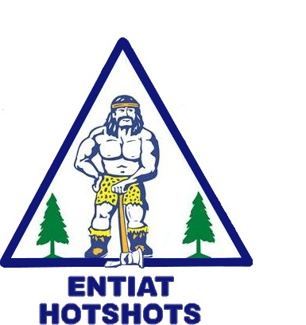
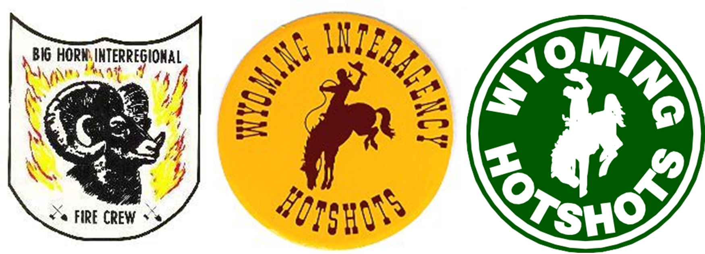
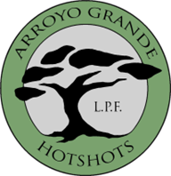
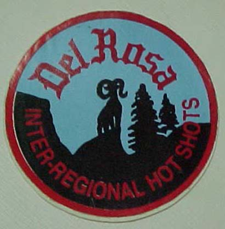
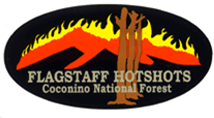

 **HOTSHOT CREW**

**HISTORY IN AMERICA**

{width="4.803778433945757in"
height="4.113333333333333in"}

**PRODUCED BY THE NATIONAL INTERAGENCY HOTSHOT CREW STEERING
COMMITTEE**

August 2022

# Alaska 

The first **Alaska Bureau of Land Management** seasonal fire crew was
started by Anchorage District in 1974. Named the Anchorage Hotshots\*,
crew size was set at sixteen members to meet the carrying capacity of
the Twin Otter airplane (due to lack of roads, crew transport
primarily consisted of fixed and rotor wing aircraft). The crew was
intended to be the first reinforcement for Initial Attack forces. In
1976, another crew was formed at the same location. Both crews were
moved to Kenai in 1979, on the peninsula southwest of Anchorage. The
two crews were known as the Red and Black crews due to the red or
black stripes on their hardhats.

{width="5.646873359580052in"
height="5.626279527559055in"}Seeing the value of a dependable
organized crew for fire reinforcement as well as a hiring pool for the
primary initial attack forces (Helitack and Smokejumpers), the Alaska
Bureau of Land Management decided to increase their Hotshot\* crew
program. From 1981 to 1982, Alaska BLM stationed Hotshot\* crews in
Kenai, McGrath (located on the Kuskokwim River in Southwest Alaska),
Tanacross (located on the Alaska Highway near the border of Canada's
Yukon Territory), and Fairbanks (Interior Alaska).

The **Alaska Fire Service** was established in 1982, which shifted
wildfire management responsibilities from the BLM Districts and
provided firefighting services to all Federal, Native, and some State
of Alaska lands north of the Alaska Range. By this time there were
only two seasonal BLM fire crews (Hotshot\* crew \#1 & \#2), both
based at Ft. Wainwright, an Army base located on the outskirts of
Fairbanks Alaska. When in Fairbanks, the crews lived in military
barracks and ate meals at the BLM mess hall. During the fire season,
the crews were often temporarily relocated to bush station.

In 1985, the decision was made to convert the Alaska Fire Service
Hotshot\* crews to Interagency Type 1 status. Efforts were made to
develop stability in the Hotshot program and ensure that the Alaska
Fire Service Hotshots met all agency and interagency goals and
standards. At that time, Fairbanks Hotshot\* Crews \#1 & \#2 were
renamed **Chena IHC** and **Midnight Sun IHC.**

The Alaska fire season normally starts and ends earlier than in the
Western States. At the conclusion of the Alaska fire season, the Chena
and Midnight Sun Hotshots head down to the lower 48 for fire
assignments. Both crews currently keep their crew vehicles and
miscellaneous firefighting supplies at NIFC. While in the lower 48,
they are dispatched through the Alaska Interagency Coordination Center
and are not attached to a specific geographic area. They generally
stay in the lower 48 until there is no longer a critical need for
IHC's.

A 1998 agreement between Chugachmuit Native Corporation and the Alaska
Bureau of Land Management created a third hotshot crew to be managed
under the Alaska Fire Service Hotshot Program. The Denali Hotshots,
also stationed at Ft. Wainwright, were active between 1998 and 2007.
All Denali IHC Superintendents were former Chena IHC or Midnight Sun
IHC members.

The Hotshot Program has remained an integral and highly valued
component of the Alaska Fire Service as well as one of its most
visible. The program and its members continue to serve their mission
well and are proud of their achievements.

\*Though the pre-1985 crews were referred to as "Hotshots", they
actually met Category 2 (later Type2) standards.

## Chena

Year(s) | Superintendent
:- | :-
1985-1988 | Jon Larson 
1989 | Steve Bumgarner
1990-1993 | Skip Theisen
1994 | Mike Powell
1994 | Mike Theisen
1995 | Skip Theisen
1996-1998 | Mike Theisen
1999 | Mike Theisen
1999 | Shane McDonald
2000 | Shane McDonald
2001-2003 | Pat O’Brien
2004-2007 | Jake Livingston
2008-2013 | Chris Marabetta
2014-2018 | Oded Shalom
2019-Present | Iris Sager

## Midnight Sun

Year(s) | Superintendent
:- | :-
1985 | David Lockwood
1986-1988 | Jerry Soard
1989-1991 | Dave Jandt
1992 | Dave Jandt
1992 | Dave Matier
1993-1997 | Dave Matier
1998 | Shane McDonald
1999-2007 | Dave Matier
2008 | Cory Swisher
2009-2010 | Dave Matier
2010-2014 | Jake Livingston
2015-2017 | Chris Demers
2018-2019 | Chase Maness
2020-Present | Miles Bond

## Denali

Year(s) | Superintendent
:- | :-
1998 | Larry Nolan
1999 | Pat O’Brien
2000-2004 | Lawrence Moses
2005-2006 | Ray Crowe
2007 | Steve Boatman

## Pioneer Peak

Year(s) | Superintendent
:- | :-
2003-2006 | Jeff Ennenga (Pioneer Peak T2IA & Regional Type 1)
2007-2015 | Matt Jones (2007 Type 1, 2008-2015 IHC)
2016 | Jon Glover
2017-Present | Kris Baumgartner

Pioneer Peak IHC is a State of Alaska DNR crew stationed in Palmer
Alaska. The crew started in the 1980's as a call up emergency
firefighting crew and were known as the Mat Su Ridge Runners.
Eventually they were just called the Mat Su Crew and were only
emergency hired when fire danger was high enough. The beginnings of
Pioneer Peak Hotshots start in 1996 when the Millers Reach fire burned
37,000 acres and destroyed 344 structures. It's still the worst Urban
Interface fire in Alaskan History and that fire made it clear to Fire
Management Officers that they needed an organized Wildland Fire Crew
in the heavily populated and fast growing Mat-Su Valley. In 2001 Wes
Stevens became the Crew Boss and the Mat Su Crew started receiving
funding to have a crew available all summer. Jeff Ennenga took over
the crew in 2003 and in 2004 they became a Type 2IA Crew and changed
the name to Pioneer Peak. In 2005 the crew received the "Regional Type
1" status and in 2007 Matt Jones took over as Superintendent and they
became an IHC training crew. Matt brought his extensive knowledge from
running the now disbanded Tazlina Hotshots and started building the
culture that defines Pioneer Peak to this day. In the Spring of 2008
Pioneer Peak earned the Interagency Hotshot Crew status becoming one
of only two State sponsored IHC Crews in the Nation. We pride
ourselves in operating with an old-school work ethic that encompasses
the raw toughness and strong mental attitude established by the
Hotshot Crews before us.

Sacrifice. Service. Old School.

# Great Basin

## Alta

Year(s) | Superintendent
:- | :-
2014-2018 | Wade Snyder
2019-2021 | Jesse Trembly
2022-Present | Tyler Carruth

The Alta Hotshots were officially certified as an Interagency Hotshot
Crew on June 13^th^, 2014. Earning Type 1 status followed a four-year
journey consisting of peer evaluations, an embedded review with an
ex-hotshot Superintendent and finally an extensive certification
review. The origins of the Alta Hotshots date back to 2003 as the UFRA
Type 2 crew. The UFRA crew was initially created as an agreement
between Utah Valley University (UVU) and the State of Utah. The
crew\'s intent was to provide work experience and a learning platform
in the wildland fire environment for students participating in
wildland fire suppression courses through UVU. In 2007 the crew gained
the qualifications and experience necessary to move up to status as a
Type 2 Initial Attack crew. After a couple of successful years and
retention in critical overhead positions, it was decided in 2010 to
begin the process of building UFRA into an Interagency Hotshot Crew.

With the decision to build UFRA into a Hotshot Crew in 2010, the
crew\'s focus started to swing from an internship platform for UVU
students to a highly reliable professional fire suppression resource.
With this change of focus the crew reached far and wide to bring in a
core group of firefighters to help obtain the lofty goal set forth. In
2012 it was determined that if the crew was to obtain Type 1 status,
that the UFRA Hotshots didn't quite sound right. It was decided that a
name change would be necessary, the crew voted on a few options and
Alta won the majority. With the name change a new logo was designed.
Much thought and consideration went into the new logo and each detail
has significance. The mountain range on the logo represents Devil\'s
Castle which is a popular recreation spot near the town of Alta and
the Wolverine on our logo represents our past relationship with Utah
Valley University - as that is their mascot.

The Alta Hotshots continue to foster firefighter development and an
engaging learning platform for qualified individuals both from the UVU
wildland program and other wildland fire agencies. Ultimately, the
Alta Hotshots will hire the most qualified applicants in order to
staff a highly reliable and dependable Interagency Hotshot Crew. The
crew generally starts mid-May and can be expected to go until the end
of October. Throughout the season, Alta contributes to local project
work to support state lands as well as providing a work force to
adjacent federal agencies. Project work consists of but is not limited
to: fuel reduction/fire prevention in the

urban interface, constructing fuel breaks and contingency lines on
state and federal lands, and prepping and burning RX units.

The Alta Hotshots currently reside at the Lone Peak Conservation
Center (LPCC) located in Draper, UT. LPCC is unique given it's a state
agency within the Department of Natural Resources under the Division
of Forestry Fire and State Lands. Including the Alta Hotshots, it
houses 2 Interagency Hotshot Crews, 2 Type 2 I.A Crews, and 2 Type 3
Engines.

## Black Mountain

1989-2005 | 2006-present
:-: | :-:
 | 

Year(s) | Superintendent
:- | :-
1989-2005 | Craig Workman
2005-2015 | Matt Hoggard
2016 | Matt Gill (detail)
2016 | Jed Rudelbach (detail)
2017-Present | Pamela Messal

Black Mountain Interagency Hotshot Crew 1989 -- Present
1989-2005 | 2006-Present
:-: | :-:
 | 

The Black Mountain Interagency Hotshot Crew was established in 1988
through the efforts of the Toiyabe National Forest's Fire Management
officer, Stanley E. Fitzgerald. The crews first fire season was the
summer of 1989. The crew name was suggested by Jennifer de Jung, a
former employee of Stan's, because "Toiyabe" is translated as "Black
Mountain" in the local (Piute) Native American Language. Late that
same year Robert Craig Workman was hired as the first Superintendent.
Craig recruited 2 formen and 2 squad leaders as well as the more time
consuming work of equipping the crew with tools, nomex, training
materials, line and camp gear. The crew vehicles did not arrive in the
first year so the crew used the Forest Assistant Fire Management
Officer's Suburban, plus two rental Suburbans and a surplus GSA
pick-up.

Designs for the Black Mountain Crew Logo were solicited from employees
on the forest. Jan Sanchez who worked in personnel management came up
with the basis of the logo. It incorporated a stylized black outline
of a mountain with an orange sun (setting or rising) and the Toiyabe
National Forest logo of a man on a horse leading a pack string.

The Black Mountain IHC was first based at the Stewart Indian Colony in
Carson City, Nevada (1989-1990) where barracks space was rented; and a
small storage garage at Stewart completed the station. Office space
was at the Carson Ranger District Office in Carson City Nevada. In
1991 the crew base was moved a location at the Carson Ranger District
Work Center site, located in Minden Nevada. While this provided space
for the crew to gather and crew "cache", no housing was available for
two more years. The Forest acquired four modular office units from the
abandoned Leviathan Mine that were remodeled and are currently being
used for barracks for the crew.

The crew has always been sponsored by the Humboldt-Toiyabe National
Forest and has never been disbanded or re-established.

During Craig Workman's tenure there were no fatalities and or serious
injuries on the crew. Craig Retired in February of 2005.

Matt Hoggard the long standing Assistant Superintendent (1996-2005)
took over the program as Superintendent in March of 2005 who continues
to carry on the outstanding reputation that is associated with the
Black Mountain IHC. In the spring of 2013 the crew moved from the Work
Center in Minden Nevada to a newly build Interagency Work Center and
barracks located a few miles north at the Plymouth Work Center. The
crew is co-located with the BLM Silver State Hotshot Crew.

Matt Hoggard retired in January of 2016, having worked on Black
Mountain since 1991.

## Boise

1970 | 1989-1992 | 1993-1996 | 1997-2001 | 2001-Present
:-: | :-: | :-: | :-: | :-:
 |  |  |  | 

Year(s) | Superintendent
:- | :-
1961 | Gary N. White
1962-1963 | Billings
1964 | John (Tex) Stockman
1965-1968 | Carl Rossell
1969 | Ron Dean
1970-1973 | Dave Kellogg
1974-1978 | Merrill Saleen
1979-1986 | Terry Leatherman
1987-1992 | Kole Berriochoa
1993 | Chris Simonson
1994-1996 | Kole Berriochoa
1996-1998 | Jim Cook
1999-2001 | Randy Skelton
2001-2011 | Matthew Ziegler
2011-Present | Deon Berner

**Crew History:** Payette Hotshots, Payette IR, Boise IR, Boise Hotshots.

The crew was started on the Payette National Forest, Thorn Creek
Ranger District in 1961 (one of the first Hotshot crews in the Forest
Service). The crew back then consisted of 30 men and were called the
**"Payette Hotshots"**. The dress code back then was a long sleeved
khaki shirt, light green jeans, logging boots, a gold aluminum hard
hat

and a red bandana around their neck. Their hand-tools only consisted
of a shovel and a Pulaski. In 1971 the name Hotshots was changed to
Inter-Regional" (IR) Crew calling them **"Payette IR"**. In 1980 the
crew was moved off the Payette National Forest to the Boise
Interagency Fire Center, "BIFC" (now known as NIFC) in Boise, ID. This
was done in order to meet the National requirement of all IR crews
mandating all IR crew to be stationed within a two hour report time of
a jet airport. With this big move, the crew's name was changed to
**"Boise IR"**.

As the years went on, the initials "IR" took on a new meaning of
"infrared". This new nomaclature change caused the crew name to be
changed to the now current name of **\"Boise Hotshots\"**. In 1987 the
crew declared the colors of jade, red and black for their crew colors.
In 1990 the crew took on one final move, from Boise, ID to their
current location at the Garden Vally Work Center in Garden Valley, ID.
This new location resides within the Emmett Ranger District of the
Boise National Forest.

At their new home the crew is continuing to build lasting memories.
They have received great support from the district and the forest.
They provide quality work on district projects, assisting with the
other departments on the forest. Unfortuneately over the years, the
fire seasons have become longer, reducing time spent at home to assist
with the district and forest project needs.

In 2020, the crew module configuration change- adding 8 new permanent
positions due to the "case for change" 80/20 module consideration. In
2022, another IHC module change, two perm GS-06 Lead Crews positions
were created. The Perm Seasonal positions were extended from 13 paid
pay periods to 18 with eventually all positions from GS-06 and up
becoming permanent full time 26/0. The IHC crew configuration numbers
were also been adjusted to consists of 20-25 fire fighters. Currently
the crew is sitting at 24 firefighters on the crew.

During the longer, unwielding fire seasons, the crew continues its
mission to provide quality work while striving to be proactive,
productive members for the Incident Management Teams (IMT's) and other
agencies they may work with.

## Bonneville

Year(s) | Superintendent
:- | :-
2001-2008 | Nathan Lancaster
2008-2012 | Chris Kirby
2012-Present | Pila Malolo

Bonneville Hotshots History 2001- Present
The Bonneville IHC was established in 2001 to help fulfill BLM\'s
commitment to provide national fire suppression resources. The crew is
based in Salt Lake City Utah, Salt Lake BLM Field Office. In 2001 the
crew ran as a IHC(T) and received its certification in the Spring of
2002.

## Cedar City

2001-2002 | 2003-2006 | 2007-present
:-: | :-: | :-:
 |  | 

Year(s) | Superintendent
:- | :-
2001-2002 | Jon Lee
2003-2005 | Robert Barrett
2006-2009 | Ken Henson
2010-2015 | Brian Burbridge
2016 | Dave Harmon (detail)
2017-Present | Dave Harmon

***As Professional Wildland Firefighters we are dedicated to serving
the U.S. Forest Service, our Cooperators and the Public while
maintaining the values of Leadership, Integrity and Teamwork.***

The Cedar City Interagency Hotshot Crew (IHC) is located in southwest
Utah in the town of Cedar City. Cedar City is approximately 250 miles
south of Salt Lake City, Utah and approximately 220 miles north of Las
Vegas, Nevada. This town is surrounded by the Dixie National Forest,
Cedar City Bureau of Land Management and various National Parks.

In 2001, under the direction and in accordance with the National Fire
Plan, the Dixie National Forest became host to the Dixie Interagency
Hotshot Crew based in Cedar City, Utah. The Dixie IHC would be the
first Type I or Type II crew to be hosted by the Dixie National
Forest. From 2001 to the spring of 2003, the crew was stationed in a
hangar at the Cedar City Municipal Airport. In 2003, the Dixie N.F. in
conjunction with Cedar City BLM, Zion National Park and Utah State
Fire and Forestry, the Color Country Interagency Fire Center opened in
Cedar City. The crew relocated to the new Fire Center in the spring of
2003 where they reside to this day.

Jon Lee came from the Plumas Hotshots in northern California in 2001
to become the first Superintendent of the Dixie IHC. For the first two
years of their inception, the crew was mobilized as an IHC Trainee
crew. In the spring of 2003, Jon left the crew after accepting a Fire
Management position with the Bureau of Indian Affairs in Arizona.
Robert Barrett, the Assistant Superintendent from the Logan Hotshots
in northern Utah, was hired as the new Superintendent in the early
summer. Robert changed the crew's name to the Cedar City Interagency
Hotshot Crew to represent the District and the town of Cedar City. In
that same year, the Cedar City IHC officially earned the status as a
type 1 IHC. In the winter of 2005, Robert accepted a Battalion Chief
position on the Caribou-Targhee National Forest in Idaho. In 2006, Ken
Henson from the Los Padres Hotshots in southern California became the
Superintendent of the Cedar City IHC. In 2007, a second GS-8 Captain
position was added to the crew. In the fall of 2009, Ken Henson
accepted a Fire Management Officer position on the Pine Valley Ranger
District of the Dixie National Forest. Brian Burbridge, a Captain on
the crew since 2005, accepted the Superintendent position in the
spring of 2010. In the early spring 0f 2016, Brian accepted an
operations position with the Great Basin Coordination Center. With
Brian's departure, Dave Harmon, a Captain with the crew since 2010,
detailed into the Superintendent position for 2016 and accepted the
position officially in 2017.

The crew traditionally has a start date in the beginning of May which
brings them available for assignment in mid May. They will work until
the end of September or longer depending on the severity of fire
season, funding or forest needs. As well as fire suppression the crew
has assisted with; medical aids, mechanical fuel treatments,
prescribed fire locally and nationally, shuttle recovery, hurricane
relief and various other assignments as needed.

Although the Cedar City IHC is relatively new in terms of Hotshot
longevity, the program continues to strive to become an integral part
of the National Interagency Hotshot program. From its inception, Cedar
City IHC crewmembers have been educated in the fundamental Hotshot
characteristics of Duty, Respect and Integrity. A strong work ethic,
commitment to the operation, and respect for Hotshot history and
tradition are the pillars upon which this crew stands.

## Idaho City

Year(s) | Superintendent
:- | :-
2001-2004 | Russ Long
2005-Present | Brian Cardoza

***The Idaho City Hotshots will uphold the Forest Service mission of
"Protecting the land and serving the people." Our vision is to
continue to integrate within the Wildland Fire Organization
professionally and effectively, earning respect through safety, hard
work, proficiency and exceeding performance standards*."**

In 2001, in response to the wildfires of the previous year, the
Secretaries of the Interior and Agriculture conducted a review to
determine the adequacy of the 1995 Federal Wildland Fire Management
Policy. While the review generally supported the foundations of the
policy, it also found it to be "incomplete in many areas, especially
those that involve collaboration, coordination, and integration across
agency jurisdictions and across different disciplines." Appropriations
followed and part of the effort towards installing the implementation
actions outlined in the 2001 National Fire Plan went towards funding
an expansion crew on the Idaho City Ranger District. By October of
that year, the crew was certified as a Type-1 Interagency Hotshot Crew
with Russ Long as the inaugural Superintendent.

The crew is located on Idaho's Boise National Forest, which it shares
with its sister crew the Boise IHC. Split into five districts, with
9,600 miles of perennial and intermittent streams and elevations
ranging from 2,800 -- 9,730 ft., the Boise NF is a dynamic area to
fight fire in. We share our Forest Service compound with a Type-2IA
crew, a Type-3 Engine and two prevention personnel. Completed in 2004,
our facilities include Superintendent's/Captain's offices,
readiness/training rooms, barracks and a gym.

Since inception, the Idaho City IHC has truly been utilized as an
interagency and national resource. While the overhead has experience
internationally, the crew itself has seen action from Florida to
Alaska and participated in incidents ranging from Wildland Fire to the
Columbia Space Shuttle recovery. Originally structured with a single
Assistant Supt., the crew is now composed of a two-Captain system,
allowing for greater versatility.

In 2005 Brian Cardoza accepted the Superintendent's position and has
held it ever since. The culture of the Idaho City IHC has been
predicated on hard work and aptitude. We appreciate the opportunity to
work with other agencies and resources to jointly accomplish whatever
tasks appointed us. We strive to provide a highly motivated and
skilled firefighting unit, priding itself on safety, integrity,
efficiency and aggression.

The mission of the Idaho City Hotshots is to provide a highly skilled
firefighting crew that operates safely, is versatile, and operates
with integrity and mutual respect. The crew strives to improve itself
and others by training and teaching. Fitness is held in high regard,
and is founded on the principles of hard work.

Idaho City Hotshots receive nothing but exceptional support from
District, Forest, Regional and National levels.

## Logan

Year(s) | Superintendent
:- | :-
**Logan USU Forestry Crew**
1973-1974 | Dee Sessions
1975 | Bob Clancy
**Logan I.R. Crew**
1976 | Bob Clancy
1977 | Mike Jenkins
1978 | Dan Fritz
**Wasatch Hotshots (Kamas Ranger District)**
1980-1984 | J.D. Killick
**Logan Interagency Hotshot Crew (Training Crew - Type II)**
1988-1989 | Scott Bushman
**Logan Interagency Hotshot Crew**
1990-1998 | Scott Bushman
1999 | Nathan Lancaster (Detailed)
2000-2001 | Scott Bushman
2002 | Robert Barrett (Detailed)
2003-2006 | Scott Bushman
2007-2009 | Kendal Wilson
2010 | Roy Fetzer (Detailed)
2011 | John Platt (Detailed)
2012-Present | Roy Fetzer

LOGAN INTERAGENCY HOTSHOT CREW WASATCH-CACHE NATIONAL FOREST, REGION FOUR

Since the creation of the Logan Forest Reserve in 1903, fire
prevention and suppression has been an important emphasis on the Cache
National Forest. Overgrazing and large, unchecked forest fires in the
critical watersheds of the Wasatch and Bear River Mountains of
Northern Utah led President Theodore Roosevelt to set aside the Logan
Canyon area as one of the first Forest Reserves in the nation. One of
the first directives given to the Reserves first Supervisor, John
Squires, was to organize an effective fire fighting force to control
forest fires within the reserve. In 1910 Squires' hard work enabled
Logan's Deputy Forest Supervisor, John Riis, to lead a crew of 300
firefighters from Cache Valley to fight the large fires raging in
Idaho and Montana. Though the crew was made up mostly of college
students, local farm boys, hoboes and convicts taken from the local
jail it demonstrated the Forests' ability to raise a large
firefighting force in an emergency.

The tradition of an organized, standing fire crew on the Logan Ranger
District was not realized until the late 1920's when the Forest
Service sent future chief Lyle Watts to Cache Valley. Watts was given
the task of establishing a Forestry Department at Utah Agricultural
College in Logan (now Utah State University). This was one of the
first forestry schools in the western United States. As part of the
Forestry curriculum students were required to attend a six week summer
forestry camp in the near by Cache National Forest. As the forestry
summer camp students would miss the opportunity for seasonal jobs with
the Forest Service, Watts convinced the Cache Forest Supervisor to
sponsor a forestry student fire crew on the Logan District. The Logan
IHC can be traced back to this early beginning.

As Chief of the Forest Service, Edward Cliff (Chief from1962 to 1972)
is credited with developing the concept of organized hotshot crews.
Under his leadership the first Hotshot crews (known as Inter Regional
Crews) were established on several National Forests in the early
1960s. It is interesting to note that Chief Cliff attended Utah State
College in Logan from 1928 to 1931. As part of the forestry student
employment agreement, he worked as a summer seasonal fire and
recreation guard on the Logan District while attending Forestry
School.

In the 1930's the Forestry Student fire crew tended to combine with
two Civilian Conservation Corp (CCC) camp crews hosted on the
District. During this period the CCC camp at Tony Grove was used to
train and dispatch local fire crews. In the 1940's the CCC Camp was
disbanded with Utah State University taking over the CCC work center.
From the early 1940's to 2002 the Tony Grove CCC camp was used to host
the U.S.U. Forestry Summer Camp program. It was this summer Forestry
Camp program that provided the recruitment source for the Logan Fire
crew for the next 40 years, (approximately 1940 to 1978).

In 1973 the Cache National Forest merged with the Wasatch to become
the Wasatch- Cache National Forest with the Supervisors Office in Salt
lake City, Utah. With the merger with a large urban Forest, fire
suppression and watershed protection became a major priority. Under
the leadership of District F.M.O., Neff Hardman, the crew would
eventually gain "Inter Regional" status. The size of the crews would
vary from 10 to 20 people. Dee Sessions became the first Logan Fire
Crew boss in 1973. That year the crew included Jack Ford, whose father
Gerald Ford would soon become President of the United States.

In 1974 Dee Sessions returned as Crew Boss for the Logan Fire Crew.
That year, Suzanne Morgan became the first woman member of the crew.

In 1975 Robert Clancy replaced Dee Sessions as crew boss and the crew
was expanded to a 20 person crew. In 1976 the crew was given I.R.
status as a type II crew receiving several out-of-Region assignments.
In 1977, Mike Jenkins replaced Clancy as crew boss. According to
Jenkins most of the 1977 season was spent fighting fire in Northern
California, which included a 28 day assignment on the Hog Fire. In
1978 the crew was cut back to ten crewmembers due to a lack of funding
and discontinued the following year. The USU Logan I.R. Crew's last
crew boss was Dan Fritz.

In 1980 the Wasatch-Cache decided to develop a Type I Hotshot crew.
The Kamas Ranger District was chosen to host the new crew and the crew
became the Wasatch Hotshots. J.D. Killick, with Hotshot experience in
Region 5 served as Superintendent from 1980 to 1984. In 1985 the
Wasatch Hotshot Crew was disbanded due to federal budget cutbacks.

In 1987 Forest Supervisor, Dale Bosworth (forme Chief of the Forest
Service), requested funding to re-establish a type I hotshot crew on
the Wasatch-Cache National Forest. This request was approved and
funding made available but on condition that a type I status would
only be given if and when the crew was able to meet national IHC
operational and performance standards.

Thus, the crew was funded for two years on a trial bases. After much
debate it was decided to return the program to Logan to take advantage
of the Ranger District's existing crew infrastructure and the ability
to readily recruit crewmembers from the Forestry Department at Utah
State University as established since the 1930's.

The new Logan Fire Crew came on line in 1988 with Scott Bushman as the
crew Superintendent. The crew's first season is remembered as one of
controlled chaos and learning. During the first year the crew's name
was changed three times, from USU Logan to Wasatch-Logan to Logan I.R.
Final funding for the crew was not finalized until late spring making
recruitment and ordering supplies a last minute scramble This coupled
with the worst fire season since 1910 made for an interesting first
season. In 1989 the crew worked on eight campaign fires in Utah,
Colorado and Idaho. At the end of the 1989 fire season the crew's
performance was evaluated by Region Four fire staff. It was felt that
the crew had met all performance and organizational requirements for
Type I qualifications and the crew became the Logan Hotshots.

1990 was a pivotal year for the Logan Hotshots. Once again funding
became a critical factor with no National or Regional funding
available to support the crew. If not for the efforts and support of
Regional and Forest fire staff and the constant effort of District
Ranger Dave Baumgartner the crew would have ceased to exist. Somehow,
with a combination of regional severity funds, Forest fire funds and
District project funds, enough money was scraped together to field the
crew for one more year with a commitment from the Region that after
1990 the crew would be fully funded. That year the crew worked on nine
project fires in six western states, logged over 10,000 driving miles
as well as several thousand air miles.

The Logan IHC still maintains a positive working relationship with
Utah State University established by Forest Service in the 1920s.
Though the crew no longer actively recruits from the Forestry
Department it does support and mentor several Forestry and Natural
Resource students as well as sponsoring two Joint Apprentice Program
positions. The crew also participates in the National Student
Initiative Program with the Department of Forestry at Haskell Indian
Nations University in Lawrence, Kansas. Since 1999, the crew has
hosted 5 Haskell students as well as provided instructors to teach
basic fire school to students at Haskell University during the off
season.

In 1996 the Logan Hotshots began participating in an International
Firefighter Exchange Program between the U.S.D.A. Forest Service and
The Federal Fire Protection Agency of Russia. Between 1996 and 2003
the Logan Hotshots have hosted ten Russian detailers on the crew. In
2001 the crew hosted two firefighters from Brazil. The crew
Superintendent was also detailed to Russian in 1999 and 2002 as a
Russian Hotshot Crew trainer and advisor.

Today the Logan Interagency Hotshot Crew enjoys a strong reputation as
a professional and progressive crew. The crew continues to emphasize
performance, safety and professionalism as its core values. It is
proud of its traditions and of its close working relationships with
fellow Hotshot crews, overhead teams and fire managers.

## Lone Peak

Year(s) | Superintendent
:- | :-
**Flame-in-go Hotshots**
1991-1994 | Tracy Dunford
1995-1999 | Gary Peck
2000-2001 | Scott Bovey
**Lone Peak Hotshots**
2001-2004 | Scott Bovey
2005 | Joel Butcher
2006-2009 | Mathew Armantrout
2010 | Donny Bennett
2011-2016 | Kris Bruington
2016-2018 | Darren O'Loughlin
2018 | Ryan LaFontaine (Detailed)
2019-present | Christian Berninger

The Lone Peak Hotshots are a nationally recognized Type 1 Interagency
Hotshot Crew (IHC), based out of the Lone Peak Conservation Center, in
Draper, Utah. The Lone Peak Hotshot Crew was first established in
2001. The crew starts training in mid April and will stay available
for assignments till the end of October. Lone Peak Hotshot crew was
established on the solid foundation that was once called the
"Flame-In-Go Hotshots".

In 1991, within the existing Flame-In-Go program, the concept of an
inmate hotshot crew was brewing. After gaining the support from
regional hotshot crews and the national fire management governing
bodies, the Flame-In-Go Hotshots were born. The crew was made up 17 of
inmates from the Utah State Prison, 2 Correctional Officers' and 2
Utah Forestry, Fire and State Land's Supervisors. The Flame-In-Go
Hotshots operated from 1991 through 1998 as a Regional Hotshot Crew
(RHC) dedicated to fire suppression in the Eastern Great Basin Area.
In 1998, the Flame-In-Go Hotshots gained National IHC status and began
strengthening their reputation as a nationally recognized resource.
From 1998 to 2000, the Flame-In-Go Hotshots fought fires all over the
nation with the most notable location being the Boundary Waters of
Minnesota. The crew met all qualifying requirements and accomplished
tasks with only minor differences from that of federal hotshot crews.
In 2001, after the national shift to strengthen crew qualifications
and crew standards, the Flame-In-Go Hotshots were unable to keep up
with the new standards and maintain hotshot status with inmate crew
members. At that point in time, it was decided to make the decision to
transform the Flame-In-Go Hotshots into the Lone Peak Hotshots an all
civilian crew.

Since the inception of the Lone Peak Hotshots in 2001, the crew has
traveled extensively through out the nation fighting wildland fires.
Lone Peak has developed into a professional and respected resource in
the fire community. While not on fires, the crew participates in fuels
reduction and natural resources based projects. The crew has seven
career staff positions and typically employs fifteen to seventeen
seasonal crew members each fire season. The crew normally has a low
turn over rate and openings are incredibly competitive for new crew

members. The crew still resides at the Lone Peak Conservation Center
in Draper, using the same facilities as the Flame-In-Go's did with
many new upgrades.

## Ruby Mountain

Year(s) | Superintendent
:- | :-
2001-2004 | Shane McDonald
2005-2006 | Rich Stiles
2007-2008 | Spencer Gregory
2009-2013 | Gabriel Donaldson
2014-2016 | Craig Cunningham
2016 | Troy Thomas
2017-2018 | Jerry Drazinski
2019 | Vacant
2020-Present | Chase Maness

**Ruby Mountain Interagency Hotshot Crew History, 2001 -- Present**

Ruby Mountain IHC began as a Type 1 training-crew on May 21st, 2001,
in response to the 2000 national fire plan initiative presented by
President Bill Clinton. This initiative allowed for 20 hand crews to
start the process of becoming Type 1 Hotshot Crews. Ruby Mountain
became available June 8th, 2001 and was assigned to their first fire
on the next day.

The base of operations for the crew is in Elko, Nevada. In 2003 the
crew became qualified as an Interagency Hotshot Crew.

Throughout the years, physical training has been a fundamental part of
the RMHS way of life. In the interest of quality work done safely and
efficiently, Ruby Mountain adheres to a strict physical conditioning
routine. In 2014 the crew won the BLM IHC fitness challenge.

The Ruby Mountain Hotshots place great emphasis on training and upward
mobility. Ruby Mountain has supported detail opportunities for our
state and federal partners. While maintaining its status as a High
Reliability Organization, Ruby Mountain fosters an environment of
safety, training and leadership. Gabe Donaldson earned the Kevin Hull
Nevada State Leadership Award in 2011. Craig Cunningham was the 2013
recipient of the Bureau of Land Management's National Wildland Fire
Safety Award for the development of P.L.O.W.S. In 2014, the crew
received the From the Field for the Field award for its participation
in the Wildland Fire Leadership Development Program's Leadership
Campaign.

## Sawtooth

Year(s) | Superintendent
:- | :-
1967 | Bob Berg
1968-1973 | Bill Williams
1974-1977 | Randy Doman
1978 | Joe Bongiovi (1/2 year)
1978-1980 | Randy Doman (1/2 year)
1981-1989 | Cole Johnson
1990 | Mark Barbo (detail)
1991-1995 | Andy Lang
1996-2000 | Dennis Pratt
2001-2006 | Tom Bates
2007-2011 | Heath Cota
2012-2019 | Mike Krupski
2020-Present | Kyle West

**SAWTOOTH INTERAGENCY HOTSHOT CREW SAWTOOTH NATIONAL FOREST, REGION FOUR HISTORY OF THE SAWTOOTH HOTSHOTS**

In 1966 the Sawtooth National Forest established a 10-person fire crew
that was stationed at the Featherville Brush Camp (an old CCC camp) on
the Shake Creek Ranger District (now the Fairfield R.D.). Ray Neiwert
was the foreman of that crew and Jim Prunty was assistant foreman.

The following year, in the spring of 1967, a 25-30 person ZECTRAN
spruce budworm control crew was formed and stationed at the old ranger
station in Ketchum, Idaho. Bob Berg was the foreman and Clayton
Edmonds was assistant foreman of that crew. After the spruce budworm
spray project was finished the crew was stationed near where the Big
Smoky Guard Station was to be established. The nucleus of that spray
crew replaced the Shake Creek fire crew and formed the nationally
recognized Sawtooth (IR) Interregional Hotshot Crew.

All indications are that the Sawtooth IR Crew was established as a
result of a national study identifying the need for additional
national hotshot crews after the 1966 fire season. The strong
campaigning of the then Forest FMO, Reid Christensen and the following
Forest FMO, Phil Cloward led the Sawtooth N.F. to host one.

During that first season the fire crew members spent duty-time at the
camp training for fire suppression, physical conditioning, and camp
maintenance. Project work consisted of fire line building around clear
cuts and brushwork on the Fairfield Ranger District. Army Quonset huts
were set up in the spring and disassembled in the fall. A tent
cookhouse was also erected.

After the 1967 fire season had begun the crew never returned to Big
Smoky Guard Station due to the time it took to drive to the Twin Falls
Airport. The crew then spent time repairing telephone line to Rock
Creek Guard Station. The line was abandoned before repairs were
completed. Most of the first year's crewmembers were students who
returned to school after fire season.

In the spring of 1969, the bunkhouse and kitchen at the Brush Camp in
Featherville were cut into 7-piece sections by Forest Carpenter Ray
Nelson. The sections were loaded onto trucks and reassembled to form
the Big Smoky kitchen and dining room. These replaced the Quonset
huts, one old trailer used for an office, and another trailer used as
a mess hall. It was a three-week job to move these buildings. The
prime movers behind the project were Lorin Bartlome, Joe Mallea, and
Beryl Bevercombe.

Tent cabin frames and two of the barrack buildings were also built in
1969, with the help of Ray Nelson, Bill Williams, Gordon Welch,
Darrell Smith and the IR crew. The engineering cabin was constructed
in 1971 under the supervision of Vern Barnes. The IR crew later
followed by building another barracks, an office, and doubled the size
of an existing shower house. The forest fire budget paid for building
all the "portable" buildings at the camp (it was illegal to construct
permanent structures with fire funds).

Physical training during those early years was rigorous. They did
about 40 minutes of calisthenics that finished with a run (in boots)
for about ¾ of a mile culminating in a hill climb where crewmembers
frequently experienced "type 3" nausea. Under Superintendent Bill
Williams (1968-1973) a solid foundation was laid for recognition of
the Sawtooth Hotshots as a top-grade crew.

Throughout the early years, the entire crew lived at the Big Smoky
facility Monday through Friday. Daily project work included standard
military barracks-type cleanings and equipment inspection in addition
to District project work. From 1967 until about 1975, the crew
traveled to and from Twin Falls for non-fire weekends-off in the crew
bus (non-pay status travel). The crewmembers who didn't have Twin
Falls housing lived in the Twin Falls warehouse on weekends.

The crew remained at Big Smoky during the 70's with more and more time
being spent in Twin Falls during the fire season (after initial
training). The crew was finally relocated permanently to Twin Falls
after 1980. The move was made after it was determined that fire
response time wasn't adequate due to the distance from the Twin Falls
Jetport. Other reasons included, an aging electrical generation
system, substandard wiring and water supply systems, reduced project
work requirements on the Fairfield District due to a diminished timber
harvest and it was believed that subsistence costs could be
substantially reduced.

In 1981, the crew moved into a new Dispatch/Hotshot facility at the
current S.O. location on Kimberly Rd. Two years later, the Twin Falls
District gave up on their building lease due partially to limited
access and moved into the building, bumping the Hotshots out into the
warehouse. Shortly thereafter the S.O. relocated to the same area
adding on to the building. In 1983, the crew went from being
supervised by the Forest FMO to the South Zone FMO.

From the start of the crew in 1967 until 1976 the "fire going" crew
size was 25 people with a five person "stay home squad and squad boss"
remaining behind when the crew went off-forest. In 1977, hiring was
reduced to 25 people with 25 still going to fires. Then in 1978, they
followed the national standard reducing fire crew size and hiring to
20 people to accommodate the various aircraft sizes at the time. Until
1981 no sideburns, long hair or facial hair was allowed. The Sawtooth
Hotshots maintained a close parallel to military discipline. 1979
brought women to work on the crew for the first time. The crew used a
bus until the mid-80's at which time they went to vans. A change to
the standard, widely used, crew carriers came in 1988. The crew
Foreman title was changed in 1987 to Superintendent along with the
Interregional Hotshot Crew (IR) designation changing to Interagency
Hotshot Crew (IHC).

The crew logo was developed in 1979 by Doug Borah who used the
mountain symbol from the "Scenic Sawtooth" signs. The crew color was
heather blue until 1990 when it was changed to navy blue. The crew
logo was redesigned in 1991 using the mountain scene from the 1979
logo, the navy-blue border was used from the crew's color and the
inner orange circle is representative of a smoke-filled sun-scape.

In 1996, three permanent squad leader positions were established
bringing the number of appointed positions within the crew to five,
providing the operational and administrative consistency that
characterizes "professional" organizations. Beginning in 1991, the
crew

began to emphasize physical fitness with new vigor. Fitness testing
and daily P.T. that included running, hiking, calisthenics and weight
training became the standard.

According to testing records, each following season was met with a
better conditioned crew. In 1996 the crew began advertising rigid
fitness expectations, and for the 1997 season instituted rigorous
first day fitness assessments that demanded a high level of
conditioning prior to crew employment. Gone were the days of running
in boots, but the same drive for conditioning and fitness that was
part of the crew's early history returned with zeal. The crew returned
to Big Smoky in 1999. Eight consecutive days of pre- season
preparedness training took place at the old base. Without
distractions, interruptions or concern for time constraints, this
fresh approach to readiness training helped develop a focused and
disciplined team, better prepared for assignment earlier in the field
season than in previous years.

1999 also marked the first year since the three permanent squad leader
positions were established in 1996 that all five supervisory positions
were staffed with career appointed employees hired for those specific
jobs. The consistency and integrity of the command structure was
apparent.

Partially due to the busy 2000 fire season, the National Fire Plan
provided increased opportunities to create professions out of being a
Sawtooth Hotshot. From 2000-2012, The permanent overhead structure
developed into three Senior Firefighter GS 4/5 and three Squad Leader
GS 6/7, both PSE 13/13's, one PFT GS 7/8 Assistant Superintendent and
the Superintendent GS 9. Other changes to the organization were the
acquisition through rental of a separate warehouse (aka "The Pain
Cave") in 2002, to provide needed space for the crew to work out of. A
new vehicle configuration arrived in 2004 that consisted of three
squad carrier vehicles allowing self-containment of all personal and
gear for the Squad. These vehicles were practical in design but proved
flawed in construction and were plagued with breakdowns. Many
minivans, Quad Cab pickups, and Suburban rentals later, a new
nationally standardized 10-person Crew Carrier vehicle arrived in
2012.

## Silver State

Year(s) | Superintendent
:- | :-
1976-1977 | Dick Jackson
1978 | Kelly Clark
1979 | Tom Sullivan
1980 | Mark Lathrop
1981-1989 | Steve Edgar
1990-1998 | James Ogilvie
1999-2002 | Jerry Soard
2003-2006 | Nate Gogna
2006-present | Kevin Kelly

[***[www.nv.blm.gov/carson/fire/sshs/sshs\_home.htm]{.underline}***](http://www.nv.blm.gov/carson/fire/sshs/sshs_home.htm)

Silver State Hand Crew has been around since late 1960's mainly
consisting of Emergency Firefighters.

-Organized as a Crew in 1976

-Hotshot Crew in 1977

-Interagency Hotshot Crew in 1980

Established in Carson City, NV where the crew continues to reside.

## Snake River

Year(s) | Superintendent
:- | :-
2001-2020 | Randy Anderson
2021-present | Kenny Bochniak

**Established 2001**

In 2000 the BLM made the decision to add four hotshot crews. The Upper
Snake River District (now Idaho Fall District) was chosen to host one
of these crews in Pocatello, Idaho. Randy Anderson was hired in March
2001 as the superintendent and in approximately 2 months the crew was
hired, equipment purchased, vehicles scrounged and we were up and
running. The crew maintained trainee status for the entire 2001 season
and received hotshot certification in 2002. The crew has a great
mutual relationship with the BLM of Idaho and the Idaho Falls District
in regards to fuels projects and providing experienced personnel in
leadership roles. Kenney Bochniak, an original crewmember from 2001,
and Paul Davis are the current crew foreman. In December 2014 the crew
moved into a new operations building on BLM land in Pocatello.

# Northern California

## American River

Year(s) | Superintendent
:- | :-
2005-2008 | Charlotte Wild Jordan 
2008-2016 | Adam Leyba
2016-Present | Matt Radtke

The American River Hotshot are based on the Tahoe National Forests
American River Ranger District. The American River Ranger District was
formerly the Foresthill Ranger District. The American River Hotshots
received Hotshot certification in 2005. Before 2005 the American
River/Foresthill Ranger District had some form of a crew from 10 man
brush disposal crews to Type 2 and Type 2IA crews since the 60s. The
goal of the American River Hotshots is to uphold the standards and
traditions of the Hotshot Community.

## Beckwourth

Year(s) | Superintendent
:- | :-
2017‐Present | Mike Wintch

Prior to the 2001 MEL funding build‐up, the crew existed as two fuel
modules. One was based at the Beckwourth Ranger District office in
Blairsden and the other on the east side of the District at the
Laufman Work Center. In 2003 the crews were combined and became Plumas
Crew 1, Type 2 I.A. crew and the following year named the Beckwourth
Handcrew after the district it serves. From 2004 until 2006 overhead
positions remained unfilled keeping the crew staffed as a Type 2 I.A.
crew. 2006 was the first year the crew's overhead was staffed at Type
1 IHC standards and on the boards as an IHC training crew. In May of
2007 the Beckwourth Handcrew obtained Hotshot certification and lasted
until the winter of 2007/2008, when the majority of the Overhead
promoted or moved on and the crew was down staffed to a Type 2 I.A.
crew.

The Beckwourth Handcrew in 2016 once again filled all of the overhead
positions as required by the SIHCO and began planning for
certification pending an imbedded review, for the 2017 fire season. On
September 22, 2017 the Beckwourth Handcrew re‐obtained Type 1 IHC
status.

## Diamond Mountain

Year(s) | Superintendent
:- | :-
1992  | Mike Bowles
1993-2001 | Kurt LaRue
2001-2005 | Ed Merrill
2006-2008 | Steve Shaw 
2009-Present | Dan Varney

**Diamond Mountain Hotshots**

**Agency: USDI Bureau of Land Mgmt Home Unit: Susanville, California**

**Contact Information:**

**Superintendent: Dan Varney Diamond Mountain Hotshots 2950 Riverside
Drive**

**Susanville, CA 96130**

**(530) 257-7601**

**Established 1992**

The Diamond Mountain Interagency Hotshot Crew were born in the spring
1992 under the guise of increasing the Bureau of Land Management's
commitment to contribute resources to the national fire suppression.
The crew was the second BLM hotshot crew in California and the fifth
crew in the nation. The Diamond Mountain Range west of Susanville, CA
lends to its name to the crew as its rocky crest provide a constant
visual reminder and keeps a watchful eye upon the high desert.

The original 1992 crew spawned from Crew 3221, the Initial Attack
Dawgs, a 10-person initial attack crew that worked in and around
Susanville in 1990 and 1991. Mike Minton was offered a JATC position
in the spring of 1992 and became the first official of the "soon to
be" hotshot crew. An unlikely cast of characters joined Minton for the
1992 season including Mike Bowles, who was hires as the first
superintendent, and Kevin Chambers who was selected as the foreman.
The Northern California Regional Fire Staff in Susanville supervised
the 1992 crew. The 1992 crew season saw many growing pains as the
aspired to become a well-respected crew in a region well known for its
hotshot crews. The crew responded to twenty incidents in a busy '92
fire season including the 68,000-acre Fountain Fire in Shasta County.
Extra curricular events during the Cleveland Fire in late September
led to a change in supervision for the crew for the 1993 season

Kurt LaRue was hired as new Superintendent in the fall of 1992 and
reported soon thereafter, with supervision of the crew being shifted
to the present-day Eagle Lake Field Office in Susanville. Kurt brought
many years of experience to his new crew after a long stint with the
Stanislaus, Horseshoe and Fulton Hotshots. Kurt retained Chambers as
foremen and added Ken Henson as a second. A new image was forged along
with many new faces for the 1993 season, many of which became
mainstays within the crew and contributed much to the present day
success and reputation of the crew including Keith Barker, Robert
Holt, and Edward Merrill. 1993 also saw rise to 'MO', the PT hill
still utilized by the crew to this day. The crew completed a
successful 1993 fire season and built a formable foundation by which
to continue into the future. Twenty years later, the crew continues to
deliver a quality product and achieve success following the ideals and
beliefs of our earlier years.

Minton designed the first crew logo, and like much of the 1992 crew
only lasted one season. A new logo and a new crew color were ready for
the 1993 season, but failed to meet the approval of the new
superintendent. 9914 finally saw a logo very much similar to the logo
of today. Minton was again responsible for this logo and it was
printed upon dark charcoal shirts, which also

remain in 2007. The logo was modified in 1995 wit the adding of the
"old English" script. The last modification to the Diamond Mountain
logo was made in 1999 by adding "Malum Necessarium".

The original crew utilized a make shift station in the BLM yard until
they finally found a home in 1995 and moved into the old Caltrans
building on Main Street in Susanville. It was a suitable facility and
the crew called it home until 2003 when Caltrans decided to put the
building up for sale, thus ending one of the greatest lease deals in
history at \$200.00 a month. After a tiresome search, Superintendent
Merrill finally secured a new home south of Susanville near the
airport in the Turner Complex. The new facility offered a few upgrades
with indoor plumbing and heating and actual office space. 2004 again
saw the crew move supervision, moving back to working under the fire
staff of NORCAL BLM. The crew moved their new home new and current
home, The Hidden Valley Fire Facility, lying within the shadow of
'MO', in August 2009.

Crew transportation was originally compromised of a mismatched fleet
of GSA vehicles that finally left for good in1995 season. Borrowed,
green, Forest Service crew hauls found their way to Susanville from
the Tahoe and Stanislaus for the 1994 season. The crew quietly
converted them to BLM vehicles by applying our trademark, magnetic
logo to the doors. The crew took delivery of their new yellow crew
hauls in 1996 and continually modified them until they were replaced
in 2003 by shiny new buggies. The old buggies were unique with their
ergonomically designed windows, rear suicide door, and cleverly
mounted exhaust. The exhaust won acclaim from the ground support
personnel across the west as the crew attempted to demob incidents.
This year we lost Jake Garate; he accepted the superintendent position
of the Wolf Creek IHC. Garrett Dunn is the crew Foreman since April of
2015.

## Eldorado

Year(s) | Superintendent
:- | :-
1981 | Milt Clark
1982-1988 | Barry Callenberger
1989-1995 | Greg Keller
1996-2010 | Mike Beckett
2010-2015 | Will Harris
2016-2019 | Aaron Humphrey
2019-present | Ben Strahan

**Eldorado Hotshots**

**Agency: USDA Forest Service**

**Home Unit: Eldorado National Forest Placerville Ranger District**

**[Contact Information:]{.underline} Superintendent: Ben Strahan
Eldorado Hotshots**

**5420 Sly Park**

**Pollock Pines, CA 95726 P: 530-644-3588**

**F: 530-644-4201**

**Established 1981**

On May 19, 1981, Lynn Biddison, director of Aviation and Fire
Management initiated the Eldorado Hotshots. Up until 1976, all four
districts on the Eldorado National Forest maintained a ten- person
fire suppression crew. In 1977 the Amador District gave up their crew,
which in turn was absorbed by the Placerville District. The two hand
crews were combined to form a single 20- person crew. They shared
common transportation and days off. The crew was known as the Sly Park
Fire Suppression Crew. During the winter of 1980, the Eldorado
National Forest proposed to Region Five to change this crew into a
Type 1-fire crew; on May 19, 1981, the crew became the Eldorado
Hotshot Crew, to be stationed at Sly Park on the Placerville Ranger
District. The Hotshots designed and constructed their own facility,
including men's and women's barracks, laundry facility, office and
workshop.

The first Superintendent was Milt Clark. He was detailed into the
position during this first fire season. During the fall of 1981, the
Palomar Hotshots became victim to a reduction in the workforce. Their
displaced Superintendent, Barry Callenberger, found a home on the
Eldorado Hotshots for the 1982 fire season and stayed with the crew
until 1988.

In the winter of 1989, Greg Keller, who had been the foreman from 1981
to 1988, became the next Superintendent. He held the position until
1995, when he decided to move on to greener pastures in Idaho as a
Battalion Chief.

The winter of 1995 brought on a change of leadership as Mike Beckett
became Superintendent. After details in the 2009 and 2010 fire season
as Division Chief, Mike officially became the South Division Chief of
the El Dorado National Forest in July 2010.

In the winter of 2010, Will Harris, who had been Captain from 2004 to
2010, accepted the Superintendent job in November. Will had previously
detailed into the Superintendent position during the 2009 and 2010
fire seasons.

Fire season 2015 started with Will detailed as Battalion 61 finishing
as Division 6. Aaron Humphrey detailed as Superintendent. That fall
Will moved on from 15 years with the crew accepting the Georgetown
Division Chief position. New leadership was ushered in by Aaron
Humphrey accepting the Superintendent position in December 2015.

In 2019 after serving 20 years on the Eldorado Hotshots, Aaron
Humphrey left the crew and Forest Service, to pursue a life outside
the agency. It was at this time that Ben Strahan took over the crew,
and he is currently the Superintendent of the Eldorado Hotshots.

## Elk Mountain

Year(s) | Superintendent
:- | :-
2003-2004 | Grant Montgomery
2005 | Jon Teutrine
2006-2007 | Bret Murphy
2008-2010 | Richard Tingle
2011 | Donovan Lee
2012-2014 | Cheveyo Munk
2015 | Kyle Betty (detail)
2016-Present | Reymundo Reyes

The ***Elk Mountain Hotshots*** is hosted by the Upper Lake Ranger
District on the Mendocino National Forest in Upper Lake, California.
The crew was established in 2002 under the MEL build up in Region
Five. The crew was originally known as Mendo 49. In 2003 the name Elk
Mountain Handcrew was established after a local mountain. While on
forest the crew's official name is Crew 4.

**In June 2009 a regional certification team came and certified the
Crew becoming Elk Mountain Hotshots.**

## Feather River

Year(s) | Superintendent
:- | :-
2003-Present | Robert Daniels

######### Feather River Hotshots History 2003-Present

The Feather River hotshots were established April, 2003. In 2001 the
Plumas National Forest got the funding for two additional twenty
person Type 1 Crews, and seeing the need for a Type 1 crew on the west
side of the forest the decision was made to place one of these crews
on the Feather River Ranger District. The year prior the funding was
for a 10 person fire crew this crew was called Crew 3 and was put into
service May of 2001 but due to overhead turnover this crew was
disbanded.

The Feather River Hotshots operated as a Type 2 Handcrew for the first
two years until August, 2005 when they officially got there Hotshot
status. The Hotshot Certification team consisted of: Deputy Fire Chief
and Team leader-Don Will from the Tahoe National Forest, Division
Chief Scott Brockman from the Mendocino National forest, and Division
Chief Mike Cherry from the Tahoe National Forest. Upon Completion of
the Certification Don Will presented the crew with a railroad spike he
removed from a tree during the field portion of the certification. He
presented this spike to the crew to represent the old saying "Driving
the Spike". After this we implemented the Spike in our crew emblem to
remind us to "always drive the Spike". Our Crew Emblem also represents
the Feather River which our district is named after.

The first 3 years the Crew transportation consisted of 3 six pack
pick-up trucks and one holdover ½ ton pick-up truck as a supt. Rig.
During this period there was sufficient funding for supplies but new
buggies and superintendent rig were ordered late so these were still a
year or two out. Management on the district played a critical role in
keeping the crew when there was talk about two 10-persen crews on the
forest in lieu of.

## Klamath

Year(s) | Superintendent
:- | :-
2001-2019 | Johnny Clem
2017 | Andy Zink  (Detailed)
2018 | Kevin Smyth (Detailed)
2019-Present | Andrew Zink

The Klamath Hotshots were established as part of the National Fire
Plan in response to the devastating fires of 2000. The maximum
efficiency level (MEL) for the Klamath National Forest called for the
addition of an Interagency Hotshot Crew and the Oak Knoll Work Center
was selected as the host site. Johnny Clem was selected as the
superintendent of the Klamath IHC, and was able to gain certification
as an IHC in August of the crew's first year. Transportation for the
crew was originally "six packs" provided by the forest. Mid-way
through the first year the crew took delivery of two new International
crew hauls.

In, 2003, the crew was able to complete the construction of two new
bunkhouses with rooms for up to 18 personnel.

In 2009, the overhead moved out of the barn, which had served as the
crew's office since its inception and into a modular office space with
room for training. Until this time all classes facilitated by the crew
were held in the local Klamath River Community Hall. And the next year
in 2010, two new crew hauls and a new superintendent vehicle were
delivered to the base. Those vehicles continue to log numerous miles
responding to emergency incidents around the nation today.

The crew continued to expand with the opening of a new KIHC office on
the Oak Knoll compound in 2013. It provides more space for gear
storage, and additionally a squad room that hosts the Squad leaders
and Senior Firefighters to work and have non-formal meetings. The new
building delivers a comfortable work environment year-round as the
training room facilitates not only the Crew but the District, and
forest staff. Along with the new office there is a saw shop, welding
and tool room built to accommodate the growing needs of the crew.

In 2019, the crew saw the end of an era with long time, and original,
superintendent Johnny Clem accepting the position of Deputy District
Ranger for KNF Happy Camp/Oak Knoll. However, the tradition continues
to be carried on with the hiring of Andrew Zink as the new
superintendent. Andy,

better known as "Butters," originally begin with the crew in 2002,
moving up through the ranks as Apprentice, Senior, Squad Boss, and
Captain over his career. Adding to the depth of the overhead the crew
has welcomed Isaac Flattley as Captain to counterpart Kevin Smyth.

For physical training the crew can often be found hiking its PT hill
behind the Oak Knoll Work Center. Red Line, the Repeater and The Wall
are a few of the more memorable spots that can be found along the way.
A few new hikes have been added since the crew's first year, but the
original route up the hill is still in use to this day. A fully
equipped workout facility in a reclaimed building on the compound,
pull-up bars and volleyball court are available to the crew for
additional physical training.

## Lassen

Year(s) | Superintendent
:- | :-
1974-1977 | Don Wallace
1977-1978 | Joe Carvello
1980-2002 | Jim Jimenez (retired in place)
1997 | Stan Kubota (detailed)
2003-2006 | John Bristow
2007 | Mike Sherman (detailed)
2008 | Allen Schultze (detailed)
2009-2014 | Fred Brewster
2015-Present | Allen Schultze

**Agency**

**U.S. Forest Service**

**Home Unit Lassen National Forest**

**Eagle Lake Ranger District Esablished 1974**

**Contact Information:**

**Lassen Hotshots**

**477-050 Eagle Lake Rd. Susanville, CA 96130**

**(530) 252 -6470**

**Superintendent: Allen Schultze**

**[Crew History]{.underline}**

The Lassen Hotshots were formed in the summer of 1974. The crew was
placed at Bogard Work Center on the Eagle Lake Ranger District of the
Lassen National Forest. Don Wallace was named the first superintendent
of the Lassen Hotshots. Don ran the crew until 1977, at which time Joe
Carvelo took over. Due to a budget crisis in 1978, the crew, along
with numerous others, was shut down. This was known as "Black Friday"
in the hotshot world. Due to a very active fire season in 1979, and
the lack of appropriate resources to deal with the many fires, the
decision was made to bring back several of the disbanded crews.

So in April of 1980, the Lassen Hotshots came back to life under the
leadership of Jim "Jaime" Jimenez. Lassen was one of the first crews
to travel to Alaska in the 1980's, and along with the El Dorado
Hotshots, the first to fight fire internationally in Canada.

Also, Lassen has hosted numerous international firefighters from
Chile, India and Australia.

For twenty-two years Jaime served as the Lassen Hotshot
Superintendent, training captains, squad leaders, and countless
crewmembers. Many of these hotshots returned to honor Jaime in the
spring of 2003, along with friends, family and several other hotshot
superintendents for his retirement party. Throughout his long and
prolific career Jaime exemplified the hotshot work ethic of never
quitting, always challenging himself and those around him, and by
putting honesty, duty and integrity above all else.

In that tradition, John Bristow was chosen as the next Superintendent
prior to the 2003 fire season. John service as superintendent lasted
until the spring of 2007 when detailing to the Fire Management Officer
position for the Almanor Ranger District, and going on to accept the
position in the spring of 2008.

In the spring of 2009, Fred Brewster was selected as the next
Superintendent. Fred's dedication and service as superintendent saw
the crew thru six seasons of hard work, tradition, and many fun and
exciting shifts to the end of the 2014 fire season. With Fred's long
respected career as a California Hotshot behind him, Fred will
continue to be a prolific leader as an Air Attack out of the Chester
Air Base.

With the beginning of 2015, we find Allen Schultze as the new
Superintendent to carry the Lassen Hotshot tradition into the future.

The Lassen Hotshots are proud to be a part of the California Hotshot
community. We continually strive for excellence and to uphold our
interagency hotshot crew values.

**[Recruitment Information]{.underline}**

**Please Contact:**

**Supt. 9: Allen Schultze --
[[allen.schultze\@usda.gov]{.underline}](mailto:allen.schultze@usda.gov)
Captain 9-1: Brett Matthews-
[[brett.matthews\@usda.gov]{.underline}](mailto:brett.matthews@usda.gov)
Captain 9-2: Fernando Estrada --
[[fernando.estrada\@usda.gov]{.underline}](mailto:fernando.estrada@usda.gov)**

**(530) 252-6464 Supts. Office (summer)**

**(530) 252-6470 Hotshot Office (summer)**

**(530) 252-5874 Winter Office**

**Also, visit Lassen Hotshots Facebook page.**

## Mad River

Year(s) | Superintendent
:- | :-
2001-2002 | Tim Diaz (acting)
2002-2003 | George Mason
2003-2005 | Ernie Weber (acting)
2006-2009 | Ernie Weber
2009 | Don Perez
2010 | Ernie Villa
2011-present | Tad Hair 

***Established 2001***

The Mad River Handcrew has been proudly serving the U.S. Forest
Service since it was established in 2001 on the Mad River Ranger
District, of the Six Rivers National Forest as a type II training
Hotshot crew. The crew reached its long time goals and achieved its
IHC status in May of 2013. Tenacity and perseverance are the two words
that best describe the character of the crew. The crew will uphold the
tradition of being professional wildland firefighters and will
diligently support the overall mission of the United States Forest
Service while, protecting life, property and our natural resources.

The crew overhead structure consists of seven career positions, one
GS-462-09 Superintendent with two GS-462-08 Captains, two GS-462-07
Squad Leaders , four GS- 462-05 Lead Firefighters, and up to thirteen
employees; comprised of temporary seasonal, detailers, and
apprentices.

## Mendocino

Year(s) | Superintendent
:- | :-
1974-1977 | Bob Moore
1978-1978 | Rusty Witwer
1980-1986 | Jerry Barney
1987-1988 | Larry Edwards
1988-1994 | Don Will
1995-2000 | Bill Pierce
2001-2006 | Daren Dalrymple
2007-2015 | Jon Tishner
2015-2019 | Chris Markey
2020-Present | Ernest Ceccon

**Mendocino Hotshots**

**Agency: USDA Forest Service**

**Home Unit: Grindstone Ranger District Contact Information:**

**Mendocino Hotshots PO Box 160**

**Stonyford CA 95979 Superintendent: Ernest Ceccon**

**Foremen: Adam Coronado, Patrick Sullivan Squad Bosses: Wally
Carreno, Scott Romuk 530-963-1316**

{width="1.829374453193351in"
height="0.42083333333333334in"}

**Established 1974**

Like several other IHC's the Mendocino Hotshots were established in
1974 under the direction of Superintendent Bob Moore. During the first
year the crew was split into two locations on the same district. Ten
people were in Alder Springs and ten were located approximately forty
miles away, in Stonyford, due to facility constraints. In 1975 all
members were brought together and placed in Alder Springs, where they
remained through the 1986 season.

During the twelve years at Alder Springs the crew had two other men
lead them. In 1978 Rusty Witwer took over as Superintendent for the
1978-79 seasons until he left to become the Hobart Hotshot
Superintendent. During the remaining six seasons of the Alder Springs
era the crew was led by Superintendent Jerry Barney (1980-1986).

In 1987 the crew was moved back to the base of the Coast Range in
Stonyford, California. With the change in locations came a change in
Superintendents. Larry Edwards was hired as Superintendent and
remained in that position for the 1987 and part of the 1988 season.

Don Will took over as Superintendent during the 1988 season. Don took
the crew through the remainder of its first 20 years. Don was the
Superintendent for a total of six seasons and left the crew after the
1994 season.

Bill Pierce was hired as the Superintendent in 1995. With this change
in Superintendents came changes in the crew logo and crew colors. The
Mendocino color went from blue to black in 1996. Bill remained
superintendent thru the 2000 fire season.

In 2001, due to lack of qualified supervision, the hotshot crew status
was temporarily removed. Rich Rushforth was then detailed into the
Superintendent position to keep the crew on and fighting fire. The
traditional Mendocino Hotshot logo and colors of Navy blue were then
brought back, and it remains that way today.

Daren Dalrymple was hired as the Superintendent in October of 2001.
Additional qualified, permanent overhead was hired before the 2002
season and the Interagency Hotshot crew status was regained with a lot
of hard work and pride during the 2002 fire season.

Jon Tishner was hired behind Daren Dalrymple in 2007. He was the
Superintendent for 8 seasons and instilled great work ethic and
integrity upon the crew. Jon served as the IHC Co-chair and helped
incorporate the Rattlesnake Staff ride as part of the Advanced
Wildland Fire Apprentice Program curriculum.

Chris Markey detailed as the Superintendent for the 2015 season when
Jon accepted an Air Attack position and Chris became the formal
Superintendent January of 2016.

Ernest Ceccon detailed into the position for the second half of the
2019 fire season and was hired into the permanent position in 2020.

## Modoc

Year(s) | Superintendent
:- | :-

**Modoc Hotshots**

**Agency: USDA Forest Service**

**Home Unit: Modoc NF, Devil\'s Garden RD Contact Information:**

**Superintendent: Willie Almand Modoc Hotshots**

**Canby Work Center 22529 Hwy 299**

**Canby, CA 96015**

**530-233-7954 (Office)**

**530-233-2844 (FAX)**

**Captain: Jesse Plummer \-- 530-233-7952 Captain Josh Osteen \--
530-233-7951**

{width="1.8339818460192476in"
height="0.4166666666666667in"}

**Established 2001**

The Modoc Interagency Hotshot Crew came into existence after the
conclusion of the 2000 fire season. At that time, it was decided by
wildland fire managers and the United States Congress to fund national
suppression efforts at the "Most Efficient Level" or MEL.

In 2001 the Modoc Interagency Hotshot Crew started operations on the
Modoc National Forest, working out of the old Canby Ranger Station.
The old Canby Ranger District has now been absorbed into the Devils
Garden Ranger District. The crew has taken over the entire compound
with adequate space for office facilities, barracks, warehouse,
workshop, storage, training and a physical fitness workout room.

The crew works directly for the forest fire staff. Direct supervision
comes from Forest Fire Management Officer, and second level
supervision comes from Kimberly Anderson, Forest Supervisor.

The original crew structure consisted of John Ryan, Superintendent,
Bob Beebe and Joe Johnston, Foreman. The crew was outfitted with the
minimum compliment of tools, vehicles and equipment. The crew was
assigned as a Type I (T) crew for the season, pending crew
certification.

In 2002, Greg Keller was brought in as Superintendent to run the crew.
The crew Foreman continued with Bob Beebe and Joe Johnston. The crew
had a productive fire season and accomplished filling out the
remaining task books required for certification. The one remaining
item to be covered was individual training experience. The crew
members were afforded priority status for training slots for the
winter training session held at the Northern California Service Center
in Redding, Ca.

All training and task book qualifications were complete and a
certification review was requested for May of 2003. The crew
certification took place on May 28 and 29. The certification team was

headed up by Safety First Officer, Joe Millar and consisted of Mike
Beckett, Superintendent Eldorado Hotshots, and Dave Bostic, Division
Chief Modoc N.F.

The crew was recognized as the Modoc Interagency Hotshot Crew on May
29^th^ 2003.

The season of 2006 was the last year Greg Keller was the
Superintendent of the crew, retiring from the Forest Service. In 2007
Bob Beebe was hired as the Superintendent for the crew. For the season
of 2010 Terry Walters was placed in the position of Superintendent.
The crew was unstaffed for the season of 2011. The crew was again
staffed for the 2012 season with Willie Almand being hired as the
Superintendent.

The crew logo, flying goose, is derived from the area\'s world famous
water fowl hunting and nesting habitat.

The crew "phrase", Pervado Tolerantia nos Benfacta was derived from
the south polar explorer, Sir Ernest Shackelton. His family coat of
arms, declared "Through Endurance we Conquer". For our purposes, we
changed it to "Through Endurance we Succeed or Benefit". The small
world part of this business became apparent with this crew logo. While
working on the Aspen Fire on the Coronado N.F. in Arizona, a safety
officer asked what the phrase meant. After explaining the Sir Ernest
Shackelton part, he stated that he had in fact heard of Shackelton,
and that his son was dating Shackelton's great granddaughter.

The crew consists of 9 full time positions, one Superintendent, two
Foreman, two squad leaders and four senior firefighters.

## Plumas

Year(s) | Superintendent
:- | :-

PLUMAS NATIONAL FOREST, REGION FIVE

The Plumas National Forest staffed its first nationally recognized
Hotshot Crew in July of 1974 and for two seasons would have it split
into two separate 10-person modules; one each on the Greenville and
Quincy Ranger Districts. These two modules would come together, upon
receipt of a resource request, to form the Plumas Interagency Hotshot
Crew.

For most of its first season **Charlie Earhart** would act as
Superintendent and supervise the Greenville half of the crew while
**Jim Hogg** supervised the Quincy module. It wasn't until near the
end of that first season that **Dan Swearingen** would officially be
hired to fill the Superintendent position and he would remain as such
until the end of 1975. Jim Hogg was his Foreman.

In 1976 Hogg took over for Swearingen and brought the entire crew
together at the Quincy Work Center location (now the Mt. Hough Ranger
District Office), where they are stationed to this day. Jim was with
the crew from 1976 until 1978 with **J.D. Killick** as his assistant.
In late August of 1978, the crew, along with several other Hotshot
Crews throughout the Region, lost their national funding. Plumas was
able to remain together to finish out the season, operating out of
local dollars, but many crews were not so lucky.

The budget crisis that began the previous season carried over through
the next fiscal year and in 1979 the crew was left unfunded and
unstaffed. All equipment remained on the shelf and Jim Hogg moved on
to other positions on the Forest and would not return to the Hotshot
organization. Killick would leave for Region 3 and eventually retire
from a Southwest Hotshot Crew.

With the return of funding in 1980, **Tom Hatcher** became
Superintendent with **Dave Ross** as his Foreman. Later that same year
a second Foreman position was created and **Larry Vogan** would be
hired to fill it. Tom was Supt. through 1987 and in March of 1988
promoted into a Fuels ADFMO position, leaving the crew under Dave
Ross, who acted as Superintendent until July of that year. Tom retired
in 2006 after working his way up to Assistant Director of Fire and
Aviation for Region 5 in Northern California.

In July of 1988 **Kent Swartzlander** was named to Superintendent
behind Hatcher with Dave Ross remaining as Foreman. Larry Vogan then
moved on to the Lassen NF and his position would remain vacant until
1989 when **Jon Lee** was hired to fill it. Kent would
hold the Superintendent position for 12 seasons, from 1988 until 1999,
during which time the organization was expanded to include two
permanent Squad Leaders and eventually a single permanent Senior
Firefighter. In 1999 Swartzlander left for the District Fuels AFMO
position and would retire in 2010 as Forest FMO of the Six Rivers NF
and Incident Commander of a Type 2 IMT.

In the year 2000 **Jack Sevelson** came back to the crew to replace
Kent as Superintendent, with Jon Lee and Dave Ross remaining in what
were now being referred to as the "Captain" positions.

A season later, in 2001, Jon Lee moved to Cedar City, UT as
Superintendent of the new Dixie Hotshots. Dave Ross retired in 2003
after 22 years as a Plumas Hotshot.

**Pete Duncan** filled the Captain 13A position behind Jon Lee and is
now the National Saw Program Manager for the USFS. He was replaced in
quick succession by **Ryan Bauer (**who is now the Forest Fuels
Officer -- Division 5) and then **Mike Sherman**.

**Fred Brewster** replaced Dave Ross as Captain 13B and with 15 years
on the crew, would move on to become Superintendent of the Lassen IHC.
**Joel Schilling** would promote from Fred's Squad Leader to Captain
in 2009.

Having started on the crew in 1980, Sevelson would retire at the end
of the 2014 season. In his fifteen seasons as Supt.13 Jack oversaw
many changes within the Plumas Hotshots organization; from the
expansion of its permanent workforce to include three more Senior
Firefighters, to a seemingly endless shuffle of folks to keep all
those permanent positions filled.

2015 started the latest era with **Mike Sherman**, after 18 seasons
with the crew, being promoted to Superintendent.

In 2016, **Joe McGinn**, after seven years with the Plumas Hotshots
accepted a promotion, becoming Captain 13B.

The current organization of the Plumas Hotshots is:

1.  -- GS-9, PFT, Superintendent -- Mike Sherman

2.  -- GS-8, PFT, Captains -- Joe McGinn, Steve Nicholson (Detail)

2.  -- GS-7, PFT, Squad Leaders -- Luke Pascucci, Jace Scheckla

3.  -- GS-5, PFT, Senior Firefighters -- Jordan (Marv) Wade, Dylan
    Ewing, Marcus Sartin 12 --Crewmembers

## Redding

Year(s) | Superintendent
:- | :-
1967-1986 | Charlie "No Slack" Caldwell
1986-2002 | Craig "Lanky" Lechleite
2002-2010 | Robert Holt
2010-present | Dan Mallia

**Historical Information**

Redding IHC

Established 1967

The Redding Interagency Hotshot Crew was the first hotshot crew in the
nation to offer a concentrated fire management training detail
opportunity. By detailing potential fire management personnel to a
crew of this nature at an early stage in their careers, they were able
to gain a mass of experience and training that might take years to
receive at their home unit.

The program was initially developed in 1967 and functioned as one of
the Pacific Southwest Region\'s three Interregional Suppression Crews
along with the Del Rosa IR Crew and the El Cariso IR Crew. It remained
an interregional crew until 1980, when at that time the interregional
concept was abolished nationwide and all category one crews were
reclassified as \"Interagency Hotshot Crews\" (IHC). The crew\'s
training and career development concept was much the same in 1967 as
it is today, but through the years it was modified to its current
concept and mission.

Throughout the four-year period from 1967-1971, the crew functioned as
a detail training opportunity. The crew organization consisted of one
permanent full-time GS 462-7 and 19 detailers, two being recruited
primarily to function in the hotshot captain positions.

The primary target audiences at that time were Foresters in need of
crew and large fire experience. The formalized training curriculum
during that period offered the detailer a variety of fire suppression
and fire management subjects geared towards preparing the individual
at the Sector Boss level.

By 1971, the pool of available Foresters fell short of the desired
level to justify the continuance of the program under its original
concept. In 1972, the crew converted to the conventional hotshot crew
concept. From 1972 to 1973, seasonal crewmembers were hired. Training
was accomplished only to the extent to meet agency requirements for
Category 1 Hotshot Crews. The crew performed conventional project work
on the Shasta Trinity N.F. during the periods when not assigned fire
duties.

Following the 1973 fire season, the detail concept was re-implemented
in 1974. The original emphasis on Foresters as the primary target
audience was relaxed and the Forestry Technician began to fill a large
majority of the 17 allocated positions. During this new era the
overhead structure consisted of a GS-462-7 Superintendent and 2
GS-462-6 Captains. Classroom and field training continued to emphasize
a fire suppression curriculum but also included supervision subjects
as well.

During the winter of 1977, the Superintendent and one Captain position
were reclassified as \"Fire and Training Specialists\". The
reclassification increased the grade structure of the crew
superintendent to a GS-462-9, and one Captain to a GS-462-7. The
second Captain remained a GS-462-6.

Throughout the period from 1981 through 1986, foresters filled a small
percentage of the crew positions. Fire Management Officers expressed
the need to re-emphasize the participation of foresters who were
interested in a career in fire management and who had demonstrated a
potential to become future large fire managers.

Early in 1985, a steering committee was formed to assist the Redding
Hotshot unit with modifying the program to include training in Timber
Sale Planning, Prescribed Fire Management and Fire Prevention. In
1991, the curriculum was updated again to better meet the needs of
fire managers and the incoming crewmembers. The adjustment in the
academic curriculum deleted the training in Fire Prevention and
Principles of Prescribed Fire Management. In their place Fuels
Management and Ecosystem Planning, S-230 Crew Boss, S-234 Firing Boss
and S-260 Fire Business Management were added.

In 1992, resulting from budget restrictions, the Redding crew was
abolished. The crew returned in 1993, but without the training
function. As in 1972-73, the crew functioned as a conventional hotshot
crew for the Shasta Trinity National Forest, hiring a mix of
career-conditional and temporary employees. In 1994, at the request of
fire management in the region, the training program was reestablished,
concentrating on Forestry Technicians in need of large crew and large
fire experience.

In 1995, the overhead structure changed again to consists of one
GS-462-9 Superintendent with two GS-462-7 Captains. In 1997, a
national reclassification changed the grade structure of the crew
Captains to GS-462-8. After the re-classification the overhead
structure consisted of one GS-462-9 Superintendent, two GS-462-8
Captains, and two GS-462-6 Squad Leaders.

In 2003, the Redding IHC training focus from Fire Program Management
to Small-Unit Leadership Development. The program was developed by
Robert Holt (former Redding IHC Superintendent), Patrick Lookabaugh
(former Redding IHC Captain), Greg Power (former R5 Regional Training
Officer), and Jim Cook (former National Training Projects
Coordinator), and is based on successful military, corporate, and fire
service leadership development models.

The basic tenet of the program is: decisions made in historic fireline
fatalities and near misses occurred at the small unit (squad/crew)
level, not at the upper management level. Therefore, developing
leadership skills and increasing decision-making abilities at the
small unit level should be the foundation of all operational fire
training.

In 2006 the "detail" was dropped, and the program became a "training
opportunity". Realizing that full time squad leaders were no longer
essential during the fireline aspect of the training opportunity; the
permanent squad leader positions were abolished. The overhead decided
that the crewmembers would benefit more by working directly for the
captains.

In 2012 and 2018, the Redding IHC overhead and Regional Office Fire
and Aviation reassessed the need and benefit from having squad leader
positions added to the overhead structure, so the overhead structure
now consists of one GS-462-09 Superintendent, two GS-462-08 Captains
and two GS-462-07 Squad Leaders.

In 2021, two GS-462-05 Senior Firefighter positions were added to the
organizational chart to be in line with the Standards for Interagency
Hotshot Crew Operations Guide (SIHCO) of 7 permanent employees. In
2022, two GS-06 Lead Firefighter positions were added to the
organizational chart per Washington Office direction for all USFS
IHC's nationally.

If fully staffed, crew will consist of all the overhead above (Nine
permanent positions) and sixteen detailers to fill out the 25
personnel.

## Salmon River

Year(s) | Superintendent
:- | :-
2001-2009 | James "Jimmy" Allen
2010-2019 | William "Big Bill" Robinson
2020-Present | Kelsey Lofdahl

**Agency:** US Forest Service

**Home Unit:** Klamath National Forest

**Contact Information** Superintendent: Kelsey Lofdahl Salmon River
Hotshots

11263 N Highway 3 Fort Jones, CA 96032

**Crew History:** The Salmon River Hotshots are a federal Interagency
Hotshot Crew (IHC) that was established in 2001 as a Type 2IA crew on
the Klamath NF. Salmon River was part of the Most Efficient Level
(MEL) Build-Up in response to the 2000 National Fire Plan, under the
leaderships of Jimmy Allen, Grant Montgomery, Bill Robinson and Jon
Jones.

In 2003, with Jimmy Allen as Superintendent, Salmon River began its
inaugural season attaining Hotshot status later that June. In February
2010, the crew saw the end of an era as Superintendent Jimmy Allen
retired from the agency allowing Bill Robinson to take the reins that
season. Bill originally came to the crew in 2001 as a Squad Leader and
then to Captain in 2002. In 2020, Bill Robinson moved on as ADFMO
making way for Kelsey Lofdahl as the crews 3^rd^ Superintendent.

The crew is stationed in Sawyers Bar, CA and if you've been there you
know and feel how remote this small defunct mining and logging town
is. The history of this crew, like the history of the town, is
somewhat lost in that deep river canyon. We know the people, we know
their names, we know a few stories, but like then the people are gone,
yet everyone leaves a ring in our tree. Amongst them and us there is
shared virtues of friendship, resilience, and sacrifice. These tenants
and much more lead to the work ethic and determination needed to
achieve and maintain our type 1 status.

The permanent workforce works hard to be the backbone of this crew,
and the temps, as they come and go, are the arms and legs. We are not
whole without each other. The coming and going of unique people makes
every season an adventure in unity. No two years are alike. Once
everyone comes together, we shape the present and future, exhibiting
coordinated efficiency and purpose.

Amongst our uniqueness however there is one thing that sets us apart,
our PT hill. It is but a spur ridge of a dominant peak but deserves
its own place in hell. The hill was there long before us, but we
claimed it as our challenge. We accept its call both alone and
together and, like it, stand proud to be here. Although Salmon River
IHC is relatively new in terms of Hotshot legacies, the program
continues to strive to become an essential part of the National
Interagency Hotshot program.

## Shasta Lake

Year(s) | Superintendent
:- | :-
2006-2010 | Jeff Michels
2011 | Jerry Spence (Detail)
2012-2015 | Donovan Lee
2016 | Anthony Herbert (Detail)
2016-2018 | Charles Barber
2019 | Currently vacant
2020 | Ron Graves/Joe Bogdan (Details)
2021-Present | Joe Bogdan

Shasta-Trinity National Forest, Region 5

The Shasta Lake Hotshots were established in 2006 on the
Shasta-Trinity National Forest in Lakehead California by crew
superintendent Jeff Michels. Shasta Lake IHC became from the
previously known Shasta Lake Hand Crew that was started on the
Shasta-Trinity National Forest in 2001. In the year of 2006 Shasta
Lake began the evaluation process for their IHC status. After months
of hard work and dedication the crew gained their Type-1 status and
was able to go out as an official IHC for their last assignment of the
2006 fire season. Since then Crew-5 has remained in Lakehead,
California and continue to uphold the dedication and values of those
that came before them.

**Most Efficient Level:**

During the year of 2000, the Nation was struck with a devastating fire
season that totaled 64,129 fires, and over 3 million acres burned
nationally. In reaction to this the President instructed the
Department of Agriculture and Interior to construct a plan to directly
address the current and rapidly increasing fire seasons. With minimal
resources and finances, and a notable amount of current employees not
being trained to their highest potential the National Fire Plan was
developed in August of 2000. The National Fire Plan allowed forests
with high fire probability, potential and an ever encroaching wild
land urban interface to acquire more resources and finances to train
and develop their employees known as the MEL (Most Efficient Level)
build up. The Shasta-Trinity National Forest took advantage of this
adding the Shasta Lake Hand Crew to its resource ranks.

**Crew Mission:**

The primary mission of Shasta Lake IHC is to provide a Type-1 hotshot
crew that is safe, organized, mobile and highly skilled for all phases
of wildland fire suppression and reinforcement during natural disaster
incident operations. The Shasta Lake organization is a dynamic
organization and will not become stagnant. Shasta Lake strives to
remain an energetic program with continued support, and will continue
to learn, improve their skills, refine tactics, and increase
situational awareness.

**Operating in all Aspects:**

Integrating and being a valuable asset to the public has always been
important to the Shasta Lake Hotshots. Shasta Lake frequently takes
part in prescribed burns, hazardous fuel removal, and fire breaks
around the community of Lakehead and other parts of the Shasta-Trinity
National Forest. On average the Shasta-Trinity NF burns around 10,000
acres a year with Shasta Lake IHC being involved in many aspects of
ICS chain of command.

Shasta Lake IHC also recognizes the importance of public interaction
and education. Frequenting community events and staying involved in
programs that help inform and educate the public on the importance
fire safety and preparedness.

## Smith River

Year(s) | Superintendent
:- | :-
2001-2002 | Rick Young 
2003-2004 | Sunbear Vierra
2005-2006 | Scott Kizzar
2006-2012 | Glen Tingley
2013-2015 | Tim Memmer
2016- | Douglas Denlinger

Smith River IHC began with the MEL build up in 2001 as SRF-NRA-Crew-1.
This ten person IA and Fuels Crew was located just inland from
Crescent City California in the small town of Gasquet. For several
years Crew-1 performed at this level and was very productive both at
station and out on fires. It was determined in 2005 to expand the crew
to 20 person type 2 IA capability with the end state of becoming an
IHC. Several key individuals with prior IHC experience were brought in
to insure the crew would be striving for standards commensurate with
the SIHCO. Over the next few years the men and women of the Smith
River Hand crew focused on work hardening, training and building
cohesiveness in hopes of joining the elite IHC community. On June 5th
of 2009 this goal became a reality. Over the brief span of Crew-1's
existence, many great leaders have emerged. Although most have moved
on, the NRA continues to be an excellent place to attract new talent.
A special thanks is owed to the early oversight from the quality
firefighters and leaders that laid the foundation to build upon. These
days, the Smith River Hotshot crew is striving to become known for its
hard work ethic and reliability.

We value diversity of culture as well as thought and try to recruit
from all over the country to ensure that. The overhead structure
brings experience from many IHCs from several regions. That
perspective is an aspect that we feel should remain a part of this
crew's identity. We strive to be humble and let our line production
speak for itself.

Our motto is a quote from Rudyard Kipling,

"The strength of the wolf is in the pack, the strength of the pack is
in the wolf."

## Tahoe

Year(s) | Superintendent
:- | :-
Hobart Inmate Crew |
1961-1970 | Les Bagby, Lynn Orr, Chuck Welch, Orv Houghan
Hobart Crew |
1971 | Bob Riley
1972 | Don Huber
Hobart Hotshots |
1973-1975 | John King
1975-1976 | Kris Kristofers
1977-1978 | Dave Fields
1979-1985 | Rusty Witwer
Tahoe Hotshots
1986-1995 | Rusty Witwer
1996-December 28, 2012 | Rick Cowell (retired in place)
2013-2016 | Eric Rice
2017-Present | Daniel Guerrero

**Tahoe Hotshots**

**Agency: USDA Forest Service Home Unit: Tahoe National Forest- Yuba
River Ranger District**

**Duty Location: Camptonville [Contact Information:]{.underline}**

**Tahoe Hotshots 15924 Hwy. 49**

**Camptonville, CA. 95922**

**530-478-6253**

**Superintendent: Daniel Guerrero**

{width="1.829374453193351in"
height="0.42083333333333334in"}

**Established 1961**

The Hobart Work Center, located outside of Truckee CA., was created in
the 1930's as part of the CCC effort after the Great Depression. In
1961 the Hobart Mills inmate crew, CC-51, was established. Volunteers
from the State Penal system took on wildland suppression duties under
the supervision of US Forest Service firefighters.

After the inmate camp was disbanded in 1970, the project of organizing
and assembling a fire crew to work out of Hobart Mills was tasked to
Foreman Bob Riley in 1971. With cooperation from the BIA and the
Truckee Ranger District of the Tahoe NF, a 32-man crew was assembled.
The ranks were mostly comprised of Indian students from the Stewart
Indian School in Stewart, NV. Alternately known as the Hobart
Southwest Indian Conservation Camp, the Truckee Fire Crew, and the
Hobart Crew, TNF engine foremen and Tank truck operators provided
supervision and leadership during this time.

The crew makeup of the early 1970's included over ten different Native
American Tribes. Beyond adjusting to Forest Service policy and "white
society", crewmen faced challenges presented by cultural differences
and language barriers. From the beginning, the Hobart crews from the
1970's demonstrated their intentions with accomplishments and
successes in the woods and on the fireline.

The crew acquired Hotshot status in 1973, becoming the second such
recognized crew in North Zone. The Hobart Braves crew emblem was
transformed to reflect the achievement. Designed by the Indian crews
of the past, the Hobart shield remains unchanged to this day.

In 1981 Celia Howe broke the gender barrier, becoming Hobart's first
female hotshot.

In the mid-1980's the logging industry was booming, creating an
abundance of project work on the west side of the Forest. Tree
planting, Slashing, and Burning funded the crew in between fire
assignments. So, after a couple years of travelling across the crest,
Hobart pulled up stakes and moved camp and duty station to the
Bullards' Bar Work Center on the Yuba River Ranger District. This move
occurred in 1984, but the crew was not renamed the Tahoe Hotshots
until 1986.

Following the busy season of 1994, Superintendent Rusty Witwer
traveled to Washington D.C. to receive the Group Honor Award for
Excellence from Secretary of Agriculture Dan Glickman, for

{width="2.1631944444444446in"
height="2.249998906386702in"}outstanding heroic action and maintenance
of safety standards.

The Tahoe Hotshots, wearing the crest and colors of our past, continue
to bring a safe, skilled, and productive resource to the fireline or
the project.

## Tallac

Year(s) | Superintendent
:- | :-
2001-2003 | Steve Burns
2004 | Mike Ierien
2005-2008 | Steve Franke
2009-2015 | Aaron Grove
2016-Present | Kyle Betty

Est. 2001 Certified. 2014

Tallac Hotshots

U.S. Forest Service

Lake Tahoe Basin Management Unit 35 College Drive

South Lake Tahoe, CA 96150

The Tallac Hand Crew was established in 2001 as part of a nationwide
buildup of resources to establish a maximum efficiency level of
preparedness as directed by the National Fire Plan. The original
intent of the crew was to perform fuels management projects meeting
resource management objectives and to be available for wildland fire
responses.

Steve Burns was the initial Crew superintendent of the Tallac Hand
Crew. Steve initiated the program from the ground up, building the
foundation for the future success of the program. Steve hired the
crew, secured all the necessary supplies and workspace at the Meyers
Work Center, where the crew still resides today. The crew was up and
running by June 2001. Steve remained in the superintendent position
until 2003 when he moved to a Battalion Chief position, eventually
becoming Chief 1 of the Lake Tahoe Basin Management Unit.

In 2004, Mike Ierien moved from captain to superintendent and led the
crew for that season. Mike moved on in 2005.

In 2005, Steve Franke became the superintendent of the crew, coming
from the Redding Smokejumpers, with Aaron Grove as the captain. In
2006, the crew moved to a two-captain system, bringing on John Chester
to fill the role as the second captain. In 2008, Aaron left the crew
and moved on to be an engine captain. Bill Sanders replaced him as
captain. Steve Franke led the crew through the 2009 season moving on
in late 2009 to lead Crew 4, the Tahoe Basin Fuels crew.

In 2010, Aaron Grove returned to the crew to become the new
superintendent with John Chester and Bill Sanders remaining as
captains. Over the next four years the crew evolved through
leadership, extensive training, recruitment, hard work and dedication.
This evolution paid off in 2014, allowing the crew to complete the
Type 1 crew certification process and achieving the goal of becoming
the Tallac Hotshots, thus becoming the first Interagency Hotshot Crew
from Lake Tahoe.

Aaron Grove left the superintendent position in 2015, moving on to
become the training officer on the Plumas National Forest. Bill
Sanders also left in 2015 to become a prevention officer on the Lake
Tahoe Basin.

In 2016, Kyle Betty was hired from the Lassen Hotshots to become the
new superintendent. Charlie Jones was hired into the captain position,
coming from the Plumas Hotshots.

In the Fall of 2019 John Chester, a long-time captain on the crew
moved on to the Division Chief position on the Lake Tahoe Basin. Elsa
Gaule a long-time crewmember and squad leader on the crew was promoted
into the Captain position.

The Tallac Hotshots continue to provide a valued resource by
responding to fires and all risk incidents throughout the Lake Tahoe
Basin and the Nation. We are proud to uphold the tradition and legacy
of the hotshot community.

## Trinity

Year(s) | Superintendent
:- | :-
2005-2015 | Justin Jeude
2009 Stew Richter (Detailed)
2016-2017 | Aaron Utterback
2018 | Ron Graves (Detailed)
2018 | Richie Reposa (Detailed)
2019-2020 | Richie Reposa
2021-Present | Tristan Dias

**Agency: USDA Forest Service**

**Home Unit: Shasta-Trinity NF, Yolla Bolla Ranger District Contact
Information:**

**Superintendent: Tristan Dias Trinity Hotshots**

**Harrison Gulch Ranger Station 2555 W. Hwy 36**

**Platina, Ca. 96076**

**530-352-4020 (Office)**

**530-352-4312(FAX)**

**Captain 11B: Jason Ballard -- (530) 352-4028 Captain 11A: Keegan
Guillory -- (530) 352-4021**

{width="1.8332863079615047in"
height="0.4166666666666667in"}

**Established 2007**

Following the devastating 2000 fire season wildland fire managers and
United States Congress realized that there was not an adequate level
of suppression resources to deal with the increase in fire activity
nationwide. As a result, it was decided to increase and fund national
suppression resources at the most efficient level. This became known
as the MEL Build up.

The South Fork Hand crew (Crew 1) was established in 2001 under the
national fire plan and stationed out of the Hayfork Ranger Station in
Hayfork, Ca. Larry Helsley was the Superintendent. The South Fork Crew
was stationed in Hayfork from 2001- 2005; during that time the crew
was a type two initial attack hand crew.

In 2006 Justin Jeude, who started his Hotshot career on Diamond
Mountain Hotshots, was promoted from Captain on the crew to
Superintendent. He had the crew identifier changed to Crew 11 and the
name changed to Trinity, a historical tribute to the days when The
Shasta and Trinity were separate National Forests. He also had the
crew relocated to Harrison Gulch ranger station, which was built in
the 1930's by Civilian Conservation Corps. It's Located on the Yolla
Bolla Ranger District in beautiful Platina California, where they
still are today. They share the station with two type three engines
and a water tender. The crew was given their own facilities with
adequate space to accommodate the needs of a twenty person Hotshot
crew.

In 2006 Doug Powell, whom had been the squad leader on the crew came
back from a detail to the California Smoke jumpers and accepted the
Captains position on the crew Doug and John Chester who had worked his
way up through the ranks were the two captains. In 2007 John left and
went to Tallac Hotshots as a captain and Kris Kochar, an ex-Diamond
Mountain and Mendocino Hotshot, was promoted from Squad Leader to
Captain. Justin and his permanent staff began to build and improve the
crew's foundation through hard work, perseverance and an all-around
good attitude with the goal to bring the crew to Type One status
(Hotshots)

In 2007 the crew was put in front of a USFS Region 5 Safety First
Hotshot Crew Certification Team lead by Jerry McGowan. The crew
performed an intensive two day evaluation and on July 8, 2007 were
certified as Regional Hotshots. The Trinity Hotshots were the
fourteenth Hotshot crew to be certified in Northern California.

2009 found Doug Powel and Kris Kochar moving on, and Justin
temporarily promoting into a Battalion Chief detail. Doug went on to
become a Forest Service LEO and later a California Smokejumper. Kris
moved on to the

private sector to pursue bigger passions. Aaron Utterback transferred
over as the permanent Crew Captain from the local Helicopter crew,
506, and Dylan Reeves from the California Smokejumpers detailed in as
the other Captain. Stew Richter detailed in as the crew
superintendent. Justin Jeude came back to the crew after his Battalion
Chief detail and continued to fill his role as Superintendent.

In 2010 Brad Schuette from the California Smokejumpers filled in as a
detailed captain. Robert Reeves, a local engine Captain, accepted the
permanent captain's position on the crew in the winter of 2010 and
Justin, Rob, and Aaron ran the crew for the next three years. In the
winter of 2013 Aaron Utterback took a Battalion Chief position on the
forest and, Richie Reposa, who came from the Klamath Hotshots in 2009
to take over the squad boss position, detailed into the Captains spot.
He permanently accepted the job in 2014.

After 10 years as the crews Superintendent, Justin stepped down from
his duties in the winter of 2015 and moved on to work at the Redding
Airtanker Base. Aaron Utterback came back to the crew in 2016 as the
Superintendent. Later that same year, Robert Reeves vacated the
position and went into the private sector. Ron Graves, who started on
the crew in 2007 and worked his way up through the ranks, detailed in
to the Captains spot behind Robert. He later took the job permanently
in 2016.

After 2 years as the Superintendent, Aaron left the crew to pursue a
career with Calfire as a Crew captain. In the summer of 2018, Richie
Reposa and Ron Graves Split 120 day details and filled the
Superintendents position.

Tristan Dias, who came to the crew in 2014 from The Lassen Hotshots as
a squad leader, detailed into the Captains position.

In 2019 Richie Reposa accepted the Superintendents position for the
crew. Tristan Dias accepted the Captains position, Ron Graves left the
crew to accept a Captains position on the forests other Hotshot crew
(Shasta Lake Hotshots) and John Castaneda, a squad leader from Tallac
Hotshots, detailed in to the Captains position behind him.

Trinity Interagency Hotshots are a young crew and have an unwavering
dedication to upholding the long standing traditions and high
standards of the IHC program through hard work, perseverance, and an
all-around good attitude. We adhere to the core values of Duty,
Respect, Integrity, and Discipline.

## Ukonom

Year(s) | Superintendent
:- | :-
2003-2006 | John W. Gibbons
2007-2010 | John P. Cataldo
2011-2016 | Keith R. Smith
2017 | Nathan Nelms
2018-Present | Joel J. Berg

USDA Forest Service - Six Rivers National Forest Lower Trinity Ranger
District

1033 HWY 299 Salyer, CA 95563

530-629-2114

*Crew History*

Prior to the National Fire Plan in 2000, the Six Rivers National
Forest's crew history had been comprised only of various BD (Brush
Disposal) and 10-person Initial Attack crews. As part of what became
known as the MEL (Most Efficient Level) build-up, the Six Rivers N.F.
Fire Chief John Wendt and Deputy Forest Fire Chief Kent Swartzlander
decided to replace the 4 districts' existing 10-person IA crews with
Hotshot Crews.

In April of 2003, Six Rivers Crew 2 was formed on the Orleans/Ukonom
Ranger District of the Six Rivers N.F. as a Type 2 IA crew with the
goal of becoming the first certified Hotshot Crew in the History of
the Six Rivers National Forest. Under the leadership of John W.
Gibbons, a veteran of 30+ fire seasons, Crew 2 set upon this mission
with great vigor and enthusiasm. The crew was stationed on the Orleans
District of the Six Rivers, and worked out of the Oak Bottom Fire
Station in Somes Bar on the Ukonom Ranger District of the Klamath N.
F. which is administered by the Six Rivers N.F.

The first couple of years of the crew's development had their share of
highs and lows. The crew was able to reach Type 1 status in July of
2004, but fell short on their first attempt at Hotshot certification
that August. To complicate matters, the crew lost one of their
founding Squad Bosses, Robert Shufelt, to a serious back injury.
However, the crew never lost sight of their goals, persevered through
these setbacks, and began to establish a solid reputation within the
firefighting community.

In 2005 the decision was made to adopt the name of the Ukonom district
and the crew became known as the Ukonom Handcrew. The "Coyote that
steals the fire", a prominent character in local Karuk tribal lore,
was incorporated into the crew logo. In 2006, Supt. Gibbons was forced
by retirement law to leave the federal service with 33 years of
firefighting experience. Captain John Cataldo was then promoted to
Superintendent, and Squad Boss Keith Smith was promoted to Captain,
and the process of building towards Hotshot status was continued.

In May of 2008, a USFS Region 5 Safety First Hotshot Crew
Certification Team comprised of Team Leader Don Will, Salmon River IHC
Superintendent Jimmy Allen, and subject-matter-expert Ed Merrill
performed an intensive 2-day evaluation of the Ukonom Handcrew. On May
22, 2008 the Ukonom Hotshots were certified as the 1st Hotshot Crew in
the history of the Six Rivers National Forest, the 15th in Northern
California, the 41st in Region 5, and the 105th Hotshot Crew in the
Nation.

In April of 2010, after 8 years of confusion and debate within the
USFS Region 5 Hotshot community as to whether the Hotshot crews that
were certified within the region as part of the MEL build-up were to
be considered Interagency or Regional Hotshot Crews, the Washington
Office issued a directive that all Hotshot crews in Region 5 are to be
identified as Interagency Hotshot Crews.

Ukonom IHC is dedicated to earning that designation every day through
hard work and strict adherence to the IHC core values of Safety, Duty,
Respect, Integrity, and Professionalism.

In April of 2017, after long discussions between Forest fire
management and the overhead from the Ukonom Hotshots, the decision was
made to move the crew from the Oak Bottom station on the Orleans
Ranger District to the Salyer guard station on the Lower Trinity
Ranger District.

The Ukonom Interagency Hotshot Crew prides itself on having an
exceptional work ethic that dates back to the early days of Hotshot
crews, and are always willing to put in the extra chain of line, and
be first ones up and the last ones off the hill each day.

[Ukonom is currently operating as a T2IA due to a squad leader
vacancy.]{.underline}

# Northern Rockies

## Bear Paw

Year(s) | Superintendent
:- | :-
2000-2006 | Mike Lamere
2006 | Earl Old Chief
2006-present | Wilbur Nagel

**Chippewa -- Cree Tribe Natural Resources / Forestry**

**Bear Paw Fire Crew**

**Agency:United States Department of the Interior Bureau of Indian
Affairs**

**Chippewa-Cree Tribe**

**Home Unit: Rocky Boy's Indian Reservation**

Established 2000 Crew History

**About the Bear Paw Fire Crew:**

In 2000, the Chippewa-Cree Tribal Business Committee and Natural
Resources Department drafted up a proposal for an Inter-Agency Hotshot
Crew to be based

out of the Rocky Boy's Indian Reservation. A formal written request
was submitted to Mr. Tom Corbin, Regional Fire Management Officer,
Bureau of Indian Affairs in Billings, Montana stating the intentions
of the Chippewa-Cree Tribe to establish a Type 1 Inter-Agency Hotshot
Crew here in Rocky Boy, Montana. The BIA-Billings Area Office
expressed their support in starting a Hotshot program and helped give
some direction on the next steps the Chippewa-Cree tribe needed to
follow to accomplish the goal of establishing an Inter-Agency Hotshot
Crew. The final action taken was to submit a formal request letter to
Mr. Jim Stires, Director

of the National Inter-Agency Fire Center in Boise, Idaho, stating the
intentions of the Chippewa-Cree Tribe of establishing a Type 1
Inter-Agency Hotshot Crew based out of the Rocky Boy's Indian
Reservation.

The name of "Bear Paw" was chosen after the Bear Paw Mountains, in
which the Rocky Boy's Indian Reservation is located. Initially, the
crew was dispatched as an elite Type II Initial Attack crew, and
received their entire funding from the Chippewa-Cree Tribal Business
Committee to keep the crew working together as required in the
National Interagency Hotshot Standards Guide and to prove themselves
capable of Type 1 status considerations from the Bureau of Indian
Affairs. The Bear Paw personnel and the Chippewa-Cree tribe natural
Resources department worked hard over the next several years to meet
all the requirements of a Inter-Agency Hotshot Crew. In the spring of
2005, the hard work of all personnel involved was rewarded when the
Bear Paw Fire Crew attained full certification as a Type 1
Inter-Agency Hotshot Crew and full funding from the Bureau of Indian
Affairs.

The next two seasons, 2005 and 2006, the Bear Paw Hotshots experienced
losses of key position personnel and a high turn-over of crew members.
Losses of overhead and experienced crew members drew concerns from the
Regional Fire Management Office about the program's integrity as an
IHC, and placed under review for the 2007 fire season. The Bear Paw
Hotshots were required to successfully complete a re-certification
review prior to being available

a Type 1 IHC, and to determine the future program's status.

***Crew Supervision:***

The first Superintendent for the Bear Paw IHC was Mike Lamere. He held
the position from the initiation of the crew in 2000 until the Spring
of 2006.

John Gardipee was chosen as the Assistant Superintendent.

2006 Earl Old Chief took over as Superintendent in the late spring of,
and held the position until November 2006. John Gardipee worked as the
Assistant Superintendent. A two Captain system was implemented for the
remainder of the 2006 season. John Gardipee and Lyman Wolf Chief, Jr.
were the Captains; John "Sonny" Roasting Stick and Lenno Henderson,
Sr. were the two Squad Leaders.

Wilbur Nagel became the Superintendent of the Bear Paw IHC in late
December 2006 and is currently holding the position. The crew
structure has reverted back to the traditional three squad
configuration. Juan Gamble was selected as the new Assistant
Superintendent in December of 2006.

*"The strength of the crew is in the individual, and the strength of
the individual is in the crew"*

**-Bear Paw IHC Mission Statement**

## Bison

**Arrowhead 3 (Bison, Alpine) Interagency Hotshot Crews**

In May of 1981, the National Park Service (NPS) established its
"Interagency Hotshot Crew Program." Under this program, three crews
were formed. Known as "Arrowhead 1, 2 and 3," these were the first
hotshot crews to be funded by any Department of the Interior agency,
and the first non-Forest Service crews. In 1981, Yellowstone Park was
the host for the Arrowhead 3 crew. John W. Allendorf, superintendent
of the Arrowhead 3 crew in 1981, recalls that since their crew was
established so quickly, they did not have a crew shirt that year.
These three crews with the same name but only a single number
differentiating them caused some confusion, so in 1982; the names were
changed respectively to "Alpine," "Arrowhead," and "Bison." These
names were derived from the National Park Service
emblem.[^1^](#_bookmark0) The Bison crew had old metal hard hats which
were painted yellow. Each had an individually hand-painted bison on
the side. [^2^](#_bookmark1) Apparently the Bison crew did not have a
crew shirt in 1982; however, by 1983 there was a crew shirt that
continued in use into the 1984 fire season. Jerry Burke (Foreman in
'82 and '83 then Superintendent in '84 at Whiskeytown) designed the
shirts. When the crew went to California in '84 the shirt became black
with a white bison and lettering, and the reference to Yellowstone was
deleted. [^3^](#_bookmark2) In 1983, the crew also had a sign made for
their quarters in Yellowstone, which was apparently made for them by a
member of the Yellowstone Helitack crew. [^4^](#_bookmark3)
Unfortunately, due to budget constraints, the Bison IHC was eliminated
from the National Park Service program after the 1984 fire season.

The shirts were not pocket tees. The front logo was applied in the
usual upper left location[^5^](#_bookmark4) Mike Holmes described the
coloring as "... Ecru (tan) with brown lettering." (Photos provided by
"JP" Mattingly.)

[]{#_bookmark0 .anchor}^1^. Hotshot Crew History in America.

[]{#_bookmark1 .anchor}^2^. Correspondence from Mike Holmes.

[]{#_bookmark2 .anchor}^3^. Ibid.

[]{#_bookmark3 .anchor}^4^. Conversation with Ken Eckstein.

[]{#_bookmark4 .anchor}^5^. Correspondence from "JP" Mattingly.

{width="5.990378390201225in"
height="9.038333333333334in"}

1983 Bison Interagency Hotshot Crew with their newly-created sign in
front of the Lower Falls and installing it at their Canyon quarters.
(Photos provided by Mike Holmes.)

## Bitterroot

Year(s) | Superintendent
:- | :-
1963 | Dean Lundberg
1964 | Vern Swanson
1965 | Lou Romero
1966-1970 | Jim Crockett
1971-1972 | John Maupin
1973-1975 | Rodney Lay
1976 | Ken Huekel
1977 | Don Rummel
1978-1983 | Buck Latapie
1984 | Don Ray
1985-1993 | Bill Miller
1990 | Joe Thompson*
1994-2000 | Steve Rawlings
2001-2006 | Rory Laws
2007 | Matt Gibson*
2008-present | Jay Wood

\* denotes Detailed

USFS

Bitterroot National Forest Darby, MT

Established 1963

The Bitterroot Interagency Hotshot Crew was established in 1963.
Initially called the Bitterroot (Hotshot) Interregional Fire
Suppression Crew it was composed of 30 men. Their original duty
station was an old CCC camp located up the West Fork of the Bitterroot
River at the current location of Trapper Creek Job Corp Center south
of Darby, MT.

In 1965 their duty station was moved to the East Fork Guard Station on
the East Fork of the Bitterroot River also south of Darby, MT. They
used this site for 11 years before moving to their current location in
Darby, MT where they remain until today. The main reason for the move
to Darby was to minimize travel time to the Missoula International
Airport for flights to fires.

In 1980 the Forest Service standardized the Interregional Fire
Suppression Crew program and adopted the term "Hotshots". Thus the
Bitterroot Interagency Hotshot crew was named.

From 1976 through 1987 the crew's headquarters was the old Ranger
Station building, now a visitor center and museum. From 1988 until
2001 the crew worked and trained out of two garage bays at the Darby
Ranger Station. In 2002 they moved into their current building, a
luxury facility with ample room to house their two crew carriers,
office space, a state of the art training room, and spacious airy
ready room (or locker room).Over the years the crew has went through
many changes ranging from crew organization, vehicle arrangement(vans
to crew carriers) and crew logo. The image above right was the crew's
first logo. The current logo (above left) is the newest version of
Steve Barringer 1990 design.

In 2013 the Bitterroot Hotshots celebrated a proud 50 years of
service, and we look forward to the next 50 years.

## Chief Mountain

Year(s) | Superintendent
:- | :-
1988-1990 | Bruce McDonald
1991-1992 | Glen Still Smoking
1993-1994 | John Murray
1995-1996 | Tom Evans
1997 | Steve Murray
1998-Present | Lyle St. Goddard

*CHIEF MOUNTAIN HOTSHOTS*

AGENCY: BLACKFEET TRIBE

BRANCH OF FORESTRY

HOME UNIT: BROWNING, MONTANA ESTABLISHED: 1988

CERTIFIED: 1990

The Chief Mountain Interagency Hotshot crew is based out of Browning,
MT on the Blackfeet Reservation. The Chief Mountain crew name was
acquired by Glen Still Smoking a former Superintendent. Glen came
through the name (Chief Mountain) by a mountain located on the
Blackfeet Reservation. Chief Mountain is scared place for vision and
spiritual healing. The Hotshot crew got its Logo from a Blackfeet
artist Bob Tail feathers. Bob painted the mountain from the east side
and gave it to the program this is how the name and Logo was
established. The Blackfeet Tribe along with the Bureau of Indian
Affairs sponsored the Chief Mountain Hotshot crew in 1989. The program
started in 1986 on the Anderson Creek Complex in Idaho a Type II crew
dispatched from the Blackfeet agency was working along with several
Interagency Hotshot crews and were recognized for their hard work by
Bob Wagonfer a Type 1 Incident Commander at the time. Mr. Wagonfer
commended the crew on their performance and mentioned their might be
an opening in Region 1 for a Hotshot crew. The Blackfeet Tribe
approached the Agency about sponsoring a hotshot crew, so after having
good performance ratings on several fires as a Type II Initial Attack
crew. The Blackfeet agency took the necessary steps to get the crew
recognized by the Bureau of Indian Affairs Hotshot program and the
Region 1 IHC program. Then in 1990 the crew was certified as a Region
1 Hotshot program. The program was supported by the Blackfeet Tribe
and went through years of performing well, but did not receive any
funding. Then in 1996 the crew received its first funding by the
Department of Interior and the program was able to support it self
more openly. The performance and demand for Chief Mountain skyrocketed
to where the program was recognized by name. The Chief Mountain
Hotshot program received an award for outstanding safety performance
during the 1999 fire season for zero lost accidents and zero
reportable vehicle accidents by the US Forest Service and Northern
Rockies Coordinating Group. The Chief Mountain Interagency Hotshot
Crew has been recognized by several film production companies and
currently has 2 documentary films completed.

***"PRESERVING THE PAST WHILE BUILDING THE FUTURE"***

## Flathead

Year(s) | Superintendent
:- | :-
1966 | Bruce Pyles
1967 | Fred Andres
1968 | Byron Sangunsky
1969-1976 | Al Squires
1977-1986 | Bruce McAtee
1987-1998 | Paul Linse
1999-2002 | Don Rees
2003-2011 | Harvey Carr
2012-2015 | Tyler Anderson
2016-present | Shawn Borgen

The 1966 Flathead Interregional Fire
Suppression crew began its inaugural season in mid-June at the Big
Creek Ranger Station, 35 miles north of Kalispell, Montana and just
outside Glacier National Park. Big Creek served the crew

well for many years, but in 1982 the crew's duty station was changed
to the district office in Columbia Falls. In 1994 the Glacier View
Ranger District was consolidated with the Hungry Horse Ranger District
and the crew moved to Hungry Horse where it remains today.

Over its 50+ year history the crew has participated in fire
suppression across the nation and Canada. While fire management is the
crew's primary objective, the crew has been called on many times for
all-risk incidents - hurricanes, tornados, floods, aircraft recovery,
and search and rescue. When not suppressing fires or training, the
crew helps the Flathead NF and adjoining agencies with project work
including habitat improvement through thinning, prescribed fire
operations, trail construction, hazard tree mitigation, and other
project work.

In May, 2016, the Flathead Hotshots celebrated 50 years as a crew with
at least one person in attendance for every year since the crew's
beginnings. The current superintendent, crew, and many former members
were in attendance including former superintendents Bruce McAtee, Paul
Linse, Don Rees, and Harvey Carr.

## Helena

Year(s) | Superintendent
:- | :-
1971-1973 | Mike Collins
1974-1975 | Tom Patten
1976-1979 | Mike Pelia
1980-1982 | Larry Cole
1983-1988 | Dave Larsen
1988 | Gary Sullivan (acting)
1989-2001 | Larry Edwards
2002-2005 | Rocky Gilbert
2006 | Kenny Spint (detail)
2007-present | Fred Thompson

HELENA HOTSHOTS 1971-2009

A Brief Crew History

2009 marks 38 years of existence of an organized fire suppression crew
on the Helena NF.

Located on the Helena Ranger District, the Helena Hotshot crew had its
beginnings in 1971, organized initially as a 10-person camp/slash crew
under the supervision of Mike Collins; AD hires were used to bulk the
crew numbers up to 20. By July of 1971 the crew was being dispatched
as a suppression unit, with the crew arriving at the incident under
the \"IR\" designation. This did not endear the Helena crew to the
other legitimate IR crews and made for interesting chowtime
conversation. Crew strength numbers fluctuated, but early crew
composition included many Native Americans as well as Vietnam era
veterans.

Special mention needs to be made of Dale Jarrell\'s efforts to
establish the Helena crew during these early years. The crew continued
as a \"quasi\" Hotshot crew in 1973, responding to fires but not
having regional recognition.

In 1974 the crew received a new crew boss Tom Patten, regional
recognition and financing, and was the only Hotshot crew in Region 1
east of the continental divide, as well as the only Region 1 crew
operating with out housing or barracks for crewmembers. Patten
continued as \"crew boss\" through 1975, at which time Mike Peila took
over the helm. During this time the crew performed notably on most
major fires of the period including, Skinner Mill, Marble Cone and
late season Region 9 fires.

The crew did not have \"formal\" recognition in 1979 due to fiscal
constraints, but in 1980 the crew returned under the supervision of
new crew foreman Larry Cole, who had been recruited from the NezPerce
IR crew which was being shut-down due to restructuring of the region's
IR crews. During Cole\'s tenure - 1980 through 1982 - the crew
continued to respond to a number of fires within and out of region.

In 1983 Dave Larsen, who had previously worked on the hotshot crew
with Larry Cole and Mike Peila, took over \"Foreman\"
responsibilities. During Larsen\'s reign, 1983 through 1988, two
significant personnel actions occurred. The first being the
establishment of the GS-6 assistant foreman position in 1986, the
first in the Region to do so, and secondly, in 1987, the reinstatement
of WAE Status for the crew foreman.

Gary Sullivan performed as acting Superintendent during the bulk of
the 1988 season.

In 1989 Larry Edwards assumed the superintendent position. Under
Edwards the crew changed with the

time transforming from an Inter-regional (IR) crew to an Interagency
Hotshot Crew (IHC). Larry brought a Region 5 influence to the
organization, but opted for a three module configuration. His crews
were always known for their hard work and their ability to get the job
done. Larry dedicated 13 years to the program with his tenure ending
after the 2001 fire season.

Additionally Kenny Spint dedicated 8 seasons to the crew from
1995-2002 as a squad boss and eventual Assistant Superintendent

Rocky Gilbert took over as the Superintendent in 2002. The Helena crew
continues with an Assistant Superintendent and three modules with Ford
F-550 mini-buggies having finally converted from Suburbans.

Although crew strength has fluctuated from between 10 and 22 members
due to fiscal considerations diversity has been a mainstay of the crew
since its inception.

Early affiliations with local tribal organizations continue today, in
addition women crewmembers have been a part of the Helena Hotshots
since the mid 1970's and remain an important part of crew composition.
The Helena still has no crew quarters and centers is operations out
the "Shot House" a 1950's era Forest Service house and garage which
serves as office, cache, and locker room space.

The "Helena" performs project work for all Helena N.

F. Ranger Districts, the BLM, and adjoining forests. In addition to
having responded to fires in all FS regions, the crew has provided its
skills and expertise in emergency medical situations, search and
rescue operations, law enforcement assistance, fire training,
Hurricanes Hugo, Andrew and Georges, wilderness fire management and
prescribed burning.

Opera Non Verba

## Idaho Panhandle

Year(s) | Superintendent
:- | :-
St. Joe IHC | 
1967-1969 | Dale Jarrell
1970-1971 | Mike Cyrus
1972-1973 | Dennis Johnson
1975-1975 | Jim Preston
1976-1979 | Dean Berger
1980-1987 | John Myhre
1988-1994 | Jim O\'Dell
1995-1998 | Lynn Bornitz
1999-1999 | B Hadley Hawkins
1999-2000 | Lynn Bornitz
2000-2000 | Rory Laws
Idaho Panhandle IHC | 
2001-2003 | Louis Hartjes
2004-2008 | Terry Zufelt
2009-Present | Chris Smith

**IDAHO PANHANDLE INTERAGENCY HOTSHOT CREW HISTORY 1967-PRESENT**

Since 1962, four Type I hotshot crews have been established in
northern Idaho. Today, the Idaho Panhandle Hotshot Crew, formerly the
St. Joe Interagency Hotshot Crew (changed name in 2001 to better
represent the whole forest), is the sole survivor. Dale Jarrell
organized the crew in 1967 and served as crew boss until 1969. The
crew is based at the Idaho Panhandle National Forest\'s Supervisor\'s
Office in Coeur d\'Alene, Idaho. This forest is an administrative
combination of the Kaniksu, Coeur d\'Alene, and St. Joe National
Forests.

For 30 years, the hotshot crew worked out of the Clarkia Work Center
on the St. Joe Ranger District. In 1998, the crew moved to the Coeur
d\'Alene Ranger District in Coeur d\'Alene. This move was in response
to national agency direction to position the crew closer to high
priority fuels and restoration work that was being done in the
wildland/urban interface and within the Coeur d\'Alene Basin.

The crew use to start critical training the first week of May. In 2002
we made the change to start the 3^rd^ week of April. This has given us
many opportunities. We are now able to get our 80 hours of training
out of the way and be able to help the forest with their spring
burning program. We have also benefited by being able to participate
in suppression efforts earlier in Region 3. Traditionally our season
has ended around October 9^th^. But the crew is always prepared to run
until the 3^rd^ week of October if there our incidents.

The Idaho Panhandle Hotshots have a rich history of safety. There has
been no fatalities sense the crew existence or permanent disabilities
that I have ever been made aware of. The crew currently has a streak
of nine years with no lost time to personal injuries or chargeable
vehicle accidents (not aware of what occurred prior to my tenure).

Memorable incidents that stick out as part of our history is the
Earthquake Fire that we traveled to on September 11^th^, 2001. When
the rest of the world was mourning the loss of so many American lives
we were chasing this

fire down on the Nez Pierce National Forest. Not even aware of the
magnitude of the situation that had occurred but knowing in our hearts
that we must stay focused and pull it together to accomplish our task.
We got our butts kicked until about 2:00 a.m. when we finally were
able to secure our line about 2 miles from where we originally
anchored.

Hurricane Rita is another memorable incident that comes to mind. I
still remember how eerie it was driving into St. Augustine, TX to be
pre- positioned so we would be available to open emergency routes from
the inside out. The night the hurricane hit I was second guessing my
decision to preposition but we were able to make a huge difference and
everything worked out well. There are many other stories where we have
made a positive impact but that would become a book. The bottom line
is that we are positively making a difference in the fire world and
like I constantly remind my crew, "Everyday is a Holiday, and every
meal is a banquet when you are an Idaho Panhandle Hotshot."

The crew logos that are attached above have been on the back of our
shirt for a long time. The history of the logo is uncertain. Many
times during our travel we have been approached by the public sector
requesting one of our shirts. After a brief explanation what it means
to be an Interagency Hotshot Crew the answer is always the same: You
must be a member to receive a shirt. The other logo is on the front of
our shirt and has changed a few times. Until 2002 the logo included a
tree with a lightening bolt hitting it.

The picture above shows how it looks today.

## Lewis & Clark

Year(s) | Superintendent
:- | :-
2001-2004 | Chris Theisen
2004-2010 | Mike Noel
2011 | Tyler J. Anderson (Farm)
2012-2018 | Matt Holmstrom (detail)
2019-Present | William Knudsen

**Lewis & Clark Hotshots...History 2001-Present**

The Lewis & Clark Interagency Hotshot Crew has a rather short history;
being one of several IHC's developed nationwide in 2001. After a
regional decision was made to initiate an additional R1 IHC, the Lewis
& Clark NF took the opportunity to host the L&C IHC. The name of the
crew was acquired from the forest, seemingly fitting since central
Montana provided the backdrop for pivotal events during the Lewis &
Clark Corp of Discovery in the early 1800's.

The original logo seen above was a basic outline of Meriwether Lewis,
William Clark, and Sacagawea. In the winter of '05/06 the logo was
upgraded to a more colorful version and is the current logo of the
crew.

Lewis & Clark IHC is based in Great Falls, Montana which is the second
largest city in the state, with a population near 60,000 people.
Situated in north central Montana with the Missouri River at their
doorstep, the Highwood and Little Belt mountains a short drive to the
east, and the Rocky Mountain Front looming immediately to the west,
puts the L&C IHC in the heart of Montana.

In the inaugural year of 2001, Lewis & Clark IHC was housed and
operated out of surplus housing on Malmstrom Air Force Base in Great
Falls. In the winter of 2001, a new facility adjacent to the LCF S.O.
and Great Falls Fire Center was occupied, which included IHC cache,
barracks, weight room, and office space.

From its conception the L&C IHC has operated as one of the nation's
four *training* crews. Originally for the L&C IHC this meant having a
compliment of 10-12 detailers, whereas currently they operate with
only 1-3 detailers. The remainder of the crew configurations consist
of one PFT

Superintendent, one PFT Foreman (from 2001- 2004 the crew had operated
with the two-foreman system), three 13/13 Squad Bosses (one operating
as a Saw Boss), six 13/13 Senior Firefighters, and 10-12 seasonal
employees.

## Lolo

Year(s) | Superintendent
:- | :-
1961 | Ron Stoleson
1962 | Lyle Brown
1963 | Jay Penney
1964-1973 | George Bissonette
1974 | Neil Ramberg
1975 | Neil Ramberg/Kevin Brown
1976-1981 | Mike Cyrus
1982 | Jerry Benson
1983-1984 | Don Feser
1985 | Roger Christopher
1986 | Don Feser
1987 | Steve Betlach
1988 | Greg Power
1989 | Margaret Doherty
1990-2010 | Steve Karkanen
1994 | Marshal Brown (Detail)
2000 | Holly Maloney (Detail)
2010 | Tim Laroche (Detail)
2011-2017 | Tim LaRoche
2018 | Shawn Faiella (Detail)
2019-Present | Shawn Faiella

**Lolo Interagency Hotshots Lolo National Forest Missoula, Montana**

**Background Information**

The Lolo Hotshots have roots in the beginnings of modern-day fire
suppression history. Although the crew was officially recognized as a
national shared resource in 1961 as one of the original 9
Interregional crews, the crew originated from the Blister Rust control
crews (BRC) who performed important forest health mitigation work in
areas affected by Blister Rust infection. These crews were used for
local fire suppression assistance and because of their experience,
were often requested for fire assignments outside the region. In 1961,
due to the nation-wide demand for the more experienced, mobile and
organized suppression crews, the Forest Service created Interregional
Fire Suppression Crews. Two of these crews were placed in region 1
(Northern Rockies), one based on the Nez Perce National Forest at
Slate Creek on the Salmon River (this crew no longer exists) and the
other on the Lolo National Forest at Ninemile Ranger District, 30
miles west of Missoula, Montana.

From 1961-1970 the crew was based at the Ninemile Ranger District then
was moved 40 miles west to the St. Regis Work Center in 1971 because
the work center was not being used and could accommodate 25 people.
This proved to be a logistical problem for the crew, so they moved
back to Ninemile where they were based through the 1981 season. In
1982 the crew's base of operations was moved to the Missoula Ranger
District where it remains today.

**Crew Composition**

Organization of the crew has changed significantly since 1961. In the
early years (1961-1974) the crew was composed of 1 Foreman, 3 Squad
leaders, a Cook and 20 Crewmembers. The Foreman (now Superintendent)
was the only career appointed position on the crew. In 1974 the number
of individuals assigned to the crew dropped from 25 to 20 due to
aircraft configuration and changes in flight weight limitations. In
2004, the Superintendent and Assistant became permanent full-time
employees, with 3 Squad Leaders, 6 Senior Firefighters and 2
Apprentices employed under 13/13 career appointments. Currently the
crew operates under the 1-1-3 configuration with 6 senior PSE
firefighters.

**Significant Events**

1980- The first woman was hired on the crew.

1989- Margaret Doherty became the first female Hotshot Crew
Superintendent in the nation.

1990- ESPN documentary program "America's Wilderness" profiles crew
during pre- season training and while on fire assignment. The
hour-long production was broadcast worldwide on several occasions. The
documentary included interviews with several crewmembers and footage
of fireline operations. It gave a sense of what life on a hotshot crew
is like and conveyed the diversity of both the people and the work the
crew performs.

1998- CBS News 48 Hours profiles crew during Hopper Fire in Southern
California and conducts follow-up interviews. Broadcast in October
1998 (received their lowest ratings ever).

2011- Steve Karkanen retired in May as the longest running Lolo IHC
Superintendent.

2016 -- Firefighter Justin Beebe lost his life while battling the
Strawberry Fire, GBNP, Nevada

# Northwest

## Baker River

Baker River Hotshots Est. 1976

The Baker River Interagency Hotshot Crew is a highly trained Type 1
wildland fire suppression crew. Since its inception in 1976, these
hard- working professionals have spent summers battling forest fires
and, when needed, responding to federal emergencies around the U.S.
Baker River Hotshots learn and practice critical fireline skills that
rely upon communication, team-building and high-reliability concepts.
This organization provides an exciting and fulfilling job for those
fit enough for the challenge. The Baker River IHC has a proud history
built on camaraderie, strong work ethic and mutual respect.

The Baker River Hotshots are hosted by the Mt. Baker-Snoqualmie
National Forest on the Mt. Baker Ranger District and stationed at
**Koma Kulshan Guard Station**.

The crew is on call between late April and October, averaging 105 days
per season on **assignment**. While not on fire assignments, the
hotshot crew accomplishes a variety of project assignments such as
prescribed burning, building and maintaining trails and performing
building maintenance.

Year(s) | Superintendent
:- | :-
1976-1979 | Joe King
1980-1984 | Gary McMillen
1985 | Jim Westman
1986 | Andy Gay (Parker)
1987-1990 | Ken Paul
1991-1993 | Otis Allen
1994-1998 | Steve Cross
1999-2003 | Anthony Engel
2004-2011 | Kurt Ranta
2012 | Rob Poyner
2013-2020 | Kurt Ranta
2021 | Gary Chicks

## Entiat

**Crew History**

The Entiat IHC began in the 1963 as a local fire suppression crew
consisting of 25 members who called themselves the Bushmen. In 1966,
the Bushmen became one of the first inter-regional crews (IR) in
region 6. Over the years, the Bushmen became famous amongst the fire
community for being tough, hard working firefighters whose specialties
were line construction and vulgarity. Even today, the old fire dogs
tell tales of the Bushmen.

With the taming of the Forest Service came the change in the Bushmen
name to the Entiat IHC in 1983. Since that time, the Entiat IHC has
been building a reputation of safe, aggressive firefighting. That
reputation is constructed on a foundation of hard-working,
clear-thinking crewmembers led by dedicated, experienced supervisors.
The Entiat IHC consistently receives outstanding performance
evaluations and enjoys a high level of respect in any fire
organization.

The headquarters of the Bushmen and the Entiat IHC were originally
located at a former fruit packing warehouse in the Entiat Valley. In
1983, the crew was relocated to the Steliko Workcenter on Forest
Service property. Finally, in 2001, the crew move its headquarters to
a new facility in Entiat near the Entiat Ranger Station.

Before reaching IR status, the first crew foreman in 1963 was Doug
Bowie. His crew of 15 men was a local fire suppression resource
located in the Entiat Valley. They spent most of their time fighting
fire and working on projects on the district. Doug eventually became
dispatch center manager for the Wenatchee dispatch.

When the crew reached IR status in 1966, Chuck Wolf was the foreman
that led them there. Chuck's strong leadership style served

Year(s) | Superintendent
:- | :-
1966-1967 |  Charles Wolf
1968 | Ed Harlan
1969 | Joe Marchbanks
1970-1971 | Vern Gray
1972-1973 | Lester Domingos
1974 | Dave Spies
1975 | Mike Cammack
1976-1979 | George Marcott
1980-1985 | Lonnie Williams
1986 | Tar Lesmeister
1987 | Matt Dahlgreen
1988-1991 | Tom Fogata
1992-1993 | Gabe Jasso
1994 | Russ Truman
1995-1997 | Gabe Jasso
1998-2006 | Marshall Brown
2007 | Kyle Cannon
2008-2013 | Jeff Dimke
2014-2015 | Matt Kennedy
2016-2019 | Rob Poyner
2020-Present | Dan Pickard

the crew well in the first few years as they began to build their
reputation throughout the west. Later, Chuck became the FMO of the
Entiat Ranger District and was able to keep a watchful eye on the crew
he had helped to build.

In 1976, a former smokejumper named George Marcott took over as
superintendent of the Bushmen. With George at the helm, the crew could
be often seen doing hard physical training in preparation for fire
assignments. Numerous stories are still told about the tough
assignments tackled by the Bushmen. George went on to become an FMO on
the Wenatchee National Forest.

In 1980, Lonnie Williams became superintendent of the Bushmen.
Lonnie's extensive fire knowledge and unique style of vulgarity became
well known in the fire world. Lonnie took over as superintendent of
the Winema Hotshots after leaving the crew and eventually became an
FMO on the Malheur National Forest.

In 1988, a Region 5 firefighter named Tom Fogata assumed command of
the Entiat IHC. Tom was a strong leader with a equally strong sense of
fun. Under Tom's direction, the crew continued with a strong tradition
of working hard as well as playing hard. Tom went on to become and
AFMO on the Stanislaus National Forest.

In 1991, after working on the Prineville IHC, Gabe Jasso took over as
superintendent. Gabe's tenure as superintendent marked the increase in
the utilization of IHCS including increasing length of the fire
seasons as well as increase in the number of days on assignments.

In 1998, Marshall Brown became superintendent of the Entiat IHC. As
the longest running superintendent in Entiat IHC history, Marshall
increased the number of days the crew was assembled which resulted in
longer fire seasons, and more days on fires. Marshall also was crucial
in facilities and equipment improvements that were much needed for the
crew. Marshall was active in the National Steering Committee and
assisted in furthering the cause of the IHCs on a national level.

Long tenured assistant superintendent and Entiat Hotshot Kyle Cannon
became superintendent during the 2007 season. The season included two
trips to the east coast and one to Alaska. Kyle has since moved on to
become the Fire Staff Officer on the Okanogan- Wenatchee National
Forest.

In 2008, Jeff Dimke began his 6-year run as the superintendent of the
Entiat Hotshots. Jeff provided a new perspective having come from the
Rogue River IHC and having previous service as an Army Ranger. Jeff is
currently the FMO for the Spokane District BLM.

Matt Kennedy became superintendent in 2014 and finished with nearly
two decades as an Entiat Hotshot during his final season in 2015. Matt
oversaw the crew during two of the largest fire seasons in North
Central Washington's history. Matt is currently an AFMO on the
Wenatchee River District of the Okanogan- Wenatchee National Forest.

In 2016, Rob Poyner became superintendent of the Entiat Hotshots.
Rob's previous IHC experience from Smokey Bear, Winema, and Baker
River IHC's played an instrumental role in a productive and successful
four-year stretch ending after the 2019 season. After 18 years of
service in the IHC community, Rob moved on to become FMO for the North
Zone of the Mt.

Baker-Snoqualmie National Forest.

Dan Pickard, the current superintendent of the Entiat Hotshots, has
been with the crew since 2007.

Many former superintendents and crewmembers have gone on to become
leaders in the fire suppression, aviation, and fuels community.

Many of them attribute part of their career successes to their time on
the Bushmen and the Entiat IHC.

**Additional Information**

For additional information contact the Entiat Hotshot Superintendent
at the address below:

Entiat Hotshots

Attn: Superintendent Entiat Ranger Station PO Box 476

Entiat, WA 98822 or phone

\(509) 784-1016

## La Grande

La Grande's roots come from the Wallowa Whitman Inter Regional Crew
based out of Sled Springs Guard Station in 1967. Under the guidance of
Rayford Gillory 25 firefighters engaged the North Sam Fire on the
Olympic National Forest to set the groundworks of what would led to
the foundation of two great crews. During the summer of 1973 under the
leadership of new Superintendent Tom Turner the crew relocated to the
La Grande Air Center, sharing a base with the La Grande Smoke
Jumpers.1977 Superintendent John Pino hired the first female on the
crew, starting a long list of females to come through La Grande on
their way to successful fire careers. In 1980 the decision was made to
split the IR crew overhead and form two National Interagency Shot
Crews, giving birth to La Grande and Union IHC's. John Allendorf took
the reins for La Grande and Greg Vergari leading Union. La Grande IHC
has had a long history of providing the public and cooperating
agencies a high level of service and have always been known for a
strong work ethic. We are a diverse team of highly skilled and highly
motivated professional fire fighters. As a team, we are dedicated to
performing our jobs safely and effectively with a positive attitude.
We take pride in the service we provide and strive for excellence in
our performance.

Year(s) | Superintendent
:- | :-
1967-1972 | Rayford Gillory
1973-1976 | Thomas Turner 
1977-1978 | John Pino
1979-1980 | John Allendorf
1981 | Randy Knight
1983-1989 | Steve Morefield
1990 | Steve Dickinson
1991-1999 | Jay Rasmussen
2000-2002 | John Gale
2003-2009 | Willy Crippen
2009-2012 | Brian Bush
2013-Present | Josh Diacetis

## Prineville

PRINEVILLE HOTSHOT HISTORY 1980 TO PRESENT

The brain child of John Maupin, Fire Staff on the Ochoco Nation
Forest, the "Prineville Interagency Hotshot" crew name came into
existence in 1980. Under the leadership of Wade Burleson, the crew
developed into a top-notch fire fighting unit. A crew logo, was
designed in the early eighties and meshed well with its sister crew,
the Redmond Roadrunners. The crew has had seven superintendents during
its thirty years of existence. The present make-up is ten permanent
seasonal employees and ten temporary employees. Some crew statistics
included an average of 17 fires per season; about 90-110 days out on
fires, with the average fire size about 8,000 acres.

The Prineville Hotshots are based in the city of Prineville in what is
now called the Lamonta Compound, where the original Ochoco Ranger
Station Office was located, about 2.5 miles from the Ochoco National
Forest Supervisor's Office. There are two monuments in memory of the
nine Prineville Hotshots who perished on the South Canyon Fire near
Glenwood Springs, CO in 1994, one at the Prineville Hotshot base

and one at Ochoco Park in Prineville. Crew offices were originally in
two "older" wooden structures that were torn down in the late 80's and
a doublewide trailer was brought in from the Umpqua National Forest,
and served up until the winter of 2016-17 when snow and ice buildup
caused the building to be condemned. The crew was in temporary office
trailers for almost 18 months before two new office modular trailers
were put in for crew offices, training, and storage. The crew has also
established and very well designed workout room for off season
training and crew workouts.

In 1980, the crew transportation was a blue school bus. Crew carriers
were introduced in 1989. Those were gasoline fueled and were
underpowered for what they were required to do. Diesel cabs replaced
those in 1993, but the original crew carriers boxes were transferred
to the diesel cabs. Prineville IHC traveled in those carriers until
2006.

They were likely the oldest crew carriers still in service until one
of them just became completely unusable on the way to a fire in 2006,
and was left in Sacramento, CA. A crew superintendent vehicle was
added in 1992. In 2014 the crew moved up to the standard IHC crew
carriers. The current fleet consists of Superintendent Truck, two Crew
Carriers, one Chase truck and crew UTV.

Flights of Region 6 hotshot crews in the 80's were on Sierra Pacific
Convair 580s and later 737s. Prineville flew mostly out of the Redmond
Airport and boarded in front of the Redmond Smoke Jumper Base, though
the crew sometimes flew out of Klamath Falls, Wenatchee or Moses Lake
Airport.

Original line gear was army surplus web gear and canteens, cruisers
vests and a Forest Service Red bag for personal gear. The crew ran
Stihl 045s for the first few years. The crew was issued 4 3 watt
Motorola radios that had 5 channel capabilities. Everyone was issued a
fire shirt and a couple pair of nomex pants, a crew hard hat, canvas
brush jacket and a pair of gloves. Each crew member had to purchase
their own crew T-shirts and ball caps. A tent was not even a conscious
thought. Today each crew member gets a full complement of the best
line gear we can find, canteens and hydration systems, an oversize
duffel bag for off forest dispatches, another oversize bag for line
gear for airplane flights, a high quality tent, high quality sleeping
bags, a thermarest sleeping pad, several different styles of safety
eye wear, and gloves. Crew members still buy their own crew shirts;
have the option to buy crew shorts, baseball caps, crew beanies,
wind/water resistant crew jackets and hooded sweatshirts. Presently we
also carry 12 radios, with 4 replacements in the vehicles, and more in

reserve to account for ones needing repair. Each crew member is issued
their own saw for project work.

Project work during the early years was line construction around
logging units that were to be burned, trail maintenance, and some
thinning and piling projects. The crew was utilized a little for
prescribed fire support. In the mid 80's the crew started to work on
juniper eradication projects, and some of that continues into the
present. Today we still do a little line construction, and provide a
good deal of support and supervision on prescribed fire projects on
two forests, and the BLM.

For physical training in the first years, the crew was bussed down to
the local high school football field. There would warm up, stretch for
15 minutes, then run on various paths around the city of Prineville
for 3-5 miles and end up back at the football field. At several times
during the run, the first person would turn around and "pick up" the
last person, then continue with the run. The run would be followed by
20-30 minutes of calisthenics such as push-ups, stretches and
reportedly "thousands" of crunches. In 1983 a professional trainer was
hired for 3 days to provide weight training instruction and advice.

Currently the crew runs between 3-6 miles at various venues, often out
in the field, especially where there are hills. Weight training is
also performed at various venues from the compound to a local gym, to
nearby parks and in the field. The exercises range from core work
outs, to strictly weight training, to calisthenics and cross-fit type
workouts. If not on a fire assignment, the crew is required to take
part in the Prineville Hotshot Memorial Run, in honor of former crew
members from the South Canyon Fire.

In 1980, the crew superintendent and foreman were the only permanent
staff members. There were two temporary squad leaders. Today, we still
have a superintendent, assistant superintendent, three squad leaders
and five senior fire fighters, all permanent members of the crew and
12 1039 temporary employees.

Year(s) | Superintendent
:- | :-
1980-1986 | Wade Burleson
1986-1987 | Darrell Schulte
1988-1995 | Tom Shepard
1996-1997 | Andy Lang
1997-2009 | Lance Honda
2009-2014 | James Osborne
2014-2019 | Eric Miller
2020-Present | Brendan O'Reilly

## Redmond

The Redmond Hotshot Crew, located in Redmond Oregon, is housed at the
Redmond Air Center and supported by the Pacific Northwest Training
Center. They were the first interregional fire suppression crew
established by the Forest Service in the Pacific Northwest Region, in
August of 1960. This crew functioned as a regular Type I hotshot crew,
with temporary crewmembers, from 1960 through 1980. In 1981 the crew
was converted to a developmental training detail crew. California\'s
Redding Hotshot Crew was the first to use developmental detail
training for permanent employees assigned to an IHC - it was
established in 1967. The number of applicants though, far exceeded the
slots. The program\'s popularity - along with a 1977 fire fatality of
an AFMO on the Okanogan N.F. in WA State supported the establishment
of a detail crew in the Pacific Northwest.

The Redmond Interagency Hotshot Crew is permanently staffed with seven
positions. The Superintendent coordinates training classes,
instructors, instructing and training assignments on both fuels and
wildland fire assignments, and overall management of the detail
training program. The two Assistant Superintendents are responsible
for supervision of the crew on fire and fuels assignments, mentoring
the crew boss trainees, and assists in instructing courses and
coordinating classes. The two Squad

Leaders mentor squad leader trainees and assist in instructing courses
and coordinating classes. The two Lead Firefighters provide
mentorship.

The remainder of the crew is comprised of 16 detailers of which are
Forest Service, BLM, USFWS, NPS, BIA and State Land Management
Agencies.

Redmond IHC has a strong desire to continue interagency training and
collaboration into the future.

The crew is primarily focused on leadership development and team
building.

Year(s) | Superintendent
:- | :-
1960-1968 | Carl Rader
1968-1972 | Wayne Linville
1972-1974 | Byron Bonney
1975 | Dave Brown
1976-1979 | Richard Kreger
1980 | Dave Craycroft
1981-1986 | Tim Sexton
1987-1993 | Andy Parker
1994 | Steve Dickenson
1995-1996 | Andy Parker
1996 | Lance Honda
1997-1999 | John Holcomb
2000-2002 | Doug Johnson
2003-2005 | Deb Blais
2006-2011 | Mike Muehlbauer
2012 | Chris Buhrig(detail)
2013-2017 | Neil Austin
2017 | James Pursell (detail)
2018-2022 | Gabe Mason

## Rogue River

USDA Forest Service

Rogue River -- Siskiyou National Forest Established 2001

The Rogue River Hotshots are hosted by the Rogue River - Siskiyou
National Forest and are located on the High Cascades Ranger District
in Prospect Oregon. The Rogue River Hotshots were founded in 2001
under the National Fire Plan spurred on by the large fire seasons of
1999 and 2000. Randy Lehman was selected as the first Superintendent
for the crew; he had previously been the Superintendent for the Winema
Hotshots. Randy was instrumental in getting the program off the ground
and remained as the Superintendent until he retired in the summer of
2011 after serving 11 seasons on the crew. Aaron Schuh took over as
Superintendent in 2012 after coming over from Klamath Hotshots and is
still in this position today.

Each year we strive to build on the legacy put forth by past
crewmembers, always adhering to our core motto of attitude and effort.
As a crew we will deliver a professional, safe and hardworking hotshot
crew, we will provide leadership through our actions. The Rogue River
Hotshots promote crewmembers that are untiringly hardworking,
selfless, safety orientated, respectful, accountable, self- motivated,
possess situational intelligence and maintain their mental toughness
under any condition or overcoming any obstacle. Our crew's strength
comes from our ability to work together as a tight knit, highly
cohesive unit, in which 25 individuals share the same common goals and
values; we expect honesty, direct communication and a willingness to
influence for the betterment of the crew.

{width="2.1033333333333335in"
height="1.9266666666666667in"}The Original Rogue River Hotshot logo
was designed by our first Superintendent and reflects our forest
scenery, with the Cascade Range in the background,

forested hills in the foreground and the Rogue River as the
centerpiece. The Current Logo is was a collaborative effort from past
and current Rogue River Hotshots. The logo is centered around Mount
McLoughlin, the most prominent feature on the district.

*Figure 1 Original logo*

Year(s) | Superintendent
:- | :-
2001-2011 | Randy Lehman
2012-Present | Aaron Schuh

Link to the Rogue River IHC Website;
[[https://w](http://www.fs.usda.gov/detail/rogue-)ww.fs.[usda.](http://www.fs.usda.gov/detail/rogue-)g[ov/detai](http://www.fs.usda.gov/detail/rogue-)l[/rogue-](http://www.fs.usda.gov/detail/rogue-)]{.underline}
[siskiyou/fire/?cid=fseprd998715]{.underline}

## Union

**Union Interagency Hotshot Crew Wallowa--Whitman National Forest,
Region 6**

Union Interagency Hotshot Crew was established in 1980 when the
Wallowa-Whitman Inter-Regional Hotshot Crew (est.1967) was divided
into two crews.

The original IR crew was located at Sled Springs on the northern end
of the forest. In 1973 the IR crew moved to Union County Airport
located in La Grande.

{width="2.657011154855643in"
height="2.1447911198600176in"}Original IR crew logo

Located in the city of La Grande, Oregon; the Union Hotshots and our
sister crew the La Grande Hotshots are the only Forest Service crews
in the lower 48 states that share a common base and facility.

In 2005 Union moved into a new facility next to the Air Tanker Base at
the Union County Airport. The new facility replaces an old doublewide
trailer that had housed the crew for almost three decades.

The crew's first fire assignment was the Emerald Lake Fire on the Nez
Perce National Forest in Idaho.

The original crew overhead structure consisted of a Permanent Full
Time (PFT) GS-7 Superintendent and one Seasonal GS-6 Assistant
Superintendent. In 1987 the Assistant Superintendent was converted
from a seasonal position to an 18-8 Permanent Seasonal Employee
position (PSE).

!\"\# %&\#\' (&\#)\#\*+,- .) )+&/%+/&\#0 \'.+\" 1 23! 4567
5/(\#&.\*+\#\*0\#\*+8 1 23! 4569

:)).)+1\*+ 5/(\#&.\*+\#\*0\#\*+8 +\"&\#\# 25; \<969 456= 5\/10
?\#10\#&)8 1\*0 @ 25; \<A6

\<A 456@ 5\#\*.B& 3.&\#C.D\"+\#&)E

Since 2001 when crew went to 110-day available season with the
national direction the crew has averaged 16 fires a year with 95 days
spent on assignments. Since 2017 the days spent on assignment has
increased largely due to the crew starting critical training a month
sooner (April) to an average of 115 days on assignment. The crew now
spends more days on RX fires in R-6 each year, so we support the needs
of the Region and the different Forests throughout R-6.

The original logo was a triangle with fire in the center and Union
Interagency Hotshots written on the outside of the triangle legs. The
crew logo was changed in 1988 to feature the head of a Goshawk (an
aggressive forest bird of prey) in a circle with the crew name printed
around the outside.

Year(s) | Superintendent
:- | :-
1980-1987 | Greg Vergari
1988-1995 | Tom Wordell
1996-2006 | Dan Fiorito
2007-2016 | Jody Prummer
2017-Present | Eric Jorgensen

## Vale

In 1997 the BLM established the Vale Hotshots. The Vale District is
located in Eastern Oregon and was chosen to host the Vale IHC because
of its capability to operate and maintain a National Resource; and is
geographically located within 2 hours of the Boise Jet port, and with
the availability of recruiting from the National SRV Program for
diversity and trained firefighters. Rick Roach was the first
Superintendent. Rick hired and trained the Hotshot Crew the first
season and the crew was available for its first fire assignment June
14^th^, 1997.

Rick supervised the crew from 1997 to 2002 and in 2003 Bart Yeager was
hired as the Superintendent. The crew was in a training status for the
first season and has been on and off training status since, due to the
difficulty maintaining overhead positions and personnel qualified for
key positions. In 2002 the crew started to operate with 23 people and
an additional Type 6 Engine was added to the fleet in order to
strengthen suppression actions and mitigate training needs for the
crew. The additional crewmembers and engine proved to be a valuable
asset to the crew's production and training needs.

In 2018 Bart Yeager retired as the Superintendent. He now resides in
Riggins ID where he is enjoying retirement, hunting, fishing in the
heart of Idaho.

Glenn Heitz was hired as superintendent in the spring of 2019. Glenn
joined the crew in 2005 as a squad leader. He moved up the Assistant
Supt. in 2009 and assisted Bart up to his retirement.

The crew starts Critical Training the first or second week of May and
the crew ends around the first or second week of October. Since 1997
the District has used the PFT's and PSE's for early and late season
project work when funding and projects become available.

The crew has been dispatched to the following States for Fire
Suppression. (Alaska, Washington, Oregon, California, Nevada, Utah,
Arizona, New Mexico, Colorado, Wyoming, Montana, Idaho, South Dakota,
Florida, and Canada.)

Year(s) | Superintendent
:- | :-
1997-2002 | Rick Roach
2003-2018 | Bart Yeager
2019-Presemt | Glenn Heitz

## Warm Springs

**THE WARM SPRINGS INTER-AGENCY HOT**

**[shot Crew was initially developed as an employment opportunity
program through Forestry on the Warm Springs Indian Reservation
in]{.smallcaps}**

**[1984. Research had shown a need]{.smallcaps}**

**FOR A FOREST IMPROVEMENT CREW WHICH MAY ALSO DEVELOP INTO A**

**[firefighting unit. This prototype]{.smallcaps}**

**BECAME THE FOREST CREW.**

**[It was recognized by Warm Springs Fire Management that an
opportunity existed to develop this crew for firefighting
assignments.]{.smallcaps}**

**[Negotiations began with the]{.smallcaps}**

**[Geographical area coordination center and Warm Springs Fire
Management to make this crew]{.smallcaps}**

**[available for national wild land fire suppression. The Warm Springs
forest crew became available as a type 2 wild land
firefighting]{.smallcaps}**

**ORGANIZATION DURING THEIR INITIAL SEASON OF OPERATION.**

**[Located in Warm Springs OR, the]{.smallcaps}**

**[Warm Springs IHC crew began as a 20 person Forest Crew. This forest
crew was initially funded thru contracts with Confederated
Tribes]{.smallcaps}**

**[of Warm Springs and neighboring]{.smallcaps}**

**AGENCIES WITH AN UNDERSTANDING THAT THE CREW WILL BECOME SELF
SUFFICIENT IN THE NEAR FUTURE BY WORKING ON MISCELLANEOUS CONTRACT**

**[work throughout the Region. This]{.smallcaps}**

**[system was successful in the development of the Warm Springs
IHC.]{.smallcaps}**

**[After two successful fire seasons as a type 2 crew, and with the
support of the Confederated Tribes of]{.smallcaps}**

**[Warm Springs, the organization elected to pursue Type 1 IHC
status.]{.smallcaps}**

**[From 1986 to 1987 the Warm Springs Forest Crew operated on a two
year probationary period in Region 6. In March of 1988
the]{.smallcaps}**

**[Warm]{.smallcaps}**

**[Springs Agency Forest Crew was recognized thru NIFC as a Type 1
Inter-Agency hotshot crew, the second Bureau of Indian Affairs Hotshot
crew in the nation.]{.smallcaps}**

**[The Warm Springs Hotshots]{.smallcaps}**

**HISTORICALLY AND CURRENTLY ARE PREDOMINANTLY MEMBERS OF THE**

**[Confederated Tribes but also]{.smallcaps}**

**CONSIST OF MARRIED INTO THE TRIBE, OTHER NATIVES AND NON-NATIVES.**

**[Once fire season is complete for the year, the crew is utilized
throughout the community of Warm Springs for various types
of]{.smallcaps}**

**PROJECTS SUCH AS TREE THINNING, SLASHING/LOPPING, HAZARD FUEL
REDUCTION, PRESCRIBED FIRE, OTHER**

**[community events consist of Cutting and distributing firewood for
the senior citizens of Warm]{.smallcaps}**

**[Springs, deliver holiday food baskets and assist with local
community school district]{.smallcaps}**

**FUNCTIONS.**

Year(s) | Superintendent
:- | :-
1984-1987 | Michael Gomez
1988-2003 | Luther Clements
2004-2008 | Tony Holliday Sr.
2009-Present | Gary Sampson Jr.

## Winema

**Winema Interagency Hotshot Crew**

**Region 6, Fremont-Winema National Forest, Klamath Falls, Oregon**

The Winema Interagency Hotshot Crew (IHC) is stationed in south
central Oregon on the Fremont- Winema National Forest. The crew is
based at the Klamath Ranger Station in Klamath Falls, which is located
on the east slope of the Cascade Mountains.

The Winema IHC traces its roots back to 1962 when the Star Inter-
Regional Fire Suppression Crew was formed at the Star Ranger Station
on the Applegate Ranger District of the Rogue River National Forest.

In 1970, the crew was moved to the Union Creek Guard Station on the
Prospect Ranger District. They remained at Union Creek through the
1981 season.

After the relocation, the crew's name was changed to the Rogue River
Interregional Fire Suppression Crew or the "Rogue River Roughriders,"
as they were more commonly called.

Their logo, currently, was a cowboy on a bucking horse.

In the summer of 1979, the crew traveled with 21 people. One of the
crew members was a photojournalist from the National Geographic
Society. His photographs later appeared in a September 1982 issue of
the magazine accompanying an article on wildfire. The Roughriders also
earned a Region 6 cash award for fireline performance in 1979.

The crew was renamed the Prospect Interagency Hotshot Crew in 1980,
because of the U.S. Forest Service standardizing all hotshot crew
names. The crew's name was based on the Prospect Ranger District.

In 1982, the crew moved to Klamath Falls and the Winema National
Forest. It was renamed the "Winema Interagency Hotshot Crew." The
Tasmanian Devil (drawn by a crewmember's father) became the Winema IHC
logo in 1984.

In 2022 Winema was selected to be one of the pilot crew under the
national IHC modernization efforts. The crew will test a 30-person
model

that is 22 permanent and 8 seasonal employees through 2024.

+----------------+------------------------------+-------------------------------+
| **Years**    | **Name**                   | **Location**                |
+================+==============================+===============================+
| 1962-1969    | Star I.R. Suppression Crew | Applegate RD Rogue River NF |
+----------------+------------------------------+-------------------------------+
| 1970-1979    | R.R. I.R. Suppression Crew | Prospect RD Rogue River NF  |
+----------------+------------------------------+-------------------------------+
| 1980-1981    | Prospect IHC               | Prospect RD Rogue River NF  |
+----------------+------------------------------+-------------------------------+
| 1982-present | Winema IHC                 | Klamath RD Fre-Win NF       |
+----------------+------------------------------+-------------------------------+

**Crew Logo's and shirt designs**

-   1970-1979 Blue shirt with "Rogue River Roughriders" logo, patch was
    of a bucking horse and rider.

-   1980-1981 Same logo as years before, but "Prospect IHC" instead of
    RR Roughriders.

-   1982 Pelican on green shirt.

-   1983 "Winema Hotshots" on front of green shirt.

-   1984-1988 Silver Tasmanian Devil on blue shirt.

-   1989-1991 Taz with legs on blue shirt.

-   1991-2000 Taz with "tornado" legs on blue shirt.

-   2001 shirts changed to integrate all previous logos to comemorate
    the 40^th^ anniversary.

-   2006 shirts changed to written logo stating "Winema Hotshots R-6".

-   2013 returned to using the Taz logo on blue shirts.

Year(s) | Superintendent
:- | :-
1962-1965 | Pete Gregory
1966 | Edward Graham
1967-1968 | Darrel Hawkins
1969 | Bob Foster
1970-1971 | Roy Skelton
1972 | Richard Bonney
1973-1974 | Dale Alter
1975 | Don Bailey
1976 | Mike Monahan
1977-1978 | John Funderberg
1979 | John (Woody) Haas
1980-1983 | Gene Rogers
1984-1985 | Andy Gay (Parker)
1986 | Lonnie Williams
1987 | Larry Decker
1988-1991 | Dale Cuyler
1992-2000 | Randy Lehman
2001-2002 | James Hampton
2003 | Neil Austin
2004-2006 | James Hampton
2007- 2012 | Neil Austin
2013-2019 | David G. Lilly
2020-Present | Karl Krauter

## Wolf Creek

Wolf Creek Interagency Hotshot Crew

The Wolf Creek Interagency Hotshot Crew was born out of the Wolf Creek
Job Corps Center South of Glide Oregon in 1976. Job Corps was designed
to assist young people who both need and can benefit from the wide
range of services provided in the residential setting of a Job Corps
Center.

These services include basic education, vocational skills training,
work experience, counseling, health care and related support services.
There are several Job Corps Centers located around the country
operated by the Department of Agriculture and Interior. Most of these
centers have provided AD firefighters and fire camp crews. In 1976,
Wolf Creek started organizing a regular Forest Service Fire Crew with
the intentions of developing an Interagency Hotshot Crew.

Serious skepticism greeted Wolf Creeks attempt to make fire fighters
out of young, inexperienced Job Corps trainees. Wolf Creek officials
had a field of 240 prospects and months of time to whip the best of
them into Hotshot shape. Richard Aguilar, the first Superintendent
started a program called Hell Week to separate the Hotshots from the
rest. There was traditionally two Hell Weeks, the first in mid-April
and the second in mid-June. The second one was for students that
didn't' make the first one to challenge for a spot on the crew.

The students first day consisted of a 1.5 mile run before lunch and a
10.5 mile run after lunch. They must run the 1.5 mile run in less than
eleven minutes and the 10.5 mile run in less than one hour and thirty
minutes. Day two started with stretches and calisthenics followed by a
fifteen-mile forced up the scenic Thunder Mountain Road and ended back
at the Center. Days three and four consisted of lots of digging fire
line around control burn units with little rest and little food
simulating conditions on a fire. The last day students are required to
do calisthenics for the day, pushups, pull ups, sit ups and the step
test. Only the best performers of Hell Week are selected to be members
of the crew.

In 1985 Wolf Creek obtained Type 1 status and became an Interagency
Hotshot Crew. Since the crew remains available year-round, they were
able to extend their availability service wide, beyond the normal fire
season.

Richard Aguilar was the Superintendent from the program's inception in
1976 up until 1996. Chris

Theisen became the Superintendent next and was the Supt up until 2001
when he left to start up Lewis and Clark IHC in Region 1 under the
National Fire Plan. In 2002 the program struggled and lost their IHC
status, student numbers were dropping, and it was hard to find quality
people. Chris Chiverton was the acting Supt in 2002. In 2003 Clyde
Johnson took over the program. The program was struggling for several
reasons, lack of students, and changes in direction with the National
Interagency Hotshot Guide which required permanent overhead, fewer
rookies, and higher qualifications. In 2005 the crew looked outside
the Job Corps and started hiring regular 1039 Forestry Technicians to
balance out the crew and regained their Type 1 status. At this time
management and oversight of the crew was transferred to the Umpqua
National Forest and the North Umpqua Ranger District and was
supervised by the District Fire Management Officer. Adam Veale was the
Assistant Superintendent from 2003-2005 and became the Superintendent
in 2006, leaving in 2007 to become the Assistant Fire Management
Officer on the North Umpqua Ranger District. Eric Miller was hired as
the Superintendent in 2008 and held the position until 2014. Jake
Garate was hired as Superintendent in the fall of 2014 and currently
still holds the title. In the spring of 2015, the crew moved to
Roseburg where they have made a home at the Fleet shop.

Over the years the Wolf Creek IHC has gone through many changes, some
big and some small. The original crew logo of a wolf running towards
burning trees with tools in hand on a bright orange shirt has been
changed. The logo shows a wolf howling on a rock under the full moon.
The crew colors were bright orange from 1976 until 2005 then changed
to black briefly. In 2008 the crew adopted the burnt orange as their
color with the newer logo.

Year(s) | Superintendent
:- | :-
1976-1996 | Richard Aguilar
1997-2001 | Chris Theison
2002 | Chris Chiverton (acting)
2003 | Alan Andrews (Detail)
2004-2005 | Clyde Johnson
2006-2006 | Adam Veale
2007 | Ken Gregor (Detail)
2008-2014 | Eric Miller
2014 | Dean Whitney (Detail) 
2014-Present | Jake Garate

## Zigzag

From the Early 1960s to Today

The roots of the Zigzag Interagency Hotshot Crew
stretch back to the early 1960s, when the Mt. Hood National Forest's
Zigzag Ranger District hosted the 12-person "Zigzag Fire Suppression
Crew." This multi-purpose line-digging crew responded to fires, but
also helped build and maintain forest trails and recreation sites. Don
Vandenberg, who would become the Zigzag District's AFMO in the 1970s,
ran this crew. It

was based out of the Summit Bunkhouse in Government Camp.

In 1975, the Zigzag District started a 20-person "Regional
Reinforcement" crew known as "The Mt. Hood RR Crew." Supervised by Lee
Englesby, the crew was based out of Snow Bunny Lodge, just east of
Government Camp. In 1976, the crew moved farther east---still in the
Zigzag Ranger District---to the Boy Scout's White River Lodge under
Bill Erickson's supervision. A pioneering woman firefighter, Kimberly
Brandel, was a member of this crew---its very first and only female.
(She had worked as a fill-in on the crew the previous year.) Kimberly
would be on the crew for the next five years.

In 1977 and 1978, under Roddy Baumann's leadership, the crew
transitioned into a 20-person "Inter-Regional" fire crew, called "The
Mt. Hood IR Crew." In 1977, Deborah Schnell became the second woman to
be on the crew.

In 1979, the crew became the Zigzag Interagency Hotshot Crew---which
it remains today. The Zigzag Hotshots' Kimberly Brandel became the
first woman in the nation to be a member of an Interagency Hotshot
Crew.

That same year, Paul Gleason---who would become the originator of the
national LCES safety program that he started at Zigzag---came onboard
as the IHC's second superintendent. While cancer claimed Gleason's
life in 2003, his national wildland fire legacy continues to burn
bright.

Gleason started his wildland fire career with southern California's
Dalton Hotshot Crew on the Angeles National Forest. Dalton's crew
colors were, and still are, red and black. Paul continued that color
scheme at Zigzag. The crew's official---and proud---colors are still
red and black today.

Gleason experienced the potential risks of the wildland fire
environment firsthand. He was with the Dalton Hotshots on the fatality
Loop Fire in 1966, and he saved a life on the Dude Fire tragedy of
1990. At the end of the 1990 season---after 11 years as Zigzag IHC's
superintendent---Paul left the crew to continue his wildland fire
career in Colorado.

In 1991, Gina Papke then took over the Zigzag Hotshot leadership
reins, becoming the first

female IHC superintendent in the nation.

Papke served as superintendent through the 2000 fire season, when
Diego Mendiola---from the Mendocino IHC in California---replaced her.
Upon his retirement in 2017, Mendiola was honored with the Paul
Gleason Leadership Award. Longtime Zigzag captains James Meisner and
Tomas Rivero filled the superintendent void in 2017 before Devin
Parks---formerly a captain for Rogue River IHC---moved to Zigzag to
become its fifth superintendent in four decades.

While the world might change, the Zigzag Interagency Hotshot Crew
remains constant: same location, same traditions, and always tough!

Year(s) | Superintendent
:- | :-
Early 1960s | Don Vandenberg
1975 | Lee Englesby
1976 | Bill Erickson
1977-1978 | Roddy Baumann
1979-1990 | Paul Gleason
1991-2000 | Gina Papke
2001-2016 | Diego Mendiola
2017 | Tomas Rivero
2017 | James Meisner
2018-Present | Devin Parks

# Rocky Mountain

## Alpine

Alpine Hotshots History 1981- Present

The National Park Service established its Interagency Hotshot Crew
program in May, 1981. The Alpine Hotshots being one of the three crews
formed at that time. These crews were the first Hotshot crews to be
funded by any Department of the Interior agency. The three crews were
known as Arrowhead 1, 2, and 3. In 1982, the names of the crews were
changed to Alpine IHC, Arrowhead IHC, and Bison IHC. These names were
derived from the National Park Service emblem. In 1985 budget
constraints eliminated Bison IHC from the program.

From 1981 until 1988, Alpine IHC was administered from the NPS office
at the National Interagency Fire Center (NIFC). The crew was assigned
to several different duty stations during this time period, including
Cumberland Island, Malibu (Camp 8), Grand Canyon, Yellowstone, Crater
Lake, and Mount Rainier National Parks only to name a few. The crew
would move during the season from one location to the next sometimes
to two or more locations during a season. While at Crater Lake the
crew was based out of the old Rogue River Hotshot base.

From 1988 to 1991 the crew was stationed at Zion National Park, Utah,
although they never lived there. Their base of operations during 1988
was Brianhead Ski area and a small motel in Parowan, UT from 1989 -
1991. The crew saw plenty of action while stationed there including
being the first crew ordered for the Yellowstone fires in 1988. The
crew spent a week on the Falls Fire west of the south entrance of
Yellowstone prior to the \" world\" being mobilized. The entire crew
as well as three individuals (Jim Mattingly -- Supt., David Niemi

\- Squad Boss, Bill Moe -- EMT) received national commendations for
life saving actions performed on the Dude Fire in 1990.

Because Zion could not provide permanent housing for the crew a
decision was made to move the crew to Wind Cave National Park, near
Rapid City, South Dakota for the 1992 season. The actual base of
operations while there, was an old coal gasification plant on the
southeast side of Rapid City. The highlights of that season included a
trip to Voyageurs NP in Minnesota

and extensive time spent in the Salmon River Breaks country of Idaho.

After the ' 92 season and a number of bids from various parks to host
the crew, a decision was made by the NPS National Office at NIFC to
permanently place the Alpine crew at Rocky Mountain NP. This was based
on a number of considerations, but of high significance was the park\'
s offer to construct new dormitory facilities for a permanent base of
operations.

The crew spent its first season living and working out of the historic
" Blister Rust" dorm at Rocky Mountain National Park. Interestingly
enough in the past while the crew was stationed at Yellowstone NP, its
base of operations was that park' s version of the " Blister Rust"
dorm.

Construction was completed on the new dorm/work center facility in the
spring of 1994 and the crew has called it home ever since. The
majority of our fire assignments have been away from the vicinity of
Rocky Mountain NP except during the summer of 2002 Colorado
experienced a record fire year.

Year(s) | Superintendent
:- | :-
1981-1984 | Jon Larson
1984-1987 | John Comery
1987 | Paul Borcherding
1988-1997 | Jim " JP" Mattingly
1997-2006 | David Niemi
2006-2007 | Chris Kirby
2008-Present | Paul Cerda

## Craig

***Craig Interagency Hotshot Crew 2001 -- Present***

The Craig Interagency Hotshot Crew is based in Craig, CO as a part of
Northwest District Fire and Aviation. The crew was founded in the
spring of 2001, along with numerous other hotshot crews, because of
the National Fire Plan.

Throughout most of 2001 and 2002, the crew spent most of its time
suppressing fires around Colorado because of a prolonged drought.
During the mid-2000's, the crew contributed their diverse expertise to
fires across the western United States, as well as traveling to the
southeast to assist in all-risk incidents such as Hurricane Katrina
relief. In addition to national assignments, the crew often spends
several weeks per season assisting the local district in handling the
significant initial attack load experienced within the dispatch area.

Through most of its operational years, the crew was based in the old
BLM engine station on the west end of Craig. At the start of the 2012
season, the crew was able to move into its newly constructed station
across from the main Little Snake Field Office, complete with
state-of-the-art training and workout facilities, bunkhouse, welding
shop, three large vehicle bays, and separate saw shop.

The Craig leadership structure has been run consistently under the
1-2-2 system, with a few exceptions over the last two decades. The
first Superintendent was Stuart Gore, who ran the crew until 2003. The
two Foremen at the time, Shawn Telford and Miles Ellis, split the
Superintendent detail in 2004, carrying the crew through the fire
season. Telford formally took the position in early 2005 and remained
the Superintendent through 2013. He retired in April of 2014.

Sean Carey detailed as the Superintendent during the fire season of
2014 and official accepted the job in December of 2014. Sean ran the
crew for three more fire seasons before detailing to the local
district as the FOS during the 2018 season. Caleb Meyer detailed
behind Sean into the Superintendent position for all of the 2018
season and half of the 2019 fire season.

Logan Blankenship has been the current Superintendent of Craig IHC
since June of 2019.

You can find out more information about Craig IHC at the website
below:
[https://[www.nifc.gov/about-us/our-partners/blm/blm-crews/craig-hotshots](http://www.nifc.gov/about-us/our-partners/blm/blm-crews/craig-hotshots)]{.underline}

Year(s) | Superintendent
:- | :-
2001-2003 | Stuart Gore
2004 | Shawn Telford (detail)
2004 | Miles Ellis (detail)
2005-2013 | Shawn Telford
2014-2018 | Sean Carey
2018-2019 | Caleb Meyer
2019-present | Logan Blankenship

## Pike

The Pike Interagency Hotshot Crew began in 1962 as the Roosevelt
Inter-Regional Fire Suppression Crew (IR Crew). Affectionately known
as "Scotty's Raider's" for first Superintendent Glenn Scott, they
traveled to 5 fires for a total of 27 days on assignment.

1971 - the crew was moved to the Pike National Forest Supervisor's
Office, and was renamed the Pike IR Crew.

1973 - the crew again moved, this time to the Pikes Peak Ranger
District and was stationed in Woodland Park, CO.

1979 - the Monument Nursery (now the Monument Fire Center- MFC) became
the duty station for the Pike IR Crew. The Pike IHC is based at MFC to
this day.

1980 - brought a name change, to the Pike Interagency Hotshot Crew in
order to comply with the national name transition.

Today, it is not uncommon for the crew to spend over 100 days on
assignment every season, traveling nationwide.

{width="3.5in" height="2.0in"}The Pike
Interagency Hotshot crew has a long and successful history that we are
proud of. To honor those who have gone before us, every year we strive
to earn again the respect that was built for us through time. Our

mission is to provide a safe, professional, organized, highly
motivated, highly skilled, and cost effective resource for wildland
fire, natural resource management, and all-risk incidents. We take
pride in what we do.

*Scotty's Raider's, circa 1960's*

Year(s) | Superintendent
:- | :-
1962-1973 | Glenn Scott
1974-1977 | Chris Brandy
1978 | Bruce Haflich
1979 | Bill Frede
1980-1981 | Chris Brandy
1982 | Brett Acres
1983-1984 | Dan Robinson
1985 |Gasper Blea
1986-1991 | Tim Foley
1992 | Paul Gleason, Matt Valdez
1993-1997 | Tim Foley
1998-2005 | Shane Greer
2006 | Shane Greer, Alissa Roeder
2007-2011 | Alissa Roeder
2012-2013 | Kevin Neiman
2014-2018 | Tom Allbright
2019-Present | David Smallman

## Roosevelt

**Roosevelt Hotshots History 2001 to Present**

The Roosevelt Interagency Hotshot Crew is based in Fort Collins,
Colorado on the Canyon Lakes Ranger District of the Arapaho-Roosevelt
National Forest. The Crew was established in 2001 as part of what
seemed at the time to be an exceedingly vast expansion of the IHC
program following the high-profile 2000 fire season.

Lacking facilities, crew carriers and many of the other standard
Hotshot accoutrements, the crew spent its first season based out of
the Poudre Fire Authority's training warehouse and drove to incidents
in a small convoy of pickups and SUV's.

The crew spent 2001 as a training crew and in 2002 was certified as an
Interagency Hotshot Crew.

Also in 2002, crew carriers were acquired and the crew moved into its
current home at the Forest Service Administrative site in north Fort
Collins. The facility, with offices, barracks, weight room, cache,
engine bays and a training room also houses the Canyon Lakes Ranger
District's fire and fuels personnel which helps emphasize the crew's
affiliation with its home district.

While the crew spends much of the summer away on assignment, when at
home the Hotshots help meet the district's needs by doing a variety of
project work and assisting with prescribed fire.

Year(s) | Superintendent
:- | :-
2001-2002 | Kelly Jones (Mellot)
2003 | Todd Millen
2003-2006 | Dave Hamrick
2007-Present | Larry Money

## San Juan

San Juan IHC Crew History 2002-Present

The planning for a new IHC crew in southern Colorado began late in
1997. At the time the Rio Grande and San Juan National Forests were
being considered as likely locations. The decision was made to base
the crew in Durango and name the crew after the host forest.

The crew was first organized in May 2002 to begin training at the
Engineer Guard Station located near Durango Mountain Resort. The first
six weeks the crew trained while the Missionary Ridge fire was burning
within view. The Engineer Guard Station was home to the crew during
the 2002 and 2003 seasons. The move to the old Ft. Lewis college
campus south of Hesperus occurred in the spring of 2004, and the crew
remained there until 2007. The final move from Hesperus to the Public
Lands Center/ San Juan NF Supervisors Office occurred late fall of
2007. This is where the crew is currently located.

Transportation for the crew the first two seasons was Ford Excursions
which were hand-me-downs from Roosevelt IHC. New International crew
carriers arrived for the 2004 season and are expected to be replaced
before the 2014 season. Additionally, the crew travels with a
Superintendents truck, a chase vehicle, and an ATV/UTV.

San Juan IHC is organized using the 1-1-3 system for Hotshot crews.
This means 1 Superintendent, 1 Assistant Superintendent, and 3 squad
bosses. Additionally, four positions are slotted for permanent
seasonal senior firefighters. The remainder of the crew is composed of
seasonal employees.

Project work for the crew has varied throughout the years. We have
taken on the normal fuels reduction work as well as unique assignments
working for the engineering programs rebuilding/ removing bridges,
mine reclamation, range projects that have included fence
building/removal, and weed inventory.

Year(s) | Superintendent
:- | :-
2002-2007 | Shawna Legarza
2008-2010 | Jim Cornelius
2011-2017 | Jay Godson
2018-present | Tom Allbright

## Tatanka

Tatanka Hotshots 605-673-5965/ 605-673-1138 © 12266 Tatanka Dr.

Custer, SD 57730

**Tatanka Hotshot Crew History**

The Tatanka Hotshot Crew was formed in 1999 on the Black Hills
National Forest in Custer, SD. Tatanka Hotshots were the 4^th^
Interagency Hotshot Crew in R-2. After working the 1999 fire season as
a Type 2 IA training crew, Type 1 certification was gained in the
spring of 2000. The crew was originally housed in a trustee unit on
the grounds of an old Tuberculosis sanitarium that was converted into
a juvenile offender facility. The crew moved into its current
facilities in April of 2002.

Year(s) | Superintendent
:- | :-
1999-2001 | Geoff Bell
2001-2008 | Pat Laeng
2008-2017 | Brandon Hess
2017- present | David Zortman

Tatanka Hotshots 605-673-5965/ 605-673-1138 © 12266 Tatanka Dr.

Custer, SD 57730

**Crew Structure**

GS-9 Superintendent (PFT)

GS-8 Captain (PFT) GS-8 Captain (PFT)

GS-7/6 Squad Leader (PFT) GS-7/6 Squad Leader (PFT) GS-7/6 Squad
Leader (PFT) GS-6 LEAD FF (18-8) GS-6 LEAD FF (18-8)

GS-5 Senior Crewmember (13/13) GS-5 Senior Crewmember (13/13) GS-5
Senior Crewmember (13/13) GS-5 Senior Crewmember (13/13) GS-5 Senior
Crewmember (13/13) GS-5 Senior Crewmember (13/13) GS-5 Senior
Crewmember (13/13) GS-5 Senior Crewmember (13/13)

## Wyoming

Bighorn IR & Wyoming Hotshot History 1967-Present

In 1967, Region 2 of the Forest Service was allocated a second
Inter-Regional (IR) Crew. The region conducted an inventory of work
projects and identified potential work stations within an hour of a
major airport that could host the new crew. The end result was the
selection of the Bighorn National Forest's Paintrock Ranger District
in Greybull, WY as the home of the Bighorn IR Crew. Some 40 years
later, the crew still resides in the same buildings and remains the
only hotshot crew in Wyoming.

During the late sixties, the standard size of an Inter-Regional Crew
was 32 members with a Crew Foreman, four Squad Leaders and seven or
eight firefighters on each squad. By 1970, the crew size was down to
27 members in order to reduce the number of people that had to remain
behind, as most travel was done by DC-3 or C-46 which had a maximum
capacity of 24. The current crew size of 20 was established in 1975.

Hair length could not exceed two inches and facial hair was prohibited
in the late sixties and early seventies. Sleeping quarters were
fashioned out of the carpenter shop which consisted of a garage with a
large metal building attached. Inside were excess metal military
bunks, metal military lockers that acted as screens between some of
the bunks and limited bathroom facilities.

The early 1980's brought significant change as the first woman joined
the crew in 1981 and in 1982 the Bighorn IR crew became the Wyoming
Hotshots. During the 1984 Summer Olympics in Los Angeles, the Wyoming
Hotshots were one of several hotshot crews on detail to Southern
California. Olympic and city officials requested additional crews in
an effort to prevent large wildfires that could worsen air quality.

A primitive kitchen and one unisex bathroom were tolerated throughout
the 1970's and 1980's. Handcrafted "rooms" multiplied until in 1996 a
major remodel brought individual rooms and separate men's and women's
bathrooms. Then and now, the barracks sits right next to the railroad
switching yard which provides nightly enjoyment. The locomotives rev
up their engines and build up speed and then stop to release some of
the cars. The stopping of the locomotive creates a chain of bangs as
each car smashed into the next one.

The only fire shelter deployment in crew history occurred in June of
1988 on the Brewer Fire, Custer National Forest, Montana. Severe
drought, record low fuel moistures, erratic and strong winds, extreme
temperatures and very low humidities led to extreme fire behavior
conditions. The fire went from a surface fire to a running crown fire
while the crew was flanking the fire my building fireline. The crew
ultimately deployed shelters in a nearby meadow and four firefighters
ultimately sustained burn injuries.

The 1990's experienced the major barracks remodel, a wealth of time on
assignment in Craig, Colorado and the second half of Mark Rogers'
tenure as Superintendent. Rogers was by far the longest serving
Superintendent in crew history at 13 years.

The modern era is marked by a gradual increase in permanent staff in
order to keep pace with national standards, longer fire seasons and an
increased involvement in all-risk assignments. Like all other crews,
the Wyoming Hotshots have experienced busier and busier fire seasons.
The number of days on assignment has more than tripled from the 25
to30 days spent on fires in 1967 and 1968. Other memorable recent
events include the only trip to Alaska in crew history (2004) and back
to back hurricane relief assignments in 2005 and 2006.

Year(s) | Superintendent
:- | :-
1967-1969 | Sig Palm
1970-1972 | Jim Shell
1973 | Carl "Tut" Anderson
1974 | Dennis Eckardt
1975 | Terry Wood
1976 | Tom Able
1977-1979 | Steve Nichols
1980-1983 | Jeff Johnson
1984-1996 | Mark Rogers
1997 | Chris Church (detail)
1998-2000 | Kevin Pfister
2001-2004 | Jay Kurth
2005-2007 | Scott Schuster
2008-Present | Matthew Prentiss

# Southern

## Asheville

**ASHEVILLE INTERAGENCY HOTSHOT CREW HISTORICAL INFORMATION**

The Asheville Interagency Hotshot Crew (IHC) is one of three IHC
programs in the nation to offer a concentrated training curriculum and
the combined field experience of a full fire season. The program is
designed to help develop future fireline supervisors and fire
managers. Asheville selects 17 candidates with career status as
detailers to the program for one season. The designated classroom
training provides individuals with basic requirements towards the
single resource Crew Boss qualifications. On fire assignments through
out the detail, each candidate is provided the opportunity to perform
in fire leadership positions.

From initiation in 1989 to 2001, Asheville IHC was typically the only
Type I IHC available during the Southern Region spring fire season. In
2001, two additional Forest Service IHC programs were initiated in the
Southern Area. With the limited numbers of such resources during this
period, the Asheville crew is continually requested for wildfire and
prescribed fire assignments. These assignments ensure practical
experience and knowledge gained from performing on the fireline.

The National Forests in North Carolina are the host administrative
unit for the Asheville IHC. The hotshot's base of operation was first
located in Hendersonville, NC at the Kanuga Camp and Conference
Center, from 1989 to 1995. The program moved to the YMCA Blue Ridge
Assembly in Black Mountain, NC in 1996 and continues to use this
facility. Both locations have provided excellent training, barracks
and dining facilities conducive to the intense classroom and physical
training schedule maintained by the crew.

The Asheville Hotshot crew has provided its leadership training
opportunity for seventeen years. A total of 322 individuals have
successfully completed the Asheville IHC program. The majority of
these people continue to serve in fire supervision positions across
the country. Many are working as fire program managers at the forest
level and higher.

Initially the only fulltime position with the program was the
Superintendent. From 1989 to 1995, two Foreman positions were filled
with detailers each season. In 1996, an Assistant Superintendent,
13/13 permanent seasonal position was added to help with increasing
operational needs and responsibilities. The Assistant Superintendent
position became permanent fulltime in November of 1999. In September
of 2003, a permanent fulltime Forman position was added to complete
the programs supervision organization.

The following chart shows all individuals that have performed in the
overhead positions for the Asheville Interagency Hotshot Crew from
1989 to the present.

Year(s) | Superintendent
:- | :-
1989-2002 | Dick Kastler
2003-Present | Steve Little

## Augusta

In June of 2001, the Augusta Hotshots were established on the George
Washington and Jefferson National Forests. The crew is stationed at
Augusta Springs, Virginia, located on the Deerfield Ranger District.
Augusta was one of two new Forest Service Hotshot Crews to be
established in the east under the National Fire Plan completed in
2000. The crew's season is structured around the eastern fire season.

They, also, assist in prescribed burning, and are available for
support of the western fire season, and other emergencies. Augusta
received their type one status the summer of 2002. The crew has been
involved with numerous wildfires and prescribed fires in 11 states,
and in every fuel type. In addition, the crew spent two weeks in
support of FEMA in New York City during the World Trade Center
Disaster and in Williamsburg, VA, to assist with cleanup after
Hurricane Isabel.

The Augusta Hotshot's season is structured around the Eastern fire
season; therefore, they work a different schedule than most other
crews. Currently the crew begins work the last week of January, and
works till the end of May. The crew then takes June and July off and
starts back up the first of August.

The second half of the season then ends around the first of December.
Basically the crew works four months and is off for two, on for four
and off for two. The crew is equipped with fire six-pack trucks, which
allows them to break into small modules for support of eastern fuel
types.

The crew's base, located in Augusta Springs, is adjacent to a Forest
Youth Camp. Construction of crew facilities has been under way at the
same location since the spring of 2002. Currently there are two modern
barracks with all amenities, housing six persons each. Completion of
the crew headquarters is planned for spring of 2004.The base sets
below Great North Mountain, which is part of The Allegheny Mountains
that stretch from Virginia into West Virginia. Just east of the base
lies Virginia's Shenandoah Valley. Most of the area is covered in a
mixture hardwood forests and farmland. The area is equally beautiful
as it is historic.

In summary the Augusta Hotshots have a very unique program, and work
in a very unique area! The crew is always looking for new members, and
new opportunities to serve the citizens of these United States.

For more information contact:

Oscar Montijo, Superintendent

\(540) 290-0462

Year(s) | Superintendent
:- | :-
? | Oscar Montijo

## Cherokee

**Cherokee IHC History 2001-Present**

In June 2001, in accordance with the National Fire Plan, the Cherokee
Hotshots came to be. The crew is based in Unicoi, TN since the
beginning. The crew was named after the host National Forest
(Cherokee). The crew logo as seen above has been with the crew since
2001 until 2015. It outlines the Volunteer State of Tennessee (in
gold) and the host National Forest (Cherokee) in green with the gold
star indicating the location of the crew on the north end of the
Cherokee National Forest. There has never been a crew name change or
change in the IHC base location. Tim Wharton was hired as the first
Superintendent. To date (2009) there is one individual that has been a
member of the crew from day one.

The crew was considered to be in a trainee status for the first five
fire seasons. In July 2006 the crew was able to obtain national
certification as an Interagency Hotshot Crew.

The program has a new administrative site that was completed in 2007
and has had crew quarters for 18 personnel since 2002.

There have been 2 logos used by the crew since the crew's inception in
2001. The current logo being used by our organization is what you see
at the bottom of the page. It was adopted by the crew in 2015. Dillon
McInnis drew the design for the logo a couple years prior to 2015
while on a detail with the crew.

{width="1.6393744531933507in"
height="1.6393744531933507in"}

The crew maintains the original staffing of 22 members with 18 of
these being career/seasonal appointments to meet continuous staffing
requirements for working a split season.

Year(s) | Superintendent
:- | :-
2001-2003 | Tim Wharton
2004-Present | Dennis Trentham

**Current Crew Staffing**

Superintendent -- 1

Assistant Superintendent/Captain -- 2 Squad Leaders -- 2

Lead Firefighters -- 2 Senior Firefighters -- 14 Crewmembers - 2

## Jackson

**History of the Jackson Hotshots**

During the summer of 1996, the Secretary of the Interior, Bruce
Babbitt visited several wildland fires in the western U.S. During
these visits, the Secretary noted that there was a low percentage of
minorities represented on the overhead teams and fire crews involved
in suppression efforts. To increase opportunities, the city of
Jackson, MS was selected as a site for a Hotshot crew.

Jackson was selected as the site to base a new crew because of its
proximity to Historically Black Colleges and Universities from which
to recruit individuals who may be interested in pursuing a career in
fire management.

In early 1997 the Bureau of Land Management announced the
establishment of a new Type I \"Hotshot\" wildland fire fighting crew
in Jackson, Mississippi. While fire suppression was the primary
function for the Hotshot crew, it was also envisioned that its members
would be able to gain experience in prescribed fire in the southern
states and bring that expertise to western projects. The formation of
the Jackson IHC was supported by the Historically Black Colleges and
Universities as well as the International Association of Black
Professional Firefighters Foundation (IABPFF). In addition to
increasing opportunities for African Americans, the program is also
committed to providing opportunities for other population that are
underrepresented within the fire community.

The Jackson Hotshots are the only BLM crew based east of the
Mississippi River and their main goal is to protect life, property and
resources threatened by wildland fires. In addition to wildland fires,
the crew often supports prescribed fires and All-Risk assignments. The
crew consistent of a career staff of one Superintendent, one Assistant
Superintendent, three Squad Leaders, three Lead Firefighters, and two
Senior Firefighters specifically held for Veterans. The remainder of
the crew consistent of temporary employees from GS-3 to GS-6. Outside
of the scheduled fire season which runs from March through September,
the career staff supports inter-agency partners in implanting
prescribed fires and other land management projects.

Year(s) | Superintendent
:- | :-
1997-1998 | Jerry Soard
1999-2013 | Lamar Liddell
2014 | Fred Ashford (detail)
2015 | Greg Smith
2016-2018 | Fred Ashford
2018-Present | Darren O'Loughlin

## Midewin

The Midewin (mi-day-win) IHC was established in April of 2001 as a
result of the National Fire Plan.

The Midewin National Tallgrass Prairie in Wilmington, IL (the crew's
host unit) was established in 1996 and is the first national tallgrass
prairie in the country. It is administered by the U.S. Forest Service
and with the support of hundreds of volunteers and partner agencies,
businesses, and organizations.

The crew is the only IHC in Region 9 of the US Forest Service.

The first employees arrived in July of 2001 and the crew was
operational by early August. Due to the late start, the crew was only
on two assignments in 2001, the Rex Creek wildfire in Washington and
the World Trade Center Relief Effort in New York City. The Midewin IHC
received the Forest Service Chief's award for emergency assistance for
the work performed in New York. The crew was temporarily based in 3
trailers at the Midewin National Tallgrass Prairie. The crew moved
into our current facilities in October of 2004.

{width="1.2319422572178478in"
height="1.2319356955380578in"}2004 was an extremely difficult season
for the Midewin IHC. On April 24^rd^ Alan Toepke was fatally injured
in an off-duty traffic accident while returning from a fire assignment
in Florida. The crew stood down for 2 ½ months but was able to finish
the season strong with several good assignments in July through
September. During the stand down the majority of the crew traveled to
the Superior National Forest for a 30 day detail for initial attack
and fuels management projects. At the time of the accident the crew
was pursuing its certification as a fully qualified IHC.

The crew was certified as a fully qualified Interagency Hotshot Crew
on July 30^th^, 2006 while assigned to the Cavity Lake fire on the
Superior National Forest.

The crew is typically operational from early March till early
September. Generally, the crew begins the season by supporting initial
attack efforts and prescribed fire east of the Mississippi River
before heading west. The crew has been able to establish a reputation
of being a hard working crew that spends most of the time away from
the host unit.

Year(s) | Superintendent
:- | :-
2001 | Steve Little (detailed)
2002 | Dave Martin (detailed)
2002 | Lito Contreras (detailed)
2002 | Michael Frederick
2003 | Rich Stiles (detailed)
2003 | Russell Harris (detailed)
2003 | Gordon Admundson (detailed)
2004 | Lito Contreras
2005-2007 | Bob Little
2009-2010 | Rick Moreno
2012-Present | Jerry Hoffman
2007-2012 | Jerry Hoffman (detailed)

# Southern California

## Arrowhead

+-------------+-------------+-------------+-------------+-------------+
| AGENCY:   | HOME      | ESTABLISH | CONTACT   | WEBSITE:  |
| USDI      | UNIT:     | ED:         |             |             |
|             | Sequoia   | 1981      |             |             |
+=============+=============+=============+=============+=============+
| National  | & Kings   |             | INFORMATI | [arrowhea |
| Park      | Canyon    |             | ON:         | dhotshots.o |
| Service   |             |             |             | rg]{.underl |
|             |             |             |             | ine}        |
+-------------+-------------+-------------+-------------+-------------+
|             | National  |             | Arrowhead |             |
|             | Parks     |             | Hotshots  |             |
+-------------+-------------+-------------+-------------+-------------+
|             |             |             | PO Box    |             |
|             |             |             | 925       |             |
+-------------+-------------+-------------+-------------+-------------+
|             |             |             | Kings     |             |
|             |             |             | Canyon    |             |
|             |             |             | National  |             |
+-------------+-------------+-------------+-------------+-------------+
|             |             |             | Park, CA  |             |
|             |             |             | 93633     |             |
+-------------+-------------+-------------+-------------+-------------+

**ARROWHEAD INTERAGENCY HOTSHOT CREW**

**SEQUOIA AND KINGS CANYON NATIONAL PARKS**

The National Park Service established its Interagency Hotshot Crew
program in May of 1981, the Arrowhead Hotshot crew being one of the
three crews formed at that time. These three crews were the first
non-Forest Service Hotshot crews established. They were also the first
Hotshot Crews to be funded by the Department of the Interior. In 1981
the crews were known as Arrowhead 1, Arrowhead 2, and Arrowhead 3. Our
crew was known as Arrowhead 2 that first year. As you can imagine,
having three Hotshot Crews running around with basically the same name
caused quite a bit of confusion. In 1981 the three crews were in the
following parks:

+-----------------+------------------------+----------------------+
| **Crew Name** | **Location**         | **Superintendent** |
+=================+========================+======================+
| Arrowhead 1   | Grand Canyon         | Jon Larson         |
+-----------------+------------------------+----------------------+
| Arrowhead 2   | Sequoia-Kings Canyon | Jim Cook           |
+-----------------+------------------------+----------------------+
| Arrowhead 3   | Yellowstone          | J. W. Allandorf    |
+-----------------+------------------------+----------------------+

In 1982, the names of the three crews were changed. The new crew names
were derived from the National Park Service emblem:

+-----------------+------------------------------+----------------------+
| **1981 Name** | **1982 Name**              | **Superintendent** |
+=================+==============================+======================+
| Arrowhead 1   | Alpine IHC                 | Jon Larson         |
+-----------------+------------------------------+----------------------+
| Arrowhead 2   | Arrowhead IHC              | Jim Cook           |
+-----------------+------------------------------+----------------------+
| Arrowhead 3   | Bison IHC (Disbanded 1984) | Ken Eckstien       |
+-----------------+------------------------------+----------------------+

Sequoia & Kings Canyon National Parks has been the home unit for the
Arrowhead Hotshots since the crew's inception. The crew's work center
is located in the Grant Grove District of Kings Canyon National Park.
In 1981 the crew was located at the abandoned Swale Campground site
which was built in the 1930's. That first year the crew lived in
two-man tents and had rock fire pits for heat. Since that first year
the crew has developed the old campground into what is known today as
the Swale Work Center.

Year(s) | Superintendent
:- | :-
1981-1990 | Jim Cook
1991 | Dan Buckley
1992-1995 | Jim Cook
1996 | Dan Buckley
1996-2007 | Brit Rosso
2007 | Pat Morgan
2008-2012 | John Goss
2013-2019 | Joe Suarez
2020 | Jeremy Loyd (Detail)
2021- | Joe Suarez

## Arroyo Grande

######## [Arroyo Grande IHC, Los Padres National Forest,]{.underline} [Established 2007]{.underline}

[460 Hi Mountain Road]{.underline} [Arroyo Grande Ca,
93420]{.underline} [805-481-4391]{.underline}

[Superintendent- Phil Hernandez]{.underline}

[Crew History]{.underline}

The Arroyo Grande Hotshots and Arroyo Grande Flight Crew (527) are
based near Lopez Lake, 12 miles east of the town of Arroyo Grande, Ca.
meaning "big ravine" in latin. Initially, the AG Flight Crew was
established in 1977, configured as a 17 person heli-shot module and
assigned to a Type II helicopter until 1982. From 1983 to 2000, the
Flight Crew encountered several module configurations, from using
inmate firefighters based at the Cal-Fire Cuesta Camp in San Luis
Obispo, Ca. for initial attack to US Forest Service personnel trained
and qualified for rappel. In 2001, a Type I Sikorski S-61 was assigned
to Arroyo Grande along with increased personnel up to 29. This
configuration was employed till the end of fire season 2006. Due to
forest budgetary reasons in 2007, the Flight Crew was reduced to its
standard 14 person configuration and a Type II helicopter was again
assigned. The remaining 29 personnel was given an option to choose
between the helicopter module or be assigned to the newly created
Arroyo Grande Type 2 initial attack crew. A majority of overhead and
crewman from

the Type I helicopter program chose to be part of the crew's
inauguration. Arroyo Grande Crew-3 carried the Type 2 I/A status for
2007 and into early fire season 2008. While assigned to the Indians
Fire on Ft. Hunter Liggett in June 2008, Crew 3 returned to base from
incident to complete the IHC Crew Certification Process. The
certification panel consisted of Jerry McGowan (Type I IC) John
Armstrong (Texas Canyon IHC) Jack Medina (Springville IHC) and Mike
Lanier (Groveland IHC). Arroyo Grande Crew 3 successfully completed
the certification 2 days later and quickly returned to the Indians
Fire, becoming the Arroyo Grande Hotshots. Today, AGHS continues to
exhibit professionalism, operate at the highest level of skill while
assigned to incident operations and fire management and promoting safe
working environment to all personnel. Mobilization to states
throughout the U.S. is common every year. AGHS commitment to notable
fires on the forest include Zaca (2007), Basin (2008), Chalk (2008),
Jesusita (2009), La Brea (2009), Soberanes (2016).

Year(s) | Superintendent
:- | :-
2007-2019 | Mike Hickey
2020-Present | Phil Hernandez

## Bear Divide

Bear Divide Hotshots Agency: USDA
Forest Service Home Unit: Angeles National Forest**

**[Contact Information]{.underline}:**

**Bear Divide Hotshots**

**21501 N Sand Canyon Road Santa Clarita, California 91387
818-362-1216**

**Superintendent: Brian Anderson**

{width="1.840505249343832in"
height="0.42083333333333334in"}

**Established 1975**

The Crew started in the build up years of the early 1970\'s. It was
started in 1974 as a 10-person flight crew in conjunction with a
10-person flight crew on the Valyermo district. In 1975 it was made a
20-person crew and the first superintendent was Mike Dougherty.

Bear Divide was one of 6 hotshot crews on the Angeles National Forest.
Mike\'s tenure as superintendent was 1975-1979.

The Bear Divide Station was built in the late 1960\'s and was
constructed with a 12 person barracks, kitchen and 4 bay garages. In
1975 the barracks was added on to house a total of 25 personnel.
During the early 1970\'s the station also was home to two, 7-person
engine modules. One engine module was cut in 1976.

In 1980 Bear Divide got a new superintendent, Richard McCombs, who
stayed in the job until 1982.

In 1982 David Conklin became superintendent and stayed in the job
until 1999.

In the mid 1980\'s the Station was added on to again to make a large
weight room/training room, storage room and to add additional
restrooms/showers.

Mike Alarid was promoted into the superintendent's job in 2000-2013
and has since been promoted to a Division Chief on the Angeles NF.
Effective May 2013, Brian Anderson is the new Bear Divide
superintendent.

The station is located on the now called Los Angeles River Ranger
District on the Angeles National Forest or what used to be the Tujunga
District. Bear Divide is

nestled on the Santa Clara Divide separating Santa Clarita and the LA
Basin. Its location is prime for initial attack throughout the fire
season.

Year(s) | Superintendent
:- | :-
1975-1979 | Mike Dougherty
1980-1982 | Richard McCombs
1982-1999 | David Conklin
2000-2013 | Mike Alarid
2013-Present | Brian Anderson

## Big Bear

**History:**

The Big Bear Hotshots were established in 2001 on the San Bernardino
National Forest as part of a National Wildland Fire Suppression effort
to commensurate large fire cost and initial attack resources. Big Bear
started in 2001 as a Type-2 crew and progressed into a Type-1 crew by
early 2002. In October of 2003, Big Bear was certified as a Regional
Hotshot Crew set fourth by the Interagency Hotshot Operations Guide.
Today Big Bear Hotshots carry on the same traditions of our fellow
Hotshots across the nation and follow the core values of Duty,
Integrity, and Respect.

**Mission Statement:**

The primary mission of the Big Bear Hotshots is to provide a safe,
well organized, mobile and highly skilled hand crew for all phases of
wildland fire suppression

and reinforcement during natural disaster incident operations. We will
actively support the hazardous fuels management program and other
project assignments as required.

**ABOUT BIG BEAR\...**

Big Bear Hotshots are happy to call Big Bear California home, although
the actual compound is located across the lake at the Big Bear Ranger
Station in Fawnskin, CA. These mountain communities are home to
Americas greatest Recreational activities such as Alpine Slide/ Water
Slide, Biking, Boating & Water Sports, Bowling, Camping, Cross Country
Skiing, Big Bear Discovery Center, Entertainment, Events, Fishing,
Golf, Hiking, Horseback Riding, Museum, Parasailing, RV Parks &
Marinas, Skiing, Snowboarding, Snow Play, Snowshoeing, Swimming,
Tennis, Tours, and the Alpine Zoo. Even though the Big Bear Hotshots
are usually committed to assignments, the crew more then often is
enjoying all the National Forest and local communities have to offer.

Year(s) | Superintendent
:- | :-
2001-2011 | Jimmy Avila
2012-2018 | Frank Esposito
2019-2020 | Howard Deets
2021-Present | Emanuel Torres

**Big Bear IHC Hotshot of the Year Awards**

**2005** - No Selection **2006** - Tyson Murphy **2007** - Seth
Mitchell **2008** - Cody Zetlmaier **2009** - Uriel Ortega **2010** -
Jordan Cope **2011** - Erin Whitmer **2012** - Eli Morales **2013** -
Scott Norbryhn **2014** - James Blair **2015** -- Kevin Valdiviez
**2016**- Angel Garcia **2017** - Zachary Resnick **2018** - Cody
Johnstone **2019** - Michael Rodriguez & Jimmy Butler

**2020** - Charley Morton **2021** -- Derek Barnett

**Big Bear IHC Rookie of the Year Awards**

**2005** - Samantha Gardner

**2006** - Tom Dillon/ Martin Chick

**2007** - Boston **2008** - Brooks Gary **2009** - No Selection
**2010** - No Selection **2011** - Scott Norbryhn **2012** - Paul
Topoleski **2013** - No Selection **2014** - No Selection **2015** -
Zach Resnick/ James Johnstone

**2016** - Erik Evans **2017** - Cody Johnstone **2018** - Michael
Rodriguez **2019** - Omar Garcia **2020** -- Derek Barnett **2021** -
Brian Alex

## Boundary Peak

Hotshots 2001-Present

The Boundary Peak Hotshots, based in Bishop, was started in 2001 as a
10 person fuels crew with the primary goal of completing fuels
reduction projects throughout the Inyo National Forest and Bishop BLM
field office. The crew was assigned three vehicles, two pickups with
utility beds (one single cab and one crew cab) and a Chevy blazer. The
office was a modular unit similar to temporary construction site
offices and a cargo container for the cache, located at the White Mt.
Ranger Station. That first year the crew would marry up with its
sister crew from the Mammoth Ranger District to form a 20 person Type
II crew for off forest fire assignments.

When funding increased for fire suppression resources in 2002, the
White Mt. Fire Management Staff (Jeff Iler and Terry Molzhan) turned
down the offer of a third Type III engine for the district in exchange
for funding of ten more positions for the fuels crew with the intent
of becoming a Hotshot Crew.

The first year with 20 people proved to be a productive one with the
crew completing remodel of the Forest Fire Cache into the crews' new
offices, project work (thinning, brushing roads, fuel breaks and Rx
burning) that resulted in approximately 5,000 acres treated and a few
fires for about 700 hours of overtime. The crew still had the original
three vehicles with the addition of another crew cab truck and a 10
passenger van (some were white and some were green). The crew received
the Supt. truck and CCV's that are currently in use in 2003.

In 2005 the crew moved its offices once again into the old Forest
Radio shop, which offered more room for offices, ready room, training
room and cache.

By 2008 the crew was finally able to hire all the required permanent
positions with the required qualifications. After seven years of
growth, improvement and hard work the crew succeeded in becoming an
officially recognized Hotshot Crew on August 11, 2008.

Year(s) | Superintendent
:- | :-
2001-2004 | Tim Keller
2004-2005 | Jeff Lucas (Detail)
2005-Present | Ron Riise

## Breckenridge Hotshots

Established 2002

In June of 1990, a ten person fuels crew was established, on the
Greenhorn Ranger District, of the Sequoia National Forest, located at
the Havilah Work Center. The crew's mission was to prep and execute
prescribe burn projects on the district and respond to local fires on
the forest. The crew's first foreman was Manuel Vejar, and his
assistant foreman was Raul Estrada. At the time the crew was known as
Fuels 51, in 2000 the identifier was change to Crew 8, which is still
used as the forest identifier today.

In June of 2002, as a result of increased congressional funding for
wildland fire agencies, Crew 8 was turned into a 20 person suppression
crew with a goal of becoming a Regional Hotshot Crew. Steve Griffin
became the first Superintendent, Adam Sanders and David "Buck" Owens
were the first Captains of the 20 person crew which took on the name
of Breckenridge.

The crew spent its first season, and part of the second as a Type 2
crew while building an initial program. In the fall of 2003 the crew
received its Type 1 status from the forest. In the spring of 2005
Steve Griffin requested that the crew would be considered a Type 2
Crew on the forest due to lack of qualified over head.

The crew remained a Type 2 crew until October of 2006, when the crew
went through the Hotshot Certification Review. Since the review the
crew has been known as the Breckenridge Hotshots.

Year(s) | Superintendent
:- | :-
2002-2007 | Steve Griffin
2007-2016 | Adam Sanders
2016-Present | James Robertson

## Chilao

**Agency: USDA Forest Service Home Unit: Angeles National Forest**

**Established 1949**

**Disbanded 1984**

{width="1.833982939632546in"
height="0.4166666666666667in"}

1949 -- first year of the Hotshot crew. Superintendent was Don
Biedebach with a brand new crew camp at Chilao.

1950 -- crew Superintendent was Ray Bond. The crew foremen were: Lynn
R. Biddison, Lynn Newcomb, and Jim Dolan. Ralph Jehl was the Foremen
on the engine. This was a 30-man crew with George Mc Nellis as the
camp cook. 10 or 12 of the crew members were Navajo or Hopi Indians
from the Sherman Institute in Riverside. The balance of the crew were
regular hires.

At this time there were only 5 Hotshot Crews in the nation. Those
crews were:

-   Chilao

-   Del Rosa

-   Laguna

-   Oak Grove

-   Los Prietos

Both Chilao and Oak Grove were financed by special Los Angeles River
funds. The funds were ear marked by Congress for use in the L.A. river
drainage. As a result, Chilao and Oak Grove could not be off forest at
the same time. This resulted in the rotation of off forest
assignments.

1951 -- crew Superintendent at the start of the year was Ray Bond.
Early in the season Ray left and Lynn Biddison became the Supt. The
crew consisted primarily of Indians from Taos, New Mexico. Pete
Trujillo was part of this group. The crew foremen were: Jim Murphy,
Ralph Jehl, and Tommy Brumfield.

1952 -- this year was the beginning of a yearlong Hotshot crew at
Chilao using San Quentin prisoners from the prison at Chino. The
Forest Service paid the State of California prison authority \$1.00
per day for each prisoner. The crew was a total of 30 inmates. In
addition, there was an inmate kitchen crew at Chilao. The Forest
Service had the responsibility of the inmates when we were out of camp
working on fire breaks, trails, etc. In camp the state Corrections
Officers were responsible for the inmates. On fires the Forest Service
foremen were responsible for inmate security when we were on the line.
In fire camp the Corrections Officers were responsible for inmate
security. The Forest Service was supposed to count the inmates
periodically when we were responsible for their security. We seldom
did this and we never had an inmate escape.

The inmates became a very good Hotshot crew. They competed very well
against Oak Grove, Del Rosa, Laguna, and Los Prietos. Del Rosa was the
toughest competition as a good part of their crew came from the
Chaffee College football team.

1953 -- the yearlong inmate Hotshot crew continued. Lynn Biddison was
Superintendent until September when he became Assistant Ranger / FCO
(**F**ire **C**ontrol **O**fficer) on the Arroyo Seco District. Jim
Murphy became the new crew Superintendent. The crew foremen were:
Jerry Hayes, Ray Trygar, and Ted Gregg.

*NOTE -- It was about this time that the Hotshot crew size was
standardized at 20 people (crew members) plus overhead. The 30-person
crew size was a holdover from the C.C.C. days when their stake side
trucks had bench seats that ran across the bed of the truck. The
Hotshot crews had changed this to padded tool box seats along each
side of the bed of the stake side truck and across the front. This new
set up did not provide seating for more than 12-14 people per truck.*

*The main reason though for reducing crew size to 20 people was to be
able to put the crew and their gear on a Forest Service DC-3 or C-54.
In those days the crews seldom flew to a fire, but it was starting to
happen and the crew and their gear had to fit on the airplane.*

1954 -- this was the last year of the use of inmates for the Chilao
Hotshot crew. The Superintendent was Bill Myrick. The crew foremen
were: Jerry Hayes, Ray Trygar, and Jim Ruppelt.

*NOTE -- Ralph Johnston and Jim Murphy did much of the early
pioneering with the use of helicopters on fires at Chilao. Features
such as Heli-jumping were pioneered at Chilao. The use of helicopters
to lay hose from a tray attached to the ship was also pioneered at
Chilao.*

(The 1955 through 1984 Chilao crew history is still being gathered)

Year(s) | Superintendent
:- | :-
1949 | Don Biedebach
1950-1951 | Ray Bond
1951-1953 | Lynn Biddison
1953 | Jim Murphy
1954 | Bill Myrick
1955 | Bill Thompson
1956 | Bill Longacre
1957-1958 | Woody Hite
1959 | Jack Lane
1960-1961 | Ralph Johnston
1962-1968 | Pete Trujillo
1969-1974 | Dick O' Conner
1975-1980 | Gary Raybould
1981-1984 | Jim Ogilve (crew was cut at the end of the 1984 fire
season)

(Many thanks go to Lynn R. Biddison who provided the bulk of the
Chilao crew history)

## Crane Valley

*[Crane Valley IHC History]{.underline}*

In 2001, as part of the "M.E.L." build-up, Crane Valley IHC (then
known as Crane Valley Crew 1) came into existence. The crew's humble
beginnings included a mobile office trailer, a dilapidated mobile
home, a Quonset hut, and 5 pickups. In 2001 and 2002 the crew shared a
duty location with the Sierra Hotshots, an engine, and a patrol at the
Batterson work center of the Bass Lake Ranger District, Sierra
National Forest. The original Supt., Mark Smith, was selected to run
the crew during its formative years due to his experience as a former
Sierra Hotshot Foreman, and recruiting other highly skilled
individuals, mostly from Sierra Hotshots, to fill the other overhead
positions. Mark was known for his strong work ethic and dedication to
getting the job done no matter what the task at hand was, the crew
came to reflect this attitude under his leadership, often getting out
to the line before other crews and staying much later to get the job
done.

Following two busy fire seasons during 2001 and 2002, Crane Valley
earned their chance at Hotshot Crew status. In October of 2002, a
committee of Fire overhead, including Supt.'s of established hotshot
crews came to Crane Valley's station to observe them run a mock fire.
After successful completion, they officially received Hotshot Crew
status. Shortly after which time the crew moved to its current work
center, the Douglas Ranger Station in North Fork, CA.

Mark Smith remained in the Supt. position for one more fire season in
2003 before moving on to become a Battalion Chief while still
remaining on the Bass Lake Ranger District. 2004 proved to be a year
of detailed Supt.'s before Ken Henson was named the new official Crane
Valley Supt. in 2005. He remained in the position for one year before
moving on in order to explore other opportunities elsewhere. In 2006,
the crew found its long term Supt. in Chuck Berner. Chuck had been
with Crane Valley since its inception as a foreman on B-mod. Prior to
Crane Valley, Chuck had an extensive background in wildland fire as
well as logging. Known for his entertaining off the wall stories, and
more importantly his devotion to developing crewmembers who came up
through the ranks of the Crane Valley Hotshots, Chuck continued the
Dirty Bird tradition of taking on tough assignments while finding new
and innovative solutions to the increasingly difficult wildland fire
environment. Under Chuck's and the rest of the overhead's tutelage
crewmembers every season were taught not only the current wildland
fire suppression tactics, but also the origins of the tactics as well
as the history of wildland fire and all of the lessons learned
throughout. Chuck remained in the Supt. Position from 2006 until early
2019 when he retired from the agency.

Matthew Dunlap detailed into the Supt. position during the 2019 fire
season and eventually accepted the job effective in early 2020.

*[Crew Name & Logo]{.underline}*

The Crane Valley name was derived from the area now known as Bass
Lake. Before the first dam was built in 1901 to create hydroelectric
power, the valley contained a large meadow with Willow Creek running
through the middle, the area was inhabited by Native Americans of the
Chukchansi and Mono tribes. When the Mariposa Battalion first entered
the valley in 1851 they named it after the large flocks of birds
mistakenly identified as Sandhill Cranes. Crane Valley IHC's name is a
nod to the local history of the Bass Lake Ranger District.

The Crew's Logo is a solitary flame with the head of a Crane rising
out of the center, the two symbols to the left & right of the flame
are both Japanese "Logographic Kanji", drawn characters that
representing Chaos and Fire.

Year(s) | Superintendent
:- | :-
2001-2003 | Mark Smith
2004-2005 | Charles Berner *detail*
2005 | Mike Fralicks *detail*
2005-2006 | Ken Henson
2006-2019 | Charles Berner
2019 | Matthew Dunlap *detail*
2020-present | Matthew Dunlap

## Dalton

U.S. Forest Service Angeles National Forest

Established 1953

The Dalton Hot Shot Crew was established in September of 1953 on the
Angeles National Forest. The crew, like Big Dalton and Little Dalton
canyons, where Dalton Station is located, takes its name from Henry
Dalton, an English landowner and rancher who arrived in Southern
California in 1843. The crew logo is a Nelson Desert Bighorn sheep,
the likes of which roam freely in the Sheep Mountain Wilderness
nearby. That year Harry Grace, of the ANF Supervisor's Office,
recruited 22 Native Americans (11 Jemez and 11 Zia) from Northern New
Mexico. Charles (Chuck) Culver was the crew foreman.

Dalton's first logo was the Zuni Knife Wing in their honor and worn
for a short time.

{width="1.8429232283464567in" height="1.36in"}

From 1954 to1958, the crew was stationed at the Civilian Conservation
Corp (CCC) camp on the east side of Glendora Mountain Road and south
of Big Dalton Canyon Road, in Glendora, Calif. The main CCC building
served as the office, kitchen, and dining area. It also served as
sleeping quarters for the foreman and squad bosses. The crew barracks
were surplus temporary barracks made of plywood. There was also a
separate building for washing and showering. Another building housed
pit toilets.

In 1959, the crew was stationed at Tanbark Flats, at the San Dimas
Experimental Forest in buildings constructed by the CCC and the
Conscientious Objectors. The facility consisted of a large barracks
with showers and toilet facilities, and large kitchen and dining area
were in another building. There were separate quarters for the
superintendent and foreman. From this location, the Dalton Hotshots
had easy access to freeway systems, major airports and two nearby
National Forests.

The crew changed its logo to the "Ram Shield" which became the Baldy
District logo. Which is what the crew currently wears on our helmets.

{width="1.3219575678040245in"
height="1.3691666666666666in"}

In 1964, the crew was moved back to the CCC camp at Dalton Canyon
because it was thought that the travel time from Tanbark to fires was
excessive. However, the facilities at Dalton CCC camp were
deteriorated and too unstable to house the crew, so the crew moved
back to Tanbark in 1965. This is where "Dalton Camp" gets its name.
The contract for the Dalton Barracks (across Dig Dalton Canyon Road
from the CCC site) was awarded March 13, 1969, at a cost of \$182,000.
At 7,000 square feet, the new barracks would comfortably accommodate
up to twenty people. The Dalton Hot Shots moved into the new facility
in 1970. The barracks contained a crew lounge, training facility, hot
shot crew office, and an engine crew office. Today, the facility also
includes a volleyball court, and an extensive weight training room.

From the mid-1950s to 1965, the crew used stake-side vehicles,
Chevrolets or Fords, which were modified to store tools and personal
gear and include bench seats (with cushions made from a canvas cover
stuffed with blankets).

1963, Dalton acquired the Homelite XL a lightweight chainsaw to use in
the brush, the second one on the west coast. It took two seasons
before other organized crews adapted to using chainsaws on brush
fires. When the saws went down due to fuel or needing sharpening the
hooks went back to work. Dalton also engineered a frame style backpack
to carry fuel and oil for the chainsaws.

In 1966, the crew got its first fully enclosed "cab-over" vehicle, an
International Harvester "Corn Binder", which housed the crew inside,
with storage for tools and other gear accessible from outside
compartments. This was designed and built on site.

In 1975 Dalton decided it was time identify itself better with a shirt
color. John Chakerian the Superintendent decided to go with the color
red for the shirt color for Dalton, mainly because it was the color of
the fire engine. Shortly after other crews started choosing a color
for their crews.

In 1976, the crew expanded to two vehicles with enclosed crew bodies,
chair-type seats, tool compartments that could be accessed from the
outside, and personal gear storage on the roof of the crew
compartment. The crew Superintendent drove a pick-up truck.

Dalton had this style of crew carrier "crumby" until 2000.

In 2001 Dalton received International diesel turbo crew carriers and
have cycled through two sets and are due for the national standard
crew carrier in 2021.

On this year 2001 the crew went with a logo drawn by a crewmember in
the 70's and is now used on the crew's apparel.

{width="1.4560411198600176in"
height="1.4560411198600176in"}

Throughout Dalton Hot Shot history, there is a positive value that has
been passed on from crew to crew, a tradition of self worth,
integrity, and the endeavor for excellence. It is this reward that is
Dalton\'s most valued piece of history, and it is those individuals
who have had the responsibility to lead, that have carried on this
valuable tradition.

Dalton is expected to respond when called upon, still be expected to
protect the public and private resources at risk, and still be
expected to complete the mission; whatever that may be. New conditions
be they social, fiscal, political, or biological, will compound your
already difficult job as a public servant.

We will be Safe, highly skilled, and adaptable Hotshot Crew.

We will provide leadership, training, successional training and
experience to develop strong and professional firefighters into the
future.

We will maintain high standards of professionalism, discipline,
physical fitness, and resiliency.

Our Core Values- The more accountable we are to ourselves, the less
accountable we have to be to everyone else. When you hold yourself
accountable, when you hold your crew accountable, everyone benefits.

▸ Family

▸ Duty

▸ Respect

▸ Integrity

▸ Teamwork

Year(s) | Superintendent
:- | :-
1954 | Charles Culver
1957 | Jay Shoemaker
1958-1960 | Robert Caffey
1961 | Jim Clark
1962 | Harold Allum
1963-1974 | Charles Hartley
1975-1982 | John Chackerian
1983-1990 | Lewis Yazze
1990-1999 | Bob Serrato
2001-2006 | Randy Unkovich
2007 | Luis Ocampo
2008-2014 | Steve Robles
2015-2016 | Alex Liau
2017-2021 | Scott Gorman
2022-Present | Ronald Gregor

## Del Rosa

**Agency: USDA Forest Service**

**Home Unit: San Bernardino NF, Cajon RD Contact Information:**

**Superintendent: Dave Borero Del Rosa Hotshots**

**Front Country Ranger District 4121 Quail Canyon**

**San Bernardino, CA 92404 909-383-5567**

**Established 1946**

{width="1.8399037620297463in"
height="0.4166666666666667in"}

In 1945 the C.C.C. Civilian Conservation Corps were stationed at the
Del Rosa work center, at this camp were many crews working at various
projects throughout the greater San Bernardino area, one of the many
tasks assigned to the camp was fire suppression duties, in 1946 the
fire suppression crew was renamed the Del Rosa Hot Shots and was
administered by the forest, the crew has been in the same location
since it was formed.

The Spanish name Del Rosa translated in English means (**THE ROSE**).

Originally the crew was made up of two separate crews consisting of 15
people each, one Superintendent, one Assistant Superintendent and two
Crew Forman for a total of thirty-two personnel, and several support
personnel, i.e. Cooks and camp help.

The crew adopted its name from the small community that lies below the
work center and Del Rosa Boulevard that leads to the Hot Shot camp
from Hwy 30 to the west, the work center is now considered to be in
the city limits of San Bernardino.

In the mid 1960's the Del Rosa Hotshots became one of three
Interregional Hotshot crews in R-5, this status allowed them to travel
to other regions within the U.S., for fire assignments.

At one time the crew had assigned to them their own airplane that was
used for transportation to out of region assignments, as well as a 250
gal. pumper that they staffed out of the Del Rosa work center for
initial attack on forest.

The following are those that have served as Superintendents of the Del
Rosa Hotshots since its beginning in 1946.

Year(s) | Superintendent
:- | :-
1946-1949 | Toby Ortega
1949-1950 | George McCarty
1950-1954 | Gordon Bosteder
1954-1957 | Mike Roberts
1957-1960 | Ernie Lemelin
1960-1962 | Don Mc Cormack
1962-1965 | Gerry Ewart
? | Bob Robbins
? | Eldon Henry
1966-1976 | Kenny Tortez
1976-1977 | Gary Lange
1978-1997 | Ron Regan (retired in place)
1997-1998 | Scott Wagner (detailed in 97-became the Supt in 1998)
1999-2004  Jeff Koenig (detailed in 99-became the Supt in 2000)
2004 | Frank Esposito Detailed in 2004
2005-2013 | Jim Tomaselli
2013-2018 | Neil Gamboa
2018-Present | David Borero

***Additional information sent to us from Jerry Horine:***

Toby Ortega was also supt. Between Gerry Ewart and Bob Robbins in the
60s, as I was a crew foreman under all of them. Joe Cruz was my squad
boss during that time. Also, the movie Crew Boss was made during that
time using the Del Rosa crew as the subject of the movie. A

professional actor was used as the crew boss.

I have many old pictures of the crew during the 60s if anyone is
interested. 928-718-1826

**[Jerry Horine]{.underline}**, Retired

####### Duty Respect Integrity

## El Cariso

**Agency: USDA Forest Service**

**Home Unit: Cleveland National Forest Trabuco Ranger District**

**Established 1958**

{width="1.8339818460192476in"
height="0.4166666666666667in"}

The Cleveland National Forest had its first Hotshot Crew in the late
1950's. This crew was mobile and represented the entire forest. In
1958 the crew was permanently located in the El Cariso area of the
Trabuco Ranger District. This would be the first year of the El Cariso
Hotshots, as they are known today.

The crew continued to work the entire forest, sometimes spending days
in the Mt. Laguna area on project work. Their primary responsibility
was still wildland fire suppression. The first superintendent of the
crew was Danny Street. He was the superintendent in 1958 and 1959. On
August 8, 1959 the crew experienced the first of two fire tragedies El
Cariso would be involved in. The fire was the Decker Fire located in
the foothills above Lake Elsinore. Seven people were overrun by fire
and lost their lives. Three were members of the El Cariso Hotshot
Crew.

In 1960, Glen Kay took over as interim Hotshot Superintendent. In 1961
Doug Campbell became Superintendent and remained through the 1962 fire
season. In 1961 El Cariso became the first, and one of only two
Interregional Hotshot Crews. The other crew was Del Rosa on the San
Bernardino National Forest. A C-46 airplane was kept on call at
Ontario Airport to transport the two crews upstate or out of region.
Campbell\'s successor was Marv Stout and Gordon King followed him.

Gordon King was Superintendent at the time of the tragic Loop Fire in
which 12 members of the El Cariso Hotshots perished. This fire
occurred on November 1, 1966. The post Loop Fire era for the El Cariso
Crew included many fires with no significant events. The crew
Superintendents following Gordon included Steve Gallegos, Ron
Campbell, Richard Aguillar, Greg Davis, Mike Smith, Hal Mortier, Ralph
Chavez, Allen Johnson, Don Feser, and the current Superintendent Jay
Bertek.

Crew size has varied over the years. In the early years through about
1970, the crew consisted of two fifteen-person squads, two foremen, an
Assistant Superintendent, and the Superintendent. Today\'s crew
make-up is seventeen firefighters, two Captains (Foremen), and the
Superintendent.

The El Cariso Hot Shots were originally housed across the road from
the El Cariso Engine Station on the Ortega Highway. Buildings included
Quonset Huts, pit toilets, and a combination crew kitchen/training
hall. In the early 1970\'s the crew was relocated to the Los Pinos
Forestry Camp,

Approximately 3 miles north and west of the original site. Here the
crew shared the facility with Orange County youth offenders. A final
move has put the crew in their current location. The El Cariso Hotshot
camp is adjacent to the Forestry Camp on Cleveland National Forest
land and they no longer coexist with the youth offenders.

When the crew was first formed, they used a cartoon version of a
ruptured duck as their logo. A firefighter had to participate in
hotline fire line construction as an El Cariso Hotshot to earn the
right to wear the ruptured duck. Ruptured ducks are found today on tee
shirts, hats, belt buckles, decals, and even body extremities in the
form of tattoos.

The El Cariso Interregional Hotshot Crew is one of about (65) elite
firefighting crews in the nation. Throughout the crew\'s almost 40
years, El Cariso has established quite a fire history. They have
fought fires in every western state multiple times and have also
traveled to the Southeast. They have participated in the suppression
of approximately 500 different fires and have put in countless hours
in the process. El Cariso has been involved in every large fire siege
since their inception and most firefighters with any fire savvy at all
have heard of this crew. Their reputation and performance has created
a great tradition that is sure to continue. It is unknown how many
current and ex-El Cariso Hotshots there are. Chances are conversation
with any of them would reveal their time with El Cariso as some of the
most memorable times of their life.

Year(s) | Superintendent
:- | :-

## Fulton

**Fulton Hotshots Agency: US Forest Service PO Box 343**

**Glennville, CA 93226 Home Unit: Sequoia National Forest**

**Office: 661-536-8311**

**FAX: 661-536-8532 Established 1969**

{width="1.8182425634295714in"
height="0.42083333333333334in"}

The Fulton Hotshot Crew was started on the Greenhorn Ranger District,
of the Sequoia National Forest as a 6-person suppression crew that
worked out of the Fulton Ranger Station throughout the 1960's. There
were two other 6-person suppression crews, one worked out of Davis
Camp and the other worked out of Richbar Guard Station. When a fire
assignment was required to be filled, the district combined the three
crews for a total of 18 personnel and sent them to the assignment.

In 1969 and early 1970 the district combined and mobilized the three
stations to form a total of 15-20 personnel. In the winter of 1969 and
1970 Ed Masonheimer formed the Fulton crew and became the first crew
Foreman established at Fulton Ranger Station. Ed started the hiring,
preparing for the crew, building barracks, acquiring a crew truck, but
the crew did not show up for duty until late June of 1970. Ed was
promoted to AFMO around the same time, and later, Bill Sandborg, in
and around the month of August became the crew, Foreman. At this time,
Bill Sandborg called the crew "Fulton Hotshots", while on fire
assignments, and was severely reprimanded by Dick Montague, Region 5
Director of Fire and Aviation.

Although Bill put up an outstanding fight on why they should be called
the Fulton Hotshots, he never convinced Dick Montague, Region 5
Director of Fire and Aviation, until 1973 when the crew was assigned
to the Pilliken Fire on the Eldorado National Forest.

Well, the story goes as follows: apparently the crew had pulled five
straight 24-hour shifts and picked up a large portion of the fire
which was considered the highest priority on the incident. The
Regional Fire Staff was visiting the incident due to its high
publicity. Upon the completion of Fulton's assignment, Dick Montague
visited the area of concern on the fire. At that time the Fulton crew
was returning from their shift and ran into Dick Montague while
walking off the fireline, after their 5 continuous shifts. Dick
Montague was so impressed that at that time he announced,
congratulated, and awarded Bill Sandborg, and the Fulton crew, as now
being recognized as the Fulton Hotshots Nationally.

Although all the Hotshot Crews were being established around that time
frame, Fulton was a little ahead of its time in 1973. This year, 2020,
will mark 50 years from the time the Fulton Hotshots were established.

Year(s) | Superintendent
:- | :-
1970 | Ed Masonheimer (June-August)
1970-1982 | William A. Sandborg, Jr. (August)-1982**
1982 | David R. Provencio, Jr. (Detail)
1983-1988 | James Smith
1989-1994 | Dan Kleinman
1995-1996 | Shelby Charley (Detail)**
1997 Luis Orozco (Detail)
1998-2013 | Ron Bollier
2013 | Josh Acosta (Detail)
2014-Present | Josh Acosta

## Golden Eagles

**Agency: USDI Bureau of Indian Affairs**

**Pacific Region**

**Home Unit: Sycuan Fire Department**

**Sycuan Indian Reservation**

**Established 2000**

{width="1.8340496500437444in"
height="0.4166666666666667in"}

***ABOUT THE GOLDEN EAGLES HOTSHOTS:***

The Sycuan Fire Department / BIA ***GOLDEN EAGLES HOTSHOTS*** is one
of seven BIA NIFC funded crews in the United States. The crew is the
only BIA crew in the state of California assigned to the Pacific
Regional Office out of Sacramento, Ca. and stationed in the Sycuan
Indian Reservation. The crew is dispatched by the Cleveland National
Forest where it is on rotation with the other three Forest Service
Hotshot crews.

The ***GOLDEN EAGLES HOTSHOTS*** started as a request from the USDI
Bureau of Indian Affairs Pacific Region. The region sent a letter to
all reservation tribes expressing an interest in starting three Native
American crews in the state of California. These crews were to be
located regionally throughout California, in the southern, central,
and northern parts of the state.

The Sycuan Fire Department of the Kumeyaay Nation took on this
challenge and opportunity, bringing together a diverse group of people
from many nations and different walks of life with the intent to
develop, shape and mold crewmembers into an elite team of wildland
firefighters. These courageous young men and women are destined to
become our future leaders, role models and heroes both in Indian
Country and in our communities across the nation.

The Sycuan Fire Department / BIA ***GOLDEN EAGLES HOTSHOTS***
organization was established June 15, 2000, under the name "Golden
Eagles Handcrew." The crew was initially a Type II crew, working
towards IHC certification. The crew's funding came via a cooperative
agreement between The Sycuan Band of the Kumeyaay Nation and USDI
Bureau of Indian Affairs, Southern California Agency. During this
initial period, the crew was dispatch by the San Bernardino National
Forest.

In August 2001, the ***GOLDEN EAGLES HANDCREW*** received recognition
and status as a Type II "IA" Initial Attack Crew by the San Bernardino
National Forest. This certification allowed the crew to take on Type I
assignments, which helped to shape, mold and prepare the crew for
eventual Type I certification.

In January of 2003 the Golden Eagles were recognized by BIA NIFC as a
Type I IHC in training status, which provided the crew with partial
funding from BIA NIFC Hotshot program for fiscal year 2003. The BIA
and the Sycuan Tribe met in February 2003 to discuss how the program
would operate. The main discussion point was whether the crew would be
supervised directly by the BIA, or if the Sycuan Tribe would contract
the BIA's program under Public Law 93-638 contract guidelines. The
Tribe elected to have the crew hired by the Bureau of Indian Affairs.
Crew carriers were ordered, utilizing additional funding provided by
the national office. After many months working within the federal
hiring system, final personnel selections for the ***GOLDEN EAGLES
HOTSHOTS "T"*** were made in August and September.

In February 2004, the Sycuan Tribe and the BIA met to review the
progress of the crew. Again, a discussion on the advantages and
disadvantages of the crew being operated by the BIA versus being
contracted by the Tribe came up. The Sycuan Tribe decided that the
benefits of being able to hire and fire employees utilizing the Tribal
personnel system in a short time period was critical to the ***GOLDEN
EAGLES IHC "T"***, especially during fire season. The BIA initiated
the 638 contracting process and transferred BIA funds to the Tribe to
manage the federal fire program. With this new hiring flexibility, the
Tribe was able to hire the crew within a month. The Crew is funded
with BIA federal funds, and is required to meet all federal IHC
requirements to be considered a Federal Type I Hotshot Crew.

The 2004 fire season resulted in only a few dispatches, however, the
crew worked diligently on meeting all of the required training and
qualification standards established for Interagency Hotshot Crews.

In June 2005, an Interregional review team traveled to the Sycuan
Reservation and spent several days observing the crew, reviewing all
of their training and experience listed under the Incident
Qualifications and Certification System. On the whole, the Crew
performed favorably, however, a few of the requirements for
certification as an Interagency Hotshot Crew needed to be strengthened
and documented. The Crew was dispatched to numerous fires in
California and out of the Region during the fire season. In September
2005, a follow up review was made to determine if the crew had been
successful in completing the last few items that had been identified
earlier that year. The review team found that all requirements had
been met by the ***GOLDEN EAGLES IHC "T"*** to be certified. In
October 2005, the BIA Pacific Regional Office certified the ***GOLDEN
EAGLES*** as a fully qualified Interagency Hotshot Crew. The BIA,
National Interagency Fire Center concurred with the certification that
same month.

Year(s) | Superintendent
:- | :-
2000-2008 | Ray Ruiz Sr.
2008-2012 | Juan "Hugh" Mendez
2012-2014 | Byron Alcantara
2014-2019 | Rick "Mad" Madrigal 
2019-Present | Robert Villegas

***"PRESERVING THE LAND AND THE PEOPLE"***

## Groveland

The foundation for the Groveland Hotshot crew began in 1988 as
Stanislaus Crew 4, a 10 person Brush Disposal/Initial Attack crew lead
by Mike Lanier and located at the Cherry Lake station on the Groveland
Ranger District. In 1989 the crew became two ten person modules with
one group at Cherry Lake and one at the District Office in Buck
Meadows. From 1990 through 1995 the crew went back to a 10 person crew
located in Buck Meadows. In 1996 the personnel was increased to 20 at
one location with the same mission as previous years. With the
build-up of crews in the early 2000's, Crew 4 was tabbed as one of the
crews that would have the opportunity to work towards certification as
a fully qualified Type 1 Hotshot Crew. Certification was gained in
2003.

Year(s) | Superintendent
:- | :-
Crew 4 Supervisors | 
1988 | Mike Lanier
1989 | Ron Garcia (Buck Meadows) Steve Nestor (Cherry Lake)
1990-1994 | Ron Garcia
1995 | Mike Lanier
1996-2000 | Sam Cousins
2000-2002 | Mike Lanier
Groveland Hotshot Superintendents |
2003-2010 | Mike Lanier (retired in place)
2011-Present | Pat Laeng

## Horseshoe Meadow

**Horseshoe Meadow Hotshots**

**Agency: USDA Forest Service**

**Home Unit: Sequoia NF, Hume Lake District Contact Information:**

**Superintendent: Candice Kutrosky Horseshoe Meadow Hotshots Pinehurst
Work Center**

**53921 Hwy 245**

**Miramonte, CA 93641**

**559-336-2651**

**Ryan Ross-- Captain 3B Vacant-Captain 3A**

***Established 1974***

*The "Horseshoe Meadow Crew" has been proudly serving the U.S. Forest
Service since it was established in 1974 on the Hume Lake Ranger
District of the Sequoia National Forest.*

*Ben Charley was the first Superintendent of the crew. The crew was
stationed at Horseshoe Meadow KV (Knudsen-Vanderbilt) camp. Originally
there were 25 crewmembers, this allowed for seven day a week staffing.
In the late 70's due to budget short falls, manpower programs such as
California Indian Manpower Consortium and Young Adult Conservation
Crops were used through Native American programs to hire crewmembers.
The philosophy behind this was to create diversity and develop a
young, strong, workforce. It also provided the District and Forest
with a multiple-use resource.*

*In 1980, the crew earned Hotshot status through a reputation of hard
work and safe firefighting becoming the Horseshoe Meadow Interagency
Hotshots. Ben Charley retired in 1989, but his famous line of "only
two more chains, we're almost tied in!" Is still spoken as a
motivation tool on Horseshoe to this day. Robert Bennett took over
leading Horseshoe as Supt. in August of 1989 and lead the crew until
he retired in October of 2006. "Horseshoe Bob" continued the tradition
that Ben started in the early 70's and provided the Forest Service
with a highly respected and hard-working Interagency Hotshot crew.*

*In May of 2007 Joe Gonzales was hired to lead Horseshoe as the
Superintendent. His contributions during his 10 year stint upheld the
standards of preserving the legacy, prestige and tradition established
before him.*

*In June 2017, Dustin Hallam was hired to lead Horseshoe as the
Superintendent. In June 2020, Candice Kutrosky accepted the Horseshoe
Meadow Superintendent position.*

Year(s) | Superintendent
:- | :-
1974-1989? | Ben Charley
1989-2006 | Robert Bennett
2007-? | Joe Gonzales 
2017-? | Dustin Hallam
2020-? | Candice Kutrosky

## Inyo

1974 - 1978 2008 - 2011 2014 - present

{width="1.825812554680665in"
height="0.3541666666666667in"}

The Inyo Hotshot Crew was founded in the spring of 1974 and was based
at the Mammoth Ranger District, Inyo National Forest. Originally, the
crew was named "Mammoth Hotshots," but this was quickly changed to
"Inyo" in order to encompass a total forest concept of support and
participation. The word "Inyo" is Paiute, and means "dwelling place of
a Great Spirit." The crew logo was a drawing of a mountain man
crossing a stream in the Sierras.

Starting a crew from scratch was a tremendous challenge, and coming in
contact with well- established crews, such as Mark Linane's Los
Prietos Hotshots, and Charlie Caldwell's Redding Hotshots, was
initially intimidating, but we learned a lot from these folks and just
as importantly, we earned the respect of the other Hotshot Crews by
the end of the 1975 season.

In 1976 we acquired an Air Force surplus 1967 International
29-passenger bus. Hard to believe, but that bus became the envy (only
a slight exaggeration) of the Region. Due to donated time and labor by
the crew, the bus was installed with reclining aircraft seats,
refrigerator, sound system, tool bin, painted and lettered for the
start of the '76 season. Each season saw improvements and by the '76
season we had obtained IR status, which is something we were quite
proud of...

While fighting fire on the Cleveland at the end of August 1978 we were
informed that our crew and several others were being disbanded due to
budget. After a near riot of angry crews in camp the last night, we
left the next morning saying our good-byes to our comrades as we rode
out in that ol' bus blazing the "Star Wars" theme on our speakers.

The Foremen were Lance Heister (1974-1978), Rick McCool (1974), and
Dan Whitmore (1975- 1978).

I'm quite proud of what we accomplished in such a short period of
time, and the respect we received from our peers speaks for itself. In
preparing this short bio, I looked back on crew records, and I was
reminded of why I originally chose to do what I do -- and I hope to
carry that spirit until retirement and not get bogged down in
superficial or meaningless work programs and politics we are sometimes
faced with...

Tim McMullen, Superintendent -- Inyo Hotshots -- 1974-1978

Tim McMullen continues to be an advocate and role model for the
present crew after 45 years.

In 2001, after a 23 year lapse, the Inyo National Forest acquired
funding to re-establish a handcrew. Initially two separate 10 person
modules were formed; Inyo Crew 3, stationed on the White Mountain
Ranger District in Bishop, CA and Inyo Crew 2 stationed in Mammoth
Lakes.

These modules had a primary mission of fuels reduction projects across
the Forest as well as Bishop Field Office BLM lands with fire
suppression being a collateral duty. That first year the two crews
would marry up to form a 20 person Type II crew for off forest fire
assignments.

When funding increased nationally for fire suppression resources in
2002, the White Mt. Fire Management Staff (Jeff Iler and Terry
Molzhan) turned down the offer of a third Type III engine for the
district and instead decided to bring Crew 3 up to IHC standards. With
the new org chart finalized, Tim Keller was hired to fill the
Superintendent position that same year. It was Tim who decided on the
name Boundary Peak, after one of the prominent peaks in the White
Mountain range.

In 2003 with full capacity at 20 people productivity increased
dramatically with the crew completing not only a complete remodel of
the old Forest Fire Cache into the crews' new offices, but also
project work (thinning, brushing roads, fuel breaks and Rx burning)
resulting in approximately 5,000 acres treated and a handful of fires
for about 700 hours of overtime. In 2005 the crew moved its offices
once again into the old Forest Radio shop, which offered more room for
offices, ready room, training room and cache. By 2008 the crew was
finally able to maintain all the necessary permanent positions with
the required qualifications.

On August 11^th^, 2008, after seven years of growth, improvement and
hard work, the crew succeeded in becoming officially recognized as
Type 1 and chose to hold onto its name as the **Boundary Peak
Hotshots**.

In 2011, the crew temporarily lost its status as a Hotshot Crew, but
through hard work and an effort to maintain and improve upon the
crew's traditions, they reestablished themselves as Type 1 in 2014. It
was at this time that the decision was made to return the crew name to
the original **Inyo Hotshots**, in order to recognize not only its
Forest-wide mission, but also to honor the hard work and tradition
that was cut short by the "Hotshot Massacre" of 1978.

Year(s) | Superintendent
:- | :-
1974-1978 | Tim McMullen
2002-2003 | Tim Keller
2004 | Jeff Lucas (Detail)
2005-2011 | Ron Riise
2012 | Candace Kutrosky
2013-2015 | Glen Tingley
2016-2018 | Lance Rosen
2019-Pres | Joel Schilling

## Kern Valley

est. 1983

Much of the credit for the formation of the Kern Valley Interagency
Hotshot Crew lies with former Bakersfield District FMO Rick
Haffenfeld. In the early eighties, Rick often had

trouble getting resources to his fires, especially hotshot crews. Rick
viewed having a hotshot crew on the district as a solution, and after
obtaining support [from State FMO P](mailto:lmathiesen@blm.gov)at
Kidder and Bakersfield District Manager Bob Reihner, he started the
process of putting together a crew. He began with the selection of a
Superintendent. Rick's quest to find the right [person for the job
too](mailto:ehagemeier@blm.gov)k him to the nearby Los Padres National
Forest. In the spring of 1983, a 26 year old Anthony Escobar reported
for duty.

The crew was initially a collection of BLM and Forest Service
firefighters known as Crew 6 who worked out of the Blackrock Work
Center on the Sequoia National Forest. Rick's plan in the early years
was to find the crew work by sending them to Alaska early in the
season. As the season progressed, the crew would move south bringing
with them many of the Alaska personnel. From the Alaska bunch the crew
gained several hotshots and smokejumpers, most notably Mike Bowls, who
would go on to be Captain 1A. Other noteworthy additions to the crew
were Phil Hawkins and Joe Caldwell who came from the Susanville BLM.
For key positions, Anthony chose people he had worked with on the LPF.
Among these were Ray Ruiz and Brian Fennessy (Buster). Brian would go
on to become Captain 1B.

In 1985 Anthony became a BLM permanent employee and all the
crewmembers were now strictly BLM. The crew was stationed at Chimney
Peak Fire Station. The 'Peak' as it was known consisted of three large
trailers and a mess hall. The station was powered by generator and
lacked phone service. The crewmembers stayed in small two-person
travel trailers situated uphill from the station. The 1985 fire season
was busy and several large fires burned in Southern California. During
the Wheeler Ridge fire near Ojai the crew was able to turn the corner
on a key piece of line enabling containment of the 180,000-acre fire.
Anthony regards this fire as the seminal point when the crew became a
hotshot crew. At this time there was no formal process for certifying
hotshot crews. Through informal peer recognition by the R5 hotshot
crew superintendents present, the crew *was* a hotshot crew. The crew
would come to be designated as Crew 1, the Kern Valley Interagency
Hotshot Crew.

In 1986, the Crew had begun working on the Pacific Crest Trail
pioneering in the least accessible portion known as the Spanish
needles section. In 1986 crewmembers hiked in 10 sections of 20 foot
long channel iron and an oxygen acetylene torch and built an iron
structure into the hillside to hold the trail in place. This area came
to be known as the "Iron Works."

In the spring of 1988 several crewmembers came on early to work the
trail, among them was Ron Napoles. The small crew pioneered trail
north, using Pionjars, rock bars and picks. A certified blaster,
Anthony and various crewmembers would drill and blast rocks and stumps
from the path as needed. In May of that year the crew tied in the
final section of the Spanish needles; connecting the last open portion
of the Pacific Crest Trail in California. The 1988 fire season was
very active. Most notable was a 38 day trip spent mostly on large
fires in and around Yellowstone National Park.

In the years from 1989-1993 the Crew was stationed out of the vacated
Kern County Fire station 42 on Niles Street. The station was equipped
with a kitchen, barracks, offices and large engine bays. In 1990 Ron
Napoles was selected as a crew foreman and took over the A-Module.

The 1994 fire season began with the crew moving to the newly
constructed Bakersfield Field Office. Long-time captain Jesus Robles
left the Crew and a new group emerged. The Crew acquired a small group
of high performers in Ken Bell, Leif Mathiesen, and Heath Cota. The
Crew remained largely relevant as a line cutting crew- pulling off
strong shifts when it mattered. The Crew made appearances at the 1993
Marre Fire, 1994 South Canyon Fire, 1996 Ackerson Complex and the 1999
Kirk Fire.

In 2001, Anthony Escobar accepted the Assistant Fire Management
Officer position on the Bakersfield BLM and moved down the hall. Among
his responsibilities was supervising the crew. Ron Napoles was
selected to the Superintendent position and Leif Mathiesen the
Assistant.

The Kern Valley Hotshots have had a total of 3 crew superintendents
and all have worked together and with each other on the Crew. There is
only one contiguous version of the Kern Valley Hotshots. The initial
approach, lessons, values, and work processes simply continue to be
improved and refined to meet new challenges.

Year(s) | Superintendent
:- | :-
1983-2000 | Anthony Escobar
2001-2009 | Ron Napoles
2010-present | Leif Mathiesen

## Kings River

Crew Logo Belt Buckle

Kings River Hotshots

**Agency: USDA, U.S. Forest Service Home Unit: Sierra National Forest
District: High Sierra Ranger District**

Crew History

2001 to Present

The Kings River Hotshots was organized on the Sierra National Forest
in 2001, but was first recognized as SNF Crew 2, a type 2 crew prior
to the name given by the original crew members at the end of the fire
season 2001.

The crew name "Kings River" was chosen after the old district name
Kings River R.D. and for its geographical location. The vast changes
in terrain and elevation ranging from 1,300ft at the lowest point at
our current location at Trimmer Work Center, to 12,400ft following the
north fork of the Kings River Drainage shared with the Kings Canyon
Nation Park. The animal chosen for the logo was the mountain lion for
its agility, strength, and demeanor.

In March, 2001 the crew started with three permanent employees and a
warehouse filled with district fire tools and miscellaneous fire
supplies, including one ¾ ton pick-up and two hold-over crew hauls
re-outfitted for crew use. Most of the crew overhead had worked, or
came directly from surrounding area Hotshot crews, fuels crews,
engines and had worked together on many of the same fires before
choosing to work on the Kings River crew in 2001.

Building the Crew in 2001 was a work in progress, filling the
temporary positions with mostly local personnel in and around the
surrounding communities of Fresno, Clovis, Reedley, Auberry and other
small towns in the area. Others came as far as Medford, Oregon and
Santa Fe, New Mexico. Crew cohesion, teamwork and leadership was the
priority along with building an identity for the crew, to accomplish
forest projects, prescribe burning, initial attack response and
provide a nationally recognized resource.

June of 2002 was the year Kings River Hotshots received Type I status
and has strived to improve and develop into a dedicated Hotshot Crew,
providing elements leading to success through strong leadership,
dedication and overall commitment to the Professional Wildland
Firefighting Organization.

Trimmer Work Center is still the crew's permanent location on the High
Sierra Ranger District, Sierra National Forest, located east of Fresno
and Clovis approximately 40 miles. The work center is shared with
Sierra Helitack 520, Engine 41, Prevention units along with
miscellaneous district personnel.

Year(s) | Superintendent
:- | :-
2001-006 | Ron Garcia
2007-2013 | Isaac Naylor
2013-2021 | Joaquin Marquez
2021-Present | Kelly Haines

##Laguna

**Laguna Hotshots**

**Agency: USDA Forest Service**

**Home Unit: Cleveland National Forest Descanso Ranger District**

**Contact Information: Laguna Hotshots**

**P. O. Box 418**

**Descanso, CA 91916 Superintendent: Jim Huston 619.445.5032**

[**jhuston\@fs.fed.us**](mailto:jhuston@fs.fed.us)

{width="1.8339807524059493in"
height="0.4166666666666667in"}

**Established 1974**

The Laguna Hotshot name was first used in the 1950\'s when the
Descanso Ranger District financed a forest crew and based them at Camp
Ole on Mount Laguna. Camp Ole was previously a CCC camp and had
facilities for housing the crew and was close to areas of work. The
crew was around for 4 years until funding became unavailable and the
crew was disbanded. The following year the El Cariso Hotshots were
founded on the Trabuco Ranger District.

In 1974, the Laguna Hotshots were once again established and based at
Camp Ole. This became the second Hotshot Crew on the Cleveland
National Forest. The Base at camp Ole was again used because it was
the only place on the district that had housing, offices, and a space
to handle a 20 person Hotshot Crew. The crew shared an office with the
Laguna Engine Crew and brought in an old dilapidated travel trailer to
use as a tool room. The barracks and office were all in the same
building and were from the CCC days.

Kyle Rayon, wife of 1974 crewmember Howard Rayon, designed the Oak
Tree emblem. The Oak Tree was used to reflect the Cleveland National
Forest and specifically the Descanso Ranger District.

Due to the poor conditions of the old facilities at Camp Ole, the
Laguna Hotshots moved to the Descanso Compound with the Descanso
Engine Crews in the town of Descanso. In 2004, the Laguna Hotshots
will celebrate their 30th Anniversary. To this day, the Laguna
Hotshots still carry on the crew colors and traditions.

Year(s) | Superintendent
:- | :-

## Little Tujunga

**Agency: USDA Forest Service Home Unit: Angeles National Forest**

**Established 1970**

**Disbanded 1980**

**Re-Established 2007**

{width="1.8399037620297463in"
height="0.4166666666666667in"}

THIS IS THE HISTORY OF THE EARLY YEARS OF THE LITTLE TUJUNGA HOT SHOTS
OF THE TUJUNGA RANGER DISTRICT ANGELES NATIONAL FOREST

BY ROD WRENCH RETIRED DIVISION CHIEF, SAN JACINTO R.D., SAN BERNARDINO
N.F.

Following the devastating flood of 1934 the Flood Control Act of 1936
was enacted by the

U.S. Congress to build flood control channels and structures
throughout the Los Angles basin and along the foothills of the San
Gabriel Mountains within the L.A. River watershed of the Angeles
National Forest. Then again in 1938 one of the worst floods in the
history of L.A. County, killing 85 people and creating millions of
dollars of damage, the funding was increased and expanded for decades
to come. Hence the creation of certain Forest Service fire suppression
crews to protect this valuable watershed in about 1948. The Little
Tujunga Hot Shots and their facility were established in 1970 and was
a L.A. River watershed funded crew.

The construction of the state of the art Hot Shot facility at the
existing Little Tujunga station began in 1969 and was completed in
June of 1970. Rod Wrench, a crew foreman with Del Rosa Hot Shots,
SBNF, was hired as the first GS-7 Superintendent on May 3, 1970. Walt
Sniegowski and Gary Glotfelty were hired on June 1, 1970 as the GS-6
and GS-5 crew foreman. 20 crew members and a cook were hired on July
1, 1970. While waiting for permanent transportation the crew was first
transported in a Forest Service stake side truck with metal tool bins
that also served as seating for the crew. A Forest Service 26
passenger International bus with the tool storage in a separate rear
compartment was soon acquired and used that fire season. The
superintendent had a half ton Chevrolet pickup. Both vehicles were
equipped with red light and siren.

The crew's first fire was the Kashmere Fire on July 1^st^. It was a
class C fire off the Soledad Road near Action in L.A. County
jurisdiction. On July 5^th^ the crew's first off forest fire
assignment was the Skinner Ridge Fire, a class E, in the Little Sur of
the Los Padres N. F. The crew fought 20 fires in 1970. The five forest
Hot Shot crews were rotated for off forest assignments. The 1970 fire
season concluded on November 13^th^ with the 70,000 acre Santa Ana
wind blown Bear Fire on the San Bernardino N.F.

On February 9, 1971 at 6:01 AM the 6.6 magnitude Sylmar earthquake
occurred. Even though the epicenter was in Iron Canyon north of Bear
Divide and shook the District violently

the damage was the greatest at the Little Tujunga station with minor
to moderate damage occurring to the other facilities on the District.
The Hot Shot facility was severely damaged, the engine crews barracks
was a total loss and the building that housed the engine, office, and
shop had moderate damage. Engine 54 was moved 90 degrees and sitting
sideways inside the garage. Both residence were damaged enough to make
them unlivable. The two mobile homes were knocked off their piers 3 to
4 feet and the superintendent's double wide mobile was split in half.
All utilities were severely damage and unusable. It was a mess.

For the first part of the 1971 fire season the crew worked out of the
Little Tujunga engine crew's garage and office that survived the quake
well enough to allow the Hot Shot and engine crews to occupy. Later
that season the crew moved up to the Big Tujunga Station where they
remained until it was decided what to do with the Little Tujunga
station site.

There were three alternatives considered as to what to do with the
station. One was not to rebuild but to abandon the site and not have a
station at all. Another was to tear every thing down and relocate the
station somewhere else and the third alternative was to repair and
rebuild the 1 year old Hot Shot facility and move the engine and its
crew there also. In September of 1972, nineteen months after the
earthquake, a contract was awarded to repair the structure. Prior to
the contractor taking over the site for reconstruction the Little
Tujunga Hot Shots and forest engineering demolished the south end of
the structure, deemed unsafe and beyond repair. This is where the day
room, dining room, kitchen and cooks quarters were located. Heavy
equipment, dump trucks, jack hammers, cutting torches, dynamite and
strong backs were used to bring down this portion of the one year old
structure. When the large concrete footings were blasted, chucks of
concrete debris rained down on the station trailer park, on the other
side of the ridge that separated the two locations, denting roof tops.
The reconstruction plan was to have two separate buildings instead of
the one originally constructed. The architectural design was changed
moderately for this plan.

The Engine barracks was bulldozed down, and the Hot Shot crew tore
down the old residence at the entrance to the station and also the old
Lopez station in Lopez Canyon. The Fire Control Officer's residence,
where Hugh Masterson had lived, would be repaired at a later date and
used as an interpretative and fire prevention office. This building is
now part of the District office.

The bids to rebuild came in \$121,000 over the engineers estimate due
to the cost of repairing the water and sewer system. Engineering and
the District felt Forest Service personnel could do this for \$85,000.
Rod Wrench was placed in charge of repairing the utility system and he
and Gary Glotfelty started the job in 1972 utilizing a closed circuit
television system to locate damage in the sewer system and special
plumbing parts to repair the water and sewer systems. With the help of
L.A. County Camp 15's crew they constructed a 50,000-gallon water
storage tank above the station and plumbed it into the old system.

A well in Merek Creek was installed and plumbed to a pump house that
is located in front of the district office. The work was completed
eight months later in 1973. Rod and Gary both received a Special
Achievement award from the Forest for saving \$50,000 and a job well
done. District Fire Management Officer Cal Yarbrough was also very
instrumental in the success of this project.

Due to a test trial of a district fire management re-organization in
May of 1972, the Hot Shot Superintendent, Rod Wrench, was made
responsible for the management and supervision of one of three
geographical areas of the district. He would be the Hot Shot
superintendent but in that position he would also supervise the Little
Tujunga engine and FPT, the Big Tujunga engine and FPT, and the
Mendenhall lookout. The Fire Prevention Officer and the Bear Divide
Helitack superintendent were the other area managers. They were all
responsible for the suppression, prevention, law enforcement
activities, recreation site and trail maintenance in their given
areas.

The Hot Shot crew returned to the newly repaired facility at Little
Tujunga in August of 1973.

The Hot Shots were a multitask crew and utilized for just about
anything and everything that needed to be done District and Forest
wide. They were used as a road crew repairing and installing drains, a
trail and recreation crew building and maintaining district trails and
campgrounds, a fuels management crew constructing and maintaining fuel
breaks, a hazard abatement crew clearing weeds along the roadside and
around district facilities and recreation sites, a demolition crew
taking down earthquake damaged structures, special use structures in
Big Tujunga Canyon and old unwanted abandoned structures where ever
they existed. After large fires they would go to the South Zone fire
warehouse in Arcadia and clean, repair and reorganize fire hose, cots,
headlamps, canteens and everything else at the fire cache. They were
used on a number of District construction projects such as building
concrete water tanks and installing the plumbing system, landscaping
stations and the list goes on. All of this and still maintained their
equipment, trained and fought fire with no fire or project related
accidents.

In 1973 the district fire organization returned to the more
traditional structure and Wrench became the GS-7 suppression assistant
in October of that year. He continued to supervise and respond to off
forest fire assignments with the Hot Shot crew until the end of the
1973 fire season.

In 1974 Walt Sniegowski became the GS-7 Little Tujunga Hot Shot
superintendent.

Gary Glotfelty became the GS-6 Engine foreman at Little Tujunga in
1972 and in September of 1975 Rod Wrench was promoted to the newly
upgraded GS-9 Assistant District Fire Management Officer and in
January 1980 left the district to be promoted to District Fire
Management Officer on the San Jacinto Ranger District of the San
Bernardino National Forest.

In 1980 the Little Tujunga Hot Shots were disbanded for budget
reasons, the facility continued to be used as the South Zone Training
Center. In 2007 they were reestablished. The Little Tujunga Hotshot
crew is now well reestablished in its original Hotshot Base at Little
Tujunga station that was built for the crew in the 1970's and is no
longer co-located with the training center

Year(s) | Superintendent
:- | :-
1970-1973 | Rod Wrench
1974-1976 | Walt Sniegowski
1977-1980 | John Stevenson
2007-2012 | Bob Garcia
2012-2014 | Alexander Liau
2014-2018 | Oscar Vargas
2018-Present | Joseph "JB" Button

## Los Padres

**Agency: USDA Forest Service Home Unit: Los Padres National Forest**

**Contact Information**

**Los Padres Hot Shots 3505 Paradise Road**

**Santa Barbara, California 93105 805.967.3481**

**Superintendent: Matt Aoki**

{width="1.829374453193351in"
height="0.42083333333333334in"}

**Established 1948**

The Los Padres Hot Shot Crew was established in 1948 as an initial
attack and follow up crew for the Los Padres National Forest, which
stretches from Monterey, California to Los Angeles, California. In
1948 a fire engine was assigned to the crew as well as a crew truck.
The Los Padres Hotshot Crew's primary mission was to provide wild land
fire protection to the Santa Ynez Watershed that provides the primary
water supply for the communities of Santa Barbara, Carpinteria,
Montecito, Goleta and the Santa Ynez Valley.

From 1948 to 1965 the crew comprised of thirty-five crewmembers that
provided seven-day coverage with twenty-four crewmembers. Crews were
hired locally and staffed with forestry school student referrals as
well as congressional referrals. This hiring procedure continued
through 1965. When students returned to school, R-5, R-6, and R-1
Smokejumpers were hired to finish out the season.

In 1953 a three barracks complex and mess hall/office were constructed
at the Los Prietos Ranger Station approximately 20 miles north of
Santa Barbara.

In 1957 a Bell B-1 Helicopter was assigned to the crew for helitack
and helishot assignments. The copter stayed with the crew until 1962
when it was designated as a separate unit.

In 1965 the crew name was changed to the Los Prietos Hotshots due to
the addition of two other crews on the Forest (Monterey Hotshots &
Ozena Hotshots both now disbanded). In 1974 the Ojai Hotshots were
added to the Forest, which are now also disbanded. Due to no other
hotshot

crews remaining on the Forest, the crew name was changed back to the
Los Padres Hotshots in 1994. In 1965 the crew strength was cut to
twenty with five-day coverage to allow crews Inter- Regional
mobilization by aircraft such as the DC-3 and Convair. In 1960 the
chainsaw became the tool of choice and replaced the brush hook and
misery whip.

The late sixties and early seventies (the post Vietnam years) brought
in a lot of veterans to the organization. In 1976 Deanne Shulman
joined the crew as the first woman hotshot in R-5. She later went on
to become the first woman smokejumper. In the late sixties and early
seventies, the crew did the first experimental testing, in conjunction
with MTDC, of fire line explosives and shot 10,000 feet on the
Rattlesnake Fire (LPF) in 1975, which was the first use of FLE on a
wildfire in R-5.

The crew has fought fire in all the States west of the Mississippi,
Alaska and throughout R-8. Some of the more notable fires were the
Monrovia (1958), Bel Aire (1961), Coyote (1964), Wellman (1966),
Marble Cone (1977), Canyon Creek (1988) and the Paint (1990).

The crew continues to provide a professional, multi-skilled,
experienced resource to all wildland fire agencies throughout the
United States.

Year(s) | Superintendent
:- | :-
1948-1951 | Ezra Braden
1951-1953 | Gordon Garrett
1953-1955 | Edwin Benson
1955-1958 | John Malmen
1958-1965 | H. "Porky" Moreno
1965-1968 | Richard Calkins
1970-1972 | Richard Grandalski
1973-1999 | Mark Linane (retired in place)
2000-2009 | Stan Stewart
2009-2016 | Steve Molacek
2017-Present | Matt Aoki

## Mill Creek

Agency: Forest Service

Home Unit: Front Country Ranger District

San Bernardino NF Contact Information:

Superintendent 4: John Ellison 909-382-2903

<john.ellison@usda.gov

Captain 4-1: Lincoln Peters 909-382-2902 <lincoln.peters@usda.gov

Captain 4-2 Emanuel Torres 909-382-2904 <emanuel.torres@usda.gov

Mill Creek Hotshots 34701 Mill Creek Road Mentone, CA 92359

Website:
[www.millcreekhotshots.com](http://www.millcreekhotshots.com/)

**Crew History**

**The Mill Creek Hotshots are a 20 person California Hotshot Crew. The
crew has a history that dates back to 1975. At that time the crew was
established at the Mill Creek Ranger Station on the San Gorgonio
Ranger District of the San Bernardino National Forest. The Mill Creek
Hotshots started up in 1975 under**

**Superintendent Mike Goldenbee. George Motschall became the next
Superintendent in 1981 and he ran the crew for the next two years.
Mill Creek became the victims of budget cuts and disappeared at the
end of the 1982 fire season along with several Southern California
Hotshot Crews from the Cleveland and Angeles National Forests.**

**The Mill Creek Hotshots were resurrected in 2002 as part of a
dramatic buildup of fire suppression resources in California with
increases of the federal fire management budget. Pete Coy was hired as
Superintendent and guided the Crew in attaining their Hotshot status
in 2003. Pete Coy retired in June 2012 and was succeeded by John
Ellison who is still in place as Superintendent. The crew is stationed
at the Mill Creek Visitor Center on the (now) Front Country District
and still uses the same facilities as the original Mill Creek Hotshots
three decades prior. The crew continues to serve in the tradition of
the Mill Creek Hotshots of years past and the California Hotshot
Community.**

Year(s) | Superintendent
:- | :-
1975-1978 | Mike Goldenbee
1981-1982 | George Motschall
2002-2012 | Pete Coy
2012-Present | John Ellison

***[Original Logo from 70's and 80's]{.underline}***

{width="2.049943132108486in"
height="1.9761450131233596in"}

{width="2.231933508311461in" height="2.25in"}

## Oak Grove

**Agency: USDA Forest Service Home Unit: Angeles National Forest
Arroyo Seco Ranger District**

{width="1.8339840332458444in"
height="0.4166666666666667in"}

**Established 1950**

**Disbanded 1978**

The Oak Grove facility was started as a Civilian Conservation Corps
camp (CCC), Company 903, Forest Number-133, May 16, 1933. The land
belonged to the city of Pasadena and the Forest Service, Angeles
National Forest, entered into a long- term lease agreement with the
city for \$1, to extend for 99 years.

Originally, the CCC camp buildings were all constructed of wood. The
buildings were used as an office, barracks, and for storage space.

With the deactivation of the CCC and the camps in 1942, the Forest
Service no longer had a large, organized, firefighting workforce. The
location was transitioned into the Arroyo Seco Ranger District
headquarters and fire station. For many years, the facilities were
tents that supplied the barracks, and mess hall.

At some point between the years 1950 and 1954, the Forest Service
secured seven small military surplus, four person-sleeping quarters.
These units were made of plywood, painted military green, and were
used for some or all of the crewmembers. These types of structures
were often called "flappers" due to a

hinged plywood window cover, that when shut, always seemed to "flap"
in the wind.

In 1958, there were only four of the seven structures left, and were
then being used for storage. The last four military surplus structures
were removed sometime around 1960.

The first Hotshot crew on the Angeles National Forest was the Oak
Grove Hotshot crew, approved in 1950. Eddie Lundgren, then on
Cleveland N.F. was selected for the position of the first Hotshot
Superintendent. In 1950, one of the old wooden CCC barracks was
partitioned off and converted into a one bedroom, one bath, and
residence for Eddie and wife to live in.

In 1953, the construction of permanent facilities was started. These
buildings were made using concrete block instead of plywood and
canvas. Nappy Martin, field engineer in charge, was using force
account personnel for the construction of the buildings. However,
sometime during that summer, the local masonry labor union found out
that the Forest Service was constructing their own buildings and made
a complaint about the Forest Service using force account labor. The
union was successful in getting the Forest Service to stop the force
account work.

Shortly afterword, construction of the new facilities was resumed with
the union workers. Union labor completed construction of the three
barracks buildings, a mess hall, warehouse, garage, and the district
office buildings. All of the structures were constructed using cinder
block.

In 1957, the Superintendents house was constructed on the compound,
next to the District Ranger Office. The Superintendent's house was a
three bedroom, one bath, and was also constructed with cinder block.

After the Hotshot Superintendents house was constructed, there were no
additional buildings built during the remaining life of the station.
However, there were three trailer sites constructed for Forest Service
personnel to rent and live on. Fire crew supervisors used most of
these sites.

Following the devastating flood of 1934 the Los Angeles River Flood
Prevention Act of 1936 was enacted by the U.S. Congress to build flood
control channels and structures throughout the Los Angles basin and
along the foothills of the San Gabriel Mountains within the L.A. River
watershed of the Angeles National Forest. Then again in 1938 one of
the worst floods in the history of L.A. County, killing 85 people and
creating millions of dollars of damage, the funding was increased and
expanded for decades to come. Hence, the creation of certain Forest
Service fire suppression crews to protect this valuable watershed in
about 1948.

In the early years, two of the Angeles National Forest Hotshot crews
were funded using Los Angeles River watershed funds. These crews were
Oak Grove and Chilao Hotshots. Los Angeles River watershed funding for
the Forest Service Hotshot crews, was to help reduce the size of
wildfires, control these fires quickly, and reduce burned watershed
acreage. Los Angeles County wanted to reduce the amount of damage to
water channels, roads, culvert, structures, flooding, and the debris
damage during the winter months. The control of wildfires quickly,
would also reduce the funding needed for the repair caused by large
wildfires. During the mid 70's, flood control funding for the Hotshot
crews stopped, putting additional pressure on the regional fire
budget. In the years the Los Angeles River Flood Prevention Act funded
the fire crews, the allocation of funds was approximately \$1,300,000
each year, for a number of years, and helped construct needed
facilities.

Year(s) | Superintendent
:- | :-
1950-1952 | Eddie Lundgren
1953-1956 | Harold (Tex) Strange
1957 | Dave Westfall
1958-1960 | Kenneth R. David
1961-1962 | Tom Ralls
1963-1964 | George Pond
1965-1967 | Marty Barrows
1967-1971 | Larry Boggs
1971 | Mal Ellison (Aug-Oct)
1971-1972 | Chet Cash (Oct-May, acting)
1972-1973 | Chet Cash
1974-1978 | Steve Arney

## Ojai

**Agency: USDA Forest Service**

**Home Unit: Los Padres National Forest**

{width="1.8309667541557306in"
height="0.4166666666666667in"}

**Established 1974**

**Disbanded 1982**

The Ojai Hotshots were established in 1974 as a result of
recommendations from the 1972 Region 5 Base Fire Plan. This gave the
Los Padres NF a Hotshot crew on the south- ern end of the Forest and
Region 5 another Hotshot crew with quick access to the adjoin- ing
Angeles NF and South Zone.

The crew logo is that of a California Condor, an endangered and
protected bird who's historical range encompassed much of the Ojai
Ranger District.

Bob Burnett, a former Los Prietos HS and then Wheeler Gorge Tanker
Foreman, was se- lected as Superintendent. The hiring of John Szalay
and Terry Raley as foremen com- pleted the overhead structure. The
crew was stationed at the old Ranger District office on Ojai Ave in
Ojai and operated out of the warehouse complex. No housing or barracks
were available for crew members. Crew transportation consisted of
"Little Winker", an 18 passenger bus, passed on from the Los Prietos
HS and a Superintendents pickup truck.

In 1976 Craig Lecheither replaced John Szalay as foreman and he and
Raley worked to- gether for 2 fire seasons.

In the fall of 1977 Raley and Ish Messer swapped positions, with Raley
moving to the Rose Valley Helitack Crew and Messer becoming the Ojai
HS foreman.

More overhead changes occurred in 1978 as Lechleiter took a position
with the Redding HS in June and Mike Freed was hired as a Squad Leader
in a career position.

The crew was cut mid August 1978 in what was known as the "Hotshot
Massacre". For budget reasons upwards of 10 Region 5 hotshot crews
were disbanded mid-season due to monetary constraints. Fortunately for
the Ojai HS crew members, all those who wanted to keep working were
found positions on District engines or with the Rose Valley Flight
Crew.

Fire funding was regained and the crew returned for the 1979 season.
Bob Burnett contin- ued as Superintendent, with returning Ish Messer
and Steve Slagowski, hired from the District, as foremen. Mike Freed
also returned and filled in as foreman as needed. The crew found new
quarters at Casitas Station, a move that provided bunk space for 8
crew members. Slagowski departed later in 1979, returning to his
previous prevention position.

Major changes occurred in 1980. Superintendent Burnett left for a
District fuels position and was replaced by foreman Ish Messer. Bob
Becker became one of the crew foremen coming on-board from the
disbanded Rose Valley Helishot crew and was joined later in the season
by Lloyd Howry. Mike Freed also departed, moving on to a District
fuels posi- tion working for Burnett. A larger bus, from the disbanded
Helishot crew, also arrived in 1980.

1981 saw overhead stability continuing with Messer as Superintendent,
Becker and Howry foreman. A barracks trailer was placed on site at
Casitas providing additional bunk space for 3.

1982 proved to be the last season for the Ojai HS crew. Messer left to
become the Ojai Prevention ADFMO and foreman Bob Becker was detailed
as Superintendent. Howry also left, transferring to Rose Valley
Helitack and was replaced by Steve Mortensen from the Wheeler Gorge
Engine. Although unfunded by the Region the crew was able to re- main
on duty, with Ojai and Mt. Pinos District project funding covering
costs when the crew was not on fire assignment. The Ojai HS crew was
disbanded at the end of the fiscal year 30 September 1982.

Doug Campbell, District FMO, was a big supporter and early advocate of
the Ojai Hot- shot crew.

Year(s) | Superintendent
:- | :-
1974-1979 | Bob Burnett
1980-1981 | Ish Messer
1982 | Bob Becker

## Palomar

Palomar Hots Hots

1 97 5 - 19 81, 19 87 - 1 989 , 2 002 - Present

The Palomar Hotshots were organized in 1975. The f i rst
Superintendent was Gary Glotfelty, and the f i rst foreman was George
Mangle. The crew was made up of career

conditional positions. Some of whom later became Superintendents of
other crews, Bob Bennett and Dennis Baldridge. The Crew was based at
the US Naval Survival Camp in Warner Springs, California. It was the
only Hotshot base to have i ts own store and

enlisted man' s club ( bar). To be stationed at a Navy installation
meant that we also had to follow Navy regulations and protocols. We
did get a chance to learn about survival in the wilderness since the
base specialized in t raining Navy f l iers to survive after a crash,
or

after being shot down in enemy t erritory. The crew lasted until 1978
when i t fell in the "great hotshot massacre" at the end of the
season.

In 1979 the crew came back as a district hand crew with Barry
Callenberger as the

Superintendent and Charlie Brown as the foreman. The crew was
stationed at the Henshaw YACC camp, on the Palomar District of the
Cleveland National Forest. In 1980 the crew

regained i ts Hotshot status and a second foreman, Tim Swedberg, as
well as a new office at the Oak Grove Engine Station. Then in the fall
of 1981 the crew was cut again after

just two seasons. For several years through the 1980 ' s the crew was
organized as a district crew with Dennis Baldridge as the
Superintendent. After Dennis became the

Superintendent of the Laguna Hotshots, the Palomar crew fell on hard t
imes and faded away. Once again in 2002 the National Fire Plan
resurrected the Palomar Hotshots. The crew started this t ime as a
Type 2 IA crew and was certified as a Regional Hotshot crew on July
22, 2005.At that t ime the superintendent was Wes Ruise Jr. with Jacob
Gipson

and Stan Hill as the crew foremen. Wes was on the Palomar Hotshot crew
in 1980 and 1981.

Throughout the crew' s history i t did participate during a t ime when
there were some of the largest wildfires throughout the west. Such as
the Panorama, Marble Cone, Mine f i re,

Cedar, and more. The current version of the Palomar Hotshots reside in
a converted Forest Service 9 - bay building at the Oak Grove Fire
station. Many well respected

members of the f i re community have been on the Palomar Hotshots at
one time during their careers, here are some; Carlton Joseph, Dennis
Baldridge, Bob Bennett, George Corley, Ted Visser, Dale Donahue, Dave
Kerr, J im Talbot, Kenny Yarger, and Robert Sanders to name a few.

Those of us that are here now are charged with carrying on the Palomar
Hotshot name for all of those who came before.

Year(s) | Superintendent
:- | :-
1975-1979 | Gary Glotfelty
1979-1982 | Barry Callenberger
2002-2006 | Wes Ruise
2007-present | Stan Hill

## Rio Bravo Hotshots

**Agency: Kern County FD Home Unit: Lake Isabella**

**Contact Information:**

**Superintendent: Jimmie Rocha Rio Bravo Hotshots**

**4500 Lake Isabella Blvd. Lake Isabella, CA**

**760-379-2042**

{width="1.8339785651793525in"
height="0.4166666666666667in"}

**Established 1989**

Located in the mountains south of Lake Isabella California, the Rio
Bravo Hotshots was started by the Kern County Fire Dept and Grant
Young in 1989. Since then it has grown to be the only county federally
recognized IHC.

The crew was started by the Kern County Fire Department as a
ten-person initial attack crew. The county funded three IA crews
around the county. The crews were made up of ten seasonal
firefighters, and a extra help firefighter and a crew leader, usually
a fire department engineer.

These crews worked an eight day on and four day off cycle and were
made up of college students needing summer employment.

Because of the climate and topography of Kern County, it is essential
that we maintain a fire fighting hand crew within the Kern County Fire
Department. In 1989 Black Mountain Hotshots, the original name for Rio
Bravo, was formed. Headed by Grant Young and John Smith, the crew
provided initial attack and extended attack for the county. Due to
poor economy the crew was disbanded in 1992 through 1993.

In 1994 the budget came back and the crew was started up again. A crew
in region four was currently using the name Black Mountain Hotshots so
we adopted the name Rio Bravo, after the old Spanish settlers name for
the Kern River. Because the overhead had previously worked on forest
service hotshot crews they shaped the crew like one with seventeen
seasonal firefighters and two crew Foremen and a crew Superintendent.
In 1996 the crew began to travel throughout California.

In 1998 John Smith took over as superintendent and in 2000 the crew
began to travel out side of California. In 2000 Rio Bravo became the
first and only nationally recognized local government Interagency
Hotshot Crew. In 2003 Jimmie Rocha became our Superintendent.

Year(s) | Superintendent
:- | :-
1989-1991 | Grant Young
1994-1997 | Grant Young
1998-2002 | John Smith
2003-? | Jimmie Rocha

## Sierra Hotshots

**Agency: USDA National Forest Service Home Unit: Sierra National
Forest**

{width="1.8346478565179352in"
height="0.4166666666666667in"}

{width="2.875in"
height="1.9083333333333334in"}**Established 1976**

The Sierra Hotshots have been an organized crew on the Sierra National
Forest since 1976.

The first home of the crew was at the Blue Canyon Work Center on the
Kings River Ranger District. In 1981, in order to make the crew more
available for off forest assignments and air transportation, the crew
was reassigned to the San Joaquin Experimental Range about 25 miles
north of Fresno on Highway 41. The crew was assigned to the Bass Lake
Ranger District (now the Mariposa / Minarets Ranger District).

In 1990 the Hotshots were asked to move again, this time to the
Batterson Work Center, just north of the town of Oakhurst (south of
Yosemite) where they are based out of today.

The Sierra Hotshots have had five Superintendents since the crew's
inception.

Year(s) | Superintendent
:- | :-
1976-1979 | Steve Raddatz
1980-1989 | John Szalay
1987 and 1995 | Mike Freed (Detail)
1990-1997 | Steve Slate
1998-2014 | Ken Jordan (retired in place)
2014-Present | Alan Roby

## Springville

Year(s) | Superintendent
:- | :-
2001-2004 | Robert Sanders
2004-Present | Jack Medina

{width="5.760265748031496in"
height="5.481353893263342in"}The Springville Hotshots were established
in the spring of 2001 as part of the Most Efficient Level (MEL)
build-up, as a Type II hand-crew. The crew, designated as Crew 9, is
based out of Springville, CA on Hwy 190 about twenty miles east of
Porterville, CA on the Sequoia National Forest. There had been a fuels
crew based out of the Springville in the eighties, but was cut due to
funding. Robert Sanders, the Superintendent who started the crew in
2001, continued with the crew until 2004 when he accepted a fuels
officer position on the district. Crew 9 achieved type I status in the
summer of 2002, and Hotshot Certification accomplished in October of
2003 when reviewed and certified by Safety First. Jack Medina, the
current superintendent, detailed in the position directly after
Robert, and officially accepted the position in August of 2005.

Although fire is our first priority, the crew has and continues to
work all over the Tule River Ranger District on projects for all shops
on the district, not just fire. We always extend our skills and
abilities to assist where and when we can. The crew has always been
engaged in Wildfire Use on the forest, and has actively participated
in every one of these fires to date. The heart of the Springville
Hotshots is our hard work, determination, and a continued commitment
to the high standards that define R-5 Hotshot Crews.

## Stanislaus

**Agency: USDA Forest Service**

**Home Unit: Stanislaus National Forest Mi-Wok Ranger District**

**Contact Information:**

**Stanislaus Hotshots 19777 Greenley Road**

**Sonora, CA 95370**

**Phone: 209-532-3935**

**FAX: 209-532-2932**

**Superintendent: Shawn Baker**

**Motto: Semestris Heros**

{width="1.8315791776027996in"
height="0.4166666666666667in"}

**Established 1974**

In 1974 the Stanislaus Hotshot Crew was established under the
direction of Charlie Gripp. The crew was based at Long Barn Elementary
School through 1978. The crew moved locations in 1979 under
Superintendent, Greg Overacker, to Bald Mountain Heli-tack Base and
remained there until 1981. In 1982 the crew relocated to Long Barn
Engine Station, until 1984. From 1985 to 1990 the crew worked out of
the Mi-Wok District Warehouse. In 1991, the crew found a more suitable
facility in Sonora, where we presently reside.

The crew averages 20-25 fires per season. Employment dates are usually
from May 1^st^ through November 15^th^. Crew assignments are primarily
throughout the Western United States with extended tours away from the
duty station.

When not fighting fire the crew focuses on training and development of
Firefighter 2, Firefighter 1, and Single Resource Supervisors. We also
spend time maintaining our skills cutting and maintaining fuel breaks
throughout the district. We are also involved in Fire Use fires on the
Forest.

Year(s) | Superintendent
:- | :-
1974-1978 | Charlie Gripp
1979-2006 | Greg Overacker
2006-2007 | Felix Berbina 
2007-Present | Shawn Baker

**Physical Training:**.

Hiking, various cardio exercise, Upper body strength , Stretching.
Nothing replaces time on the hill.

**Crew Structure:**

1 GS-09, Superintendent, PFT

2 GS-08, Captains, PFT

2 GS-07, Squad Leaders, PFT

3 GS-05, Senior Firefighters, PFT

10 GS-03/04/05, Temporary Firefighters 2 Apprentice

**Location Description:**

The Stanislaus National Forest is located in Central California in the
Foothills of the Sierra Nevada Mountain Range. Elevations range from
2,000 feet to above 11,500 feet. Temperatures range from the 40's in
the winter time to 100+ during the summer. There are several different
fuel types: lower elevations are grass and oak woodlands and
transition into chaparral, with higher elevations dominated by
ponderosa pines and mixed conifers.

**Living Arrangements:**

We have limited barracks available.

## Texas Canyon

The Texas Canyon Hotshot Crew, located on the outskirts of the Santa
Clarita Valley, was established in 1954. The Texas Canyon Guard
Station and Hotshot Crew were named after Texas Canyon, a tributary to
Bouquet Canyon located approximately two miles south of the station.
In the late 1860's two brothers settled a homestead on a parcel of
land in an unnamed canyon, where they ran cattle and did a little
prospecting. The brothers, feeling homesick, named their canyon
homestead Texas Canyon after their home state. Early maps of the area
indicate that in 1926, the Texas Canyon Guard Station and three other
Forest Fire Guard Stations were in service on the Saugus District of
the Angeles National Forest. From about 1933

\- 1942 Texas Canyon hosted a Civilian Conservation Corps. Camp, which
was part of the New Deal of President Franklin D. Roosevelt. In the
1950's, the U.S. Forest Service received an Army Corps of Engineers
contract for a stabilization and drainage project on a road under
construction to the Nike Missile base at Los Pinetos (LA County Camp
9). Dick Dorn, who was superintendent of the Texas Canyon Hotshots at
the time, was charged with obtaining additional manpower. Rather than
hire locals, Dorn opted to recruit Native Americans from the Zuni
Indian Reservation in New Mexico. In addition to performing this
project work, the Zunis served as firefighters on the Texas Canyon
Hotshots. The Zuni tribal symbol of the Knife Wing Kachina, (Achi ya
lada:ba), became the official symbol of the Texas Canyon Hotshots.
Dick Dorn reported that one of the Zunis would sketch the symbol onto
the hardhats and another would hand-paint the symbol in fine detail.
Zuni Indians served as firefighters with Texas Canyon until the 1977
fire season. The crew has fought fire in just about every western
state including Alaska and Region 8. In 1985 the crew was sent down to
Mexico City to provide humanitarian aid on behalf of the State
Department for Mexico's Earthquake Recovery and was recognized by the
Embassy of The United States of America and the President of Mexico,
Miguel de la Madrid. In 2009 after Eighty Three years the Texas Canyon
Compound was moved with the Hotshots and the Engine. The new station
is located down Bouquet Canyon about one half mile where the old
Saugus District Office use to stand before the Buckweed Fire burned it
down in October of 2007. The only thing left of the old station, are
the concrete foundation pads where the buildings use to stand.
Longtime superintendent Ron Smith started his career on the Texas
Canyon Hotshots in 1957. He served as the Superintendent from 1975
until his retirement on the Marre Fire in 1993. John Thomas served as
a Crewman in 1977, Foreman from 1984 to 1993 and Superintendent from
1993 to 2002. John Armstrong served as Foreman from 1990 to 2002 and
served as Superintendent from 2002 to 2016.

Year(s) | Superintendent
:- | :-
1954-1955 | Ed Kolchowski
1956-1957 | Dick Dorn
1958-1960 | Bob Alvord
1961-1963 | Leoroy Hubenak
1964-1971 | Bill Harper
1972-1974 | Ray Guardado
1975-1993 | Ron Smith (Retired in place)
1993-2001 | John Thomas
2002-2016 | John Armstrong (Retired in place)
2017-Present | Danny Breuklander

## Valyermo

Agency: USDA Forest Service

Home Unit: Angeles National Forest Service Established: 2002

Contact Info: Valyermo IHC

(Mail) P.O. Box 15 Valyermo, Ca. 93563

(Physical Address) 29835 Valyermo Rd, Valyermo, CA. 93563 (661)
944-2188 ext.229

Valyermo IHC is stationed at the Mojave Work Center on the eastside of
the Santa Clara Mojave River Ranger District. Valyermo is in the
desert foothills of the Antelope Valley but is minutes away from the
timbered areas of Big Pines and a short drive to the urban interface
of Los Angeles. Valyermo Crew-4 was established in 2002 as part of the
MEL buildup under Superintendent Ron Heinig. Valyermo performed as a
Type 2 IA handcrew for 8 years gaining experience and the strong work
ethic it takes to be an IHC. After the 2008 season Ron Heinig vacated
the Supt. Position and Kevin Grant took over the crew. Going into the
2010 season the crew and overhead were very determined to become a
Type 1 IHC and went through the certification process. After numerous
hours of training, rigorous PT program and dedication by all the crew,
Valyermo passed the IHC certification process and became the Valyermo
Hotshots In 2010. With the certification of Valyermo Hotshots they
became the fifth active IHC on the Angeles National Forest. Along with
their new status the crew changed their logo to a simple V with the
bull horns associated with the town of Valyermo. The reason for this
was to be easily recognizable on the fire line. After the 2013 season
Superintendent Kevin Grant vacated his position to become the District
Fire Management officer on the Los Padres National Forest and Jeff
Locke came over from Texas Canyon Hotshots to fill the Superintendent
position. Valyermo IHC consists of 1-Superintendent, 2 Captains, 2
Squad Leaders, 4 Senior Firefighters/Apprentices and 11 seasonal
firefighters. Valyermo IHC strives to build a good reputation with
hard work while maintaining safety as a priority.

Year(s) | Superintendent
:- | :-
2002-2008 | Ron Heinig
2009-2013 | Kevin Grant
2014-2017 | Jeff Locke
2018 | Brandon Davis, Matt Ramstead
2018-2021 | Matt Ramstead
2022-Present | Simeon "half" Hagens

## Vista Grande

**Agency: USDA Forest Service**

**Home Unit: San Jacinto Ranger District San Bernardino NF**

**Contact Information: Superintendent: Jesse Estrada**

**Captains: Brett Pascale & Howard Deets**

**Vista Grande Hotshots PO Box 518**

**Idyllwild, CA 92549**

**Station: 951.849.5750**

**FAX: 951.922.2482**

{width="1.8315791776027996in"
height="0.4166666666666667in"}

**Established 1974**

In 1974, Region 5 Fire Management added a second Hotshot crew on the
San Bernardino National Forest. The location chosen was Vista Grande
Guard Station on the San Jacinto Ranger District. Vista Grande is
located near the small mountain community of Idyllwild, California.

The name (Spanish for Great View) originated in the 1930's when this
location was a CCC camp. Vista Grande overlooks the Hemet Valley to
the west and the Banning Pass to the north. The topography in the area
ranges from the desert floors of Palm Springs up 10,000 feet to the
San Jacinto Peak.

Kirby More, a veteran firefighter of 20 years, left his position as an
engine Foreman at the Alandale Guard Station to become the first
Superintendent of this crew in June of 1974. In 1994 Art Torrez became
the Superintendent. In 2005 Jesse Estrada became the Superintendent,
along with Tony Sandrini, Captain(s) in 2005, and Manuel Villegas in

The Vista Grande Hotshots have been instrumental in the development
and implementation of the Prescribe Burn Program on the San Jacinto
Ranger District. This program provides protection from wildland fire
for the local mountain communities and enhances wildlife habitat.

The crew has also been involved in International Training Programs
since 1985. These programs consist of hosting forestry and firefighter
students from various South American countries including Brazil,
Mexico, Chile, Venezuela, Argentina, and Nicaragua. It is rewarding to
pass on important training and safety information about Prescribe Fire
as well as Fire Suppression Tactics and Strategies in the changing
world of Fire Suppression.

# Southwest

## Aravaipa

Established 2016**

**BLM Arizona Gila District**

Crew Logo 2016-2019 Current Crew Logo

**Formation of The Crew**

In 2015 the National Interagency Fire Center (NIFC) contacted the
Arizona State office for the Bureau of Land Management about hosting
Mississippi's Jackson Hotshots early in the fire season. The State
office reached out to the Gila District in Southeastern Arizona to see
if they could provide a housing solution. The district reached out to
the Chief of the Fort Huachuca Fire Department about possible housing
options on the Army base outside of Sierra Vista, Arizona. After
discussions with the Base Commander, the crew was allowed to use some
available dormitories and completed a multi-week tour of southern
Arizona.

This arrangement with The Jackson Hotshots in the spring of 2015
helped spawn the idea of the BLM having its own Hotshot Crew in SE
Arizona. NIFC would soon approve the funding for a permanent crew on
the Gila District. More discussions were needed with the Fort Huachuca
Base Commander about permanent facilities. It was decided the crew
would operate out of an unused motor pool facility and crewmembers
would have access to dormitory housing nearby. Extensive remodeling
began on the motor pool facility to prepare for the future fire crew.
The goal was set to have the crew functional by 2016 and obtain
Hotshot status within 3 years.

With the BLM having a history of veterans based fire crews and with
the already established connection to Fort Huachuca, the decision was
made to have the crew be a veteran focused crew. This would mean that
the crew would be comprised of at least 60% veterans. The crew being
housed on an active Army base would serve as a great recruiting tool
for veterans seeking employment opportunities following their military
service.

With facilities and funding established it was time to start working
on personnel.

The Gila District quickly agreed to offer the job to Greg Smith (A US
Navy Veteran) who was the

current Superintendent of The Jackson Hotshots and had a long history
of working in Region 3. Greg accepted the job and brought with him his
two assistants from Jackson, Wade Irish and Ryan Hagenah.

With the foundation for the new crew in place, Greg began making hires
and had the crew ready to go for the 2016 fire season. The crew
operated as Type 2 IA Crew through 2019, while slowly going through
the process of obtaining Type 1 Hotshot status. During the 2019 season
the crew completed the final steps of the process including an
imbedded review, and facilities inspections. In September of 2019 The
Arizona BLM proudly introduced the The Aravaipa Hotshots to the fire
community.

**The Name**

After some deliberation, the name of Aravaipa was chosen for the crew.
The Aravaipa Canyon Wilderness is a pristine area of land in
southeastern Arizona managed by the BLM. Surely the most stunning
feature of the wilderness is the Aravaipa Canyon with stretches for 11
miles with sheer canyon walls of 1000 feet. The canyon has a perennial
stream which is one of the lushest in southern Arizona. The canyon is
an amazingly rich ecosystem and includes six native species of desert
fish, desert bighorn sheep, and over 238 species of birds. The canyon
is the northern most range of some migratory parrots and other
tropical birds.

The Aravaipa watershed has a rich cultural history. It was occupied by
hunter gatherers starting about 9,500 years ago during the Archaic
Period. It was later occupied by the Mogollon, Hohokam, and Saladoan
peoples. Around the year 1350 they abandoned the canyon, and it was
later inhabited by the Western Apache tribe also known as the Aravaipa
Apache. The origins of this name are not entirely clear, but it is
believed to be the name for the Western Apaches in a Mexican Indian
Language.

**The Fort**

Fort Huachuca is named after the Huachuca Mountains west of Sierra
Vista, Arizona. Huachuca comes from the Apache word meaning "thunder
mountain" Fort Huachuca today is home to 6,500 active duty soldiers,
7,400 family, and 5,000 civilian employees, making it one of the
busiest active posts in the country.

The fort provides the crew with excellent facilities. On a day to day
basis the crew operates out of the old motor pool that has been
renovated to meet the crew's needs. The shop has three bays for the
Supt truck and buggies, lockers for crewmembers, showers, laundry
machines, a kitchen, three offices for the overhead, and a training
room for classes and meetings. Crew members have access to barracks a
few blocks away from the shop that provide individual rooms, a
kitchen, and bathrooms with showers and laundry.

The crew is also fortunate to have access to many amenities provided
on base. The base provides a full gym, swimming pools, multiple
tracks, calisthenics fields, and obstacle courses. The fort also
buttes up against the Huachuca Mountains which provide ample running
and hiking trails.

Year(s) | Superintendent
:- | :-
2016-Present | Greg Smith

Greg started his career with the Flagstaff Hotshots in 1993. Two years
later moved to the Globe Hotshots eventually becoming their
superintendent in 2001. For the 2008 season Greg moved to the Tucson
area to help convert Northwest Fire District's Type Two I.A. crew into
a Type One Hotshot

Crew. The crew achieved hotshot status in 2009, but was disbanded in
2014 due to funding issues. Greg moved on to become the Superintendent
of the Jackson Hotshots in 2015.

## Black Mesa

Apache-Sitgreaves National Forest, Region 3**

In the late 1960's and early 1970's, the Heber Emergency Crew was a
27-person crew located in Heber, Arizona on the Sitgreaves National
Forest. Active in both fire suppression and project work, this crew
was the forerunner of the Heber Hotshots. The HEC was stationed at the
Heber Ranger Station and was divided into three squads. Two squads
worked each day while one squad was off, providing 7-day-a-week
coverage during the summer. Daily life was fairly primitive. The crew
lived in one room 16'x 16' shacks with no running water and only one
light bulb. Transportation was a covered 1½ ton truck with plywood
tool boxes in the bed that doubled as seats for the crewmembers.

In 1972, the crew attained hotshot status and changed its name to the
Sitgreaves Hotshots. Two years later, the crew was renamed the Heber
Hotshots. The mid 70's brought several changes. A new duty station was
assigned and the crew moved to the Job Corps compound west of Heber.
Two cooks and a cook trailer provided meals to hotshots who wanted
them, with the expense taken directly from their check. A bus replaced
the old 1½ ton truck. However, both these changes were short lived. In
1977, the crew returned to Heber (now Black Mesa) Ranger Station,
where the crew is still stationed today. Also that year, the bus was
replaced by vans and the Hopi Sun God was adopted as the crew's logo.
In 1979, the crew was paired down from three squads to two and the
current structure, with a superintendent, foreman, and two squad
bosses was adopted.

The 1980's saw an increase in the pay of both the overhead and
crewmembers. Equipment and training improved and some of the outdated
gear was replaced. The vans were replaced with crew carriers in 1985
and the army surplus packs the crew was using were discarded in favor
of early fire packs. Memorable 30+ day assignments to California
during the "Siege of 87" stand out as milestones for the Heber
Hotshots of the late 1980's.

In the 1990's, the crew followed the national trend by building a
better career ladder into its structure in an effort to retain key
personnel. The position of saw boss was added, as well as
permanent/part time appointments for the foreman and the squad bosses.
In 1990, the Dude fire struck close to home as the fire, originally on
the neighboring Tonto National Forest, raced up the Mogollon Rim and
onto the western part of the Apache- Sitgreaves. An assignment in
Nevada's giant sage in 1999 resulted in Heber's only burn related
injuries. Four members of the Heber IHC received 1^st^ and 2^nd^
degree burns to the hands and face as they were retreating to a safety
zone. The crewmembers, who had forgotten to wear their gloves and
shrouds, received burns from holding on to tools and saws as they
walked by the torching sage.

In 2002, the Apache-Sitgreaves National Forest, along with the Fort
Apache Indian Reservation, played host to the Rodeo-Chediski fire. The
largest wildfire in Arizona history, it burned nearly 500,000 acres in
15 days and threatened tens of thousands of homes in the White
Mountains of northeastern Arizona. Far from "just another fire" for
the Heber IHC, the crew faced the difficult and challenging task of
defending one another's own homes and communities. Amid evacuations of
personal belongings and concerned phone calls to friends and family,
the crew helped with the suppression efforts south of Show Low, AZ and
participated in the burnout that successfully contained the fire's
high-priority eastern flank.

The Heber Hotshots changed their name to Black Mesa Hotshots in 2007.

Year(s) | Superintendent
:- | :-
1970-1973 | Dick Huard
1973-1975 | Pete Stewart
1975-1976 | Dennis Landrith
1976-1978 | Mark Whitney
1978-1985 | Jerry Beddow
1986 | Jim EtsHokin
1987-2000 | Chris Douros
2000-2001 | Jim Aylor
2002-2003 | Chris Wilcox
2003-2005 | Nathaniel Nozie
2005-2008 | Gary Strickland
2009-Present | Frank "Pancho" Auza

## Blue Ridge

The History of the Blue Ridge Interagency Hotshot Crew

{width="2.991854768153981in"
height="2.295832239720035in"}

The Blue Ridge Hotshot Crew was established in 1973, on the Blue Ridge
Ranger District, Coconino National Forest. The crew was transported to
fire and projects in a small GSA school bus. A Motorola pack set radio
was the sole source of communication for the crew. Tools consisted of
shovels, Pulaski's, McLeod's, military web gear and canteens, and a
38-pound Homelite Super Wiz chain saw. The crew was required to live
on station in canvas 2x4 framed tents. Three meals a day were prepared
and served by the crews cook. All crewmembers were recruited from
Northern Arizona University.

In 1974 the crew replaced the canvas tents for three mobile homes, in
1976 rock climbing and rappelling was introduced to the crew and in
1977 the rock-climbing program was sanctioned by the Forest Fire
Management Officer Bill Buck. A new crew logo was designed by the crew
depicting a firefighter rappelling to a fire. Fire resistant pants
made of Nomex were issued to crewmembers and fire shelters became
mandatory equipment to be worn on all fires. Filson vest were
introduced to carry extra equipment. In 1980, Rock climbing with
search and rescue techniques became highly developed on the crew. In
1982 high quality General Electric walkie- talkie radios replaced the
Repco radios. North Face packs were introduced to replace the Filson
vest, which had become overloaded with needed gear. Construction was
started on the new Hotshot crew quarters. The crew moved into the new
modern barracks which are so nice the crew nicknamed the quarters
"Condos".

In 1985 the King programmable radio brought hotshot communication to a
new high. In 1986 the crew begins to see more action than ever before.
Days on fire assignments were getting longer and the demand for Type 1
Hotshot crews became greater. That same year the crew assisted in the
production of the training film "Wildfire Hand tools". The issue of
full time employment for Hotshot Superintendents was addressed at the
Hotshot workshop held in Alamogordo, New Mexico. A new WCF 20
passenger, turbo diesel bus, with air conditioning and

reclining seats, became the form of transportation. In 1987 Rose
Harley and Valerie Hernandez were hired as the first women on the
crew. In 1988 the crew spent 25 days in Alaska and the Blue Ridge
Hotshot logo was changed from interregional to interagency. IHC was
added to all hotshot titles. In 1998 the Logo was changed to a bull
elk silhouetted with a rising sun.

Current configuration is one Superintendent, one Foreman, three Squad
Leaders, three Lead Crewmembers and 13 seasonal employees.

Year(s) | Superintendent
:- | :-
1973-1976 | James Colley
1977-1978 | Ed Hollenshead
1978-1982 | Robert Smith
1983-1987 | William Krushak
1988-1992 | Darryl Atchinson
1993-1999 | Russ Copp
2000-2003 | Rick Miller
2003-2007 | Ryan Peacock
2008- 2010 | Asad Rahman
2011 | Cory Robinson
2012-2018 | Brian Frisby
2019-2020 | Mark Adams
2020-Present | Travis Fuller

## Carson

**CREW HISTORY**

The Carson National Forest began researching and planning for a
Hotshot Crew in 1970. In 1972 the National Fire Plan was introduced
and the Carson National Forest did not receive the required funding
they had hoped for to start an IHC. The Forest Fire Management Officer
petitioned the Regional Office stating that Northern New Mexico needed
a crew not only for fire suppression but to help stimulate a very weak
economy. The Regional Office denied the request to start an IHC on the
Carson. The FMO then submitted a funding request to Washington Office
where approval was received. The Carson Interagency Hotshot Crew was
established in March of 1973 to stimulate the economy of Taos and the
surrounding communities.

The Carson Hotshots were originally based in El Rito, NM. Lack of
support from the District Ranger, in addition to the rural setting of
El Rito caused the crew's location to change shortly after its
inception. The Crew was moved to Penasco, NM where the crew resided
for over 20 years. In 1995, the Carson Hotshots were relocated to the
Supervisor's Office in Taos NM, where the crew presently operates.

.

In 1973, The Crew's organization consisted of one permanent Hotshot
Foreman position and two temporary Squad Boss positions, with the
remaining personnel being temporary crewmembers.

In 1992, the Foreman position was reclassified to Superintendent and a
permanent seasonal Assistant Superintendent position was established.
In 1998, two permanent seasonal Squad Boss positions were added.

Currently, the crew has nine appointed positions: Superintendent,
Assistant Superintendent, three Squad Leaders and four Senior
Firefighters.

Year(s) | Superintendent
:- | :-
1973 - 1979 | JJ Dominguez
1980 - 1983 | Adolfo Lopez
1984 - 1995 | Chester Romero
1996 - 1997 | Ron Bollier
1998 - 2001 | Stu Gore
2002 - 2012 | Paul Delmerico
2013 - 2015 | Rich Sack
2016 - Present | Tim Memmer

## Flagstaff

**Established 1972**

In 1971, only one hotshot crew existed in Region 3, and they were
stationed on the Gila National Forest. In 1972, Region 3 funded two
more crews, one on the Apache Sitgreaves National Forest and the other
on the Coconino National forest. The Flagstaff Hotshots became that
first crew on the

Coconino, established on March 20, 1972 as the Coconino Hotshots and
stationed at the Flagstaff Ranger District. The following year, in
1973, the crew name became the Flagstaff Hotshots.

Half of the original Coconino Hotshots were made up of a 10 person
Hopi suppression crew and the others from surrounding areas. Bill
Bishop became the first superintendent, with five years of prior
firefighting experience. Bishop drew from the experiences of
California hotshot crews and the Gila crew to organize and run the
first hotshot crew on the Coconino.

The Coconino Hotshots were based at a ranch the Forest Service had
recently acquired at the base of the San Francisco Peaks. First known
as the "Ski & Spur Ranch" by the previous owners, after the land
exchange it became the "hotshot ranch." Today the Flagstaff Hotshots
are still based at the ranch during the summer, and move to the Peaks
Ranger Station located on the eastern side of Flagstaff during the
off-season.

Originally, only the superintendent had a radio, the crew used two
Homelite chainsaws---one with a bow bar and a straight 24 inch
bar---and personal protective equipment consisted of a pair of levi
jeans, long sleeve fire shirt, metal hardhat and goggles

{width="2.2291666666666665in"
height="1.21875in"}supplied by the government; firefighters supplied
their own gloves and boots.

The Flagstaff Hotshots have had three different logos. The first was a
Hopi insignia used in 1972. In 1973, the wife of one of the
crewmembers designed the second logo, which is back in use today after
a hiatus during which a third design (created by a former
superintendent) was used.

Year(s) | Superintendent
:- | :-
1972 | Bill Bishop
1973-1975 | Van Bateman
1976-1978 | Ron "Biggy" Linbarger
1979-1985 | Mark Zumwalt
1986-1990 | Walker Thornton
1990-2005 | Paul Musser
2005-Present | Bill Kuche

## Fort Apache

1982-Present

{width="1.781048775153106in"
height="1.613332239720035in"}

The Ft. Apache Hotshot Crew's home base is in Whiteriver, AZ. The
majority of crew personnel are members of the White Mountain Apache
Tribe. The size of the reservation is 1.6 million acres with elevation
with lower at 3,000 ft. and upper elevation of 11,000 ft. on Mt.
Baldy, the White Mountain Apache Tribes Sacred Mountain. There are 15
communities throughout the reservation with approximately 15,000
enrolled Tribal members presently.

The Ft. Apache Agency Bureau of Indian Affairs established its
Interagency Hotshot Crew program in March of 1982. The Ft. Apache
Hotshot crew was the first all Native American Hotshot crew to be
funded nationally in the country. At the time Ft. Apache Agency had 10
Type II Hand-crews, a fully staffed Engine and Helitack Department(s).
The Hotshot Crew was established based on recommendations from IMT's
throughout the nation due to outstanding performance displayed on the
fire line by the Type II Hand-Crews.

From 1982 until 1983, Ft. Apache IHC first Superintendent was Gibson
Pinal. From 1983 to 1985 Varnell Gatewood led the crew through trainee
status to a certified Hotshot crew as the Superintendent. From 1985 to
1993 the crew Superintendent was Ralph Thomas. Through the leadership
and guidance of Ralph Thomas the crew gained valuable positive
reputation as one of the toughest and highly skilled Type I Hand-crew.
Throughout the years the crew saw plenty of action throughout the
country. The most memorable being the summer of 1988 during the
Yellowstone fire, the crew did three 30 day assignments, all in the
park. In 2002 they were given recognition for their outstanding
efforts that stopped the Rodeo-Chediski fire from jumping its
containment lines that would have done great damage to the communities
of Show Low and Pinetop, AZ. They were co-grand Marshall's along with
Rick Lupe at the Annual White Apache Tribal parade. They recently
celebrated their 25^th^ anniversary as a hotshot crew.

From 1992 to 2002 the crew Superintendent was the late Rick Lupe.
Through his leadership the crew continued the tradition of being a
highly skilled and physically tough Type I crew. Mr. Lupe's career
began in 1978 with the Type II Hand-crew. He was one of the Squad
Bosses when the crew was formed. Unfortunately he was fatally injured
in a prescribe burn incident in 2003, a year after he transferred to
Fuels Management Dept. This tragic event is a constant reminder to our
organization that accidents do occur, even to the most experienced
firefighters.

Year(s) | Superintendent
:- | :-
1982-1983 | Gibson Pinal
1984-1985 | Varnell Gatewood
1985-1992 | Ralph Thomas
1992-2001 | Rick Lupe
2002-2003 | Marco Minjarez (Detailed)
2003-2006 | Dan Philbin
2006-2011 | Trenton Prins
2012-? | Brian Quintero (Detailed)

## Geronimo

History (1991 to Present) ]{.underline}

The Geronimo Interagency Hotshot Crew (IHC) is hosted by the San
Carlos Apache Tribal Natural Resources Program. The San Carlos Apache
Reservation is located in Southeastern Arizona. Geronimo IHC began to
be established as a regular Type 2 Initial Attack Crew in 1987, known
as the San Carlos \#10. The crew was originally formed from Engine,
Helitack, and Type 2 SWFF crew personnel. The late Walt Six Killer was
the Fire Management Officer (FMO) at the time, and wanted to see a
hotshot crew established in San Carlos, AZ. The crew worked to become
an IHC crew by accepting challenging, high complexity fire
assignments, which were equal to hotshot crew capabilities. And also
the crew maintained a consistent number of fire assignments throughout
the years.

In 1990, the crew was asked to come up with a crew name and T-shirt
color by the FMO, Wilbur Belvado, and a former Globe Hotshot
Superintendent. The name "Geronimo 1" was chosen. The crew decided to
pick black as the color of the T-shirts, as the crew uniform.

A landmark had to be chosen to represent the hotshot crew name, so a
small town located on the east boundary line on highway 70, was named
the town of Geronimo. The name originated after the Chiricahua Apache
warrior/medicine man, "Geronimo" also known as "Goyathlay" to his
people. He roamed the Southwest following the season of prosperity,
hunting, farming, and of course warfare.

Mr. Belvado encouraged and continued to pursue for the crew to receive
an IHC status. In 1991, the crew received its Interagency Hotshot Crew
status as the Geronimo Interagency Hotshot Crew, hosted by the BIA San
Carlos Agency. From 1991-1995 the crew was unfamiliar with Hotshot
responsibilities, and had difficulties functioning appropriately. At
the end of the 1995 fire season, with uncertainty in budget, the San
Carlos Apache Tribe was approached by the BIA to assume control of the
Hotshot Program.

In 1996, the San Carlos Apache Tribal Natural Resources Program began
administering the crew under a PL93-638 contract. Michael Longknife
assumed the Superintendent position and hired

[Geronimo Interagency Hotshot Crew History (1991 to Present)
]{.underline}

new crewmembers and squad bosses. Longknife, who had previously worked
for the Globe and Helena Hotshots, helped advance the crew to its peak
capabilities, like an IHC should perform. It was about this time that
the crew logo was designed by the Tribal Forestry GIS Shop, with the
input from the crew.

For many years, the crew was funded using various available dollars
from Forest Management funding sources. Eventually, the National
Office determined that since the crew was a national resource, it
should be funded using national funds.

Members of the Geronimo Hotshots pride themselves on being in top
physical and mental shape. In Native American culture, it is stressed
that one should be healthy spiritually, physically, socially, and
mentally. Crew leaders stress the importance of keeping pride,
integrity, and bravery, within the crew. To maintain an alcohol/drug
free policy, by providing random drug/alcohol testing throughout the
fire season. This is to maintain a safe environment for the crew, and
to show that the organization is a professional, respectful crew. The
ultimate objective of the crew is safety for themselves and fellow
crewmembers, and adjoining resources they are working with.

The primary mission of the Interagency Hotshot Crews (IHC) is to
provide a safe, organized, mobile and highly skilled hand crew for all
phases of wildland fire suppression. The arduous duties and
specialized assignments required of IHC personnel require staffing,
certification, training, equipment, communications, transportation,
organization, and qualifications that are uniform, and adhered to by
all IHC's. And ensure retention of IHC duties and responsibilities
found and followed in the National Interagency Hotshot Crew Operations
Guide.

Year(s) | Superintendent
:- | :-
1987 | Eugene Irving
1988 | Tyrone Polk
1989 | Benedict Victor Sr.
1990-1992 | Curley Bush Jr.
1993-1995 | Loren Macktima
1996-1999 | Mike Longknife
2000 | Randy Anderson
2001-2002 | Duane Chapman
2003-2007 | Carlos Nosie Jr.
2008 | Leroy Brown
2009 | Julius Hostetler
2010-2012 | David Provencio, Jr.
2013-Present | Julius Hostetler

## Gila

 Crew. The Gila Inter-Regional Crew was a seasonal
crew based at Negrito Fire Base. The base is located on the Reserve
Ranger District approximately 40 miles southeast of the town of
Reserve, New Mexico.

Inter-Regional crews were created with a similar mission to today's
Interagency Hotshot crews (IHC). The idea was to give the Forest
Service a pool of crews who could perform the "tough" assignments on
large fires. During this same time period in California, Hotshot crews
were beginning to make their names known in the world of fire. In the
early 1970's a movement was made throughout most of the Forest Service
to standardize the IR and Hotshot crews. Other agencies began to
support Hotshot Crews and the crews became national resources required
to meet a set of nationwide standards, to reflect this the term
Interagency Hotshot Crew (IHC) was brought about. It was because of
this event that the name was changed for the first time. In 1974, the
Gila Inter-Regional crew became known as the Gila IHC.

The Negrito Fire Base has been home to the Gila Hotshots since the
beginning and is a special place to everyone who has worked here. What
makes Negrito special is the remoteness of its location. The base is
about an hour's drive from Reserve and is located approximately 6
miles from the northern edge of the Gila Wilderness as the crow flies.

With the conversion of the crew into an IHC came more structure. Until
then, the crew did not have a set roster of crewmembers or overhead.
Firefighters were hired and stationed at Negrito without being
attached to any particular program. They served as smokechasers,
helitack or member of the IR crew, as needed.

As the 1970's drew to a close, another change came to the Hotshot
program.

1977 brought another IHC program to the Forest, the Silver City IHC in
Silver City, NM. Not wanting a semblance of favoritism, no crew would
carry the forest name. So, in 1978 the name of the crew was changed
from Gila to Negrito. The Negrito name was carried for over twenty
years before the tentacles of political correctness firmly gripped the
crew. The beloved "Negrito" name was changed, and the original "Gila"
name was chosen in 1999.

Those who have led the crew include the following:

Year(s) | Superintendent
:- | :-
1968-1973 | Various Foreman
1974-1975 | Tom Reed
1975-1978 | Ricky Delgado
1979-1980 | Gary Lukas
1983-1990 | Jerome MacDonald
1991-1995 | Robert Morales
1995-1999 | Doug Kastner
1999-2016 | Dewey Rebbe
2016-Present | Jeff Campbell

## Globe

The Globe hotshots started in the mid 60's; these were known as the
"Suppression Years." During that time, the Globe Ranger Station had
two suppression crews, respectively A and B. These crews would fight
fire and perform forestry related work.

In the early 70's they became an Inter-Regional Hotshot Crew, and in
1974, the crew became an Interagency Hotshot Crew. In 1974 and 1975,
there was a Crew Boss and an Assistant, with 3 Squads. The only
permanent personnel were the Crew Boss and Assistant. In 1974 they
were both detailed from Southern California. In 1975, the Crew Boss
was detailed from S. California, with the Assistant being a local,
Linny Warren. In 1974 and 1975 the crew was split about 50/50 between
college students and non-students (several guys from those years went
on to become doctors and lawyers). In 74 the crew had a converted
cattle truck for the crew carrier. In 1975 they had 2 rental vans and
a Suburban, in which they thought they were living large.

In 1976, the crew went to a longer season, and this reduced the number
of students on the crew in order to accommodate personnel being
available for the longer season.

In 1978, the crew experimented with a 28 person crew with one
Superintendent and 2 Assistants.

Today we carry on the same professional tradition of Region 3 IHC's,
as they had in the past. That tradition continues and lives on with
duty, integrity and respect.

Year(s) | Superintendent
:- | :-
1973 | Bill Scarborough
1974 | Jeff Luff
1975 | Dean Ziehl (Asst. in 1974)
1976 | Jim Gutierrez (crewmember since 1973)
1977-1978 | Steve Rowe 
1979-1980 | Dan Eckstein
1981-1988 | Wilbur Belvado (crewmember since 1976)
1989-1990 | Jim Ets Hokin
1991-1992 | Mark Kaib (crewmember for few seasons in 80s)
1993-2000 | Louis Sandoval
2001-2007 | Greg Smith
2008 | James Osborne
2009-2011 | Mark Babieracki (Fuels detail 2012)
2012 | Nate Barrett (Acting)
2013 | Mark Babieracki
2014 | Detailed
2015-2017 | Dean Whitney
2018-Present | Drew Maxwell

**[Background on the Superintendents:]{.underline}**

-   Bill Scarborough was the Physical Education teacher at Globe High
    School for 25 plus years, and coached their baseball team. He passed
    away a few years ago. He worked Prevention during the summers on the
    District for several years after 73.

-   Jeff Luff retired from the Payette NF as the New Meadows District
    FMO.

-   Dean Ziehl is an attorney.

-   Jimmy Gutierrez resides in Miami, AZ.

-   Steve Row retired from the Forest Service.

-   Dan Eckstein currently retired from the Payson Ranger District, as
    the AFMO, on the Tonto National Forest. Still active as an AD Air
    Attack.

-   Wilbur Belvado retired from the BIA-San Carlos Indian Reservation
    in 2008.

-   Jim Ets Hokin sustained an injury and changed career paths to the
    Coronado National Forest. He has since retired and works for the
    state during the fire season.

-   Mark Kaib currently works for the U.S. Fish & Wildlife Service in
    Fire Management.

-   Louis Sandoval continued working on the Globe Ranger District as the
    Fuels Specialist from 2001 until he retired. Before Louis came to
    the Globe Hotshots he was a Flagstaff Hotshot working as the
    Assistant to Paul Musser.

-   Greg Smith also came from the Flagstaff Hotshots, where he was a
    sawyer. At the end of the 07 fire season Greg was offered a job with
    a new Type 1 training crew for the State of Arizona, the "Ironwood
    Hotshots." He is currently the Superintendent for Aravaipa, a BLM
    crew based out of Fort Huachuca.

-   James Osborne worked for all three hotshot crews on the Tonto
    National Forest. He was a Senior Crewmember for Globe Hotshots,
    Squad Leader on Pleasant Valley Hotshots, and an Assistant
    Superintendent for the Payson Hotshots under Fred Schoeffler. James
    also was the Acting Superintendent for Payson Hotshots for the 2007
    fire season. James is currently a District FMO in Prineville,
    Oregon.

-   Mark Babieracki came to the crew in 2001 as a Senior Firefighter
    from the Flagstaff Hotshots. He left in 2002 to the San Juan IHC as
    a Squad Leader during their first season, returning to Globe in 2003
    as Squad Leader. He was the Assistant from 2006-2008. He detailed as
    the Superintendent in 2009, and accepted the Superintendent position
    at the end of the 09 season. Mark is currently a member of the R3
    AFUE module.

-   Dean Whitney came from Black Mesa Hotshots where he was the
    Assistant from 2010-2014. He detailed into the Assistant Position in
    Globe during 2008, and detailed into the Assistant position for
    Pleasant Valley Hotshots during 2004. Prior to working in Arizona,
    Dean was a Squad Leader on Idaho Panhandle Hotshots from 2001-2005.
    Dean worked for both La Grande and Union Hotshots from 1994-2000.
    Currently Dean is a District FMO in Libby, Montana.

## Granite Mountain

1700 Iron Springs Road, Prescott, AZ 86305

In the spring of 1990, the City Manager of Prescott, Forest Supervisor
of the Prescott National Forest, and Prescott Fire Department Staff
met to discuss the potential for a devastating wildfire that could
affect the community. The ideas that came out of the meeting were for
the community to come together with the agencies to prepare for and
mitigate this potential problem. The Prescott City Council, Yavapai
County, Arizona State Land Department, and Prescott National Forest
signed a joint resolution creating the Prescott Area Wildland Urban
Interface Commission (PAWUIC), which is a citizen led, agency
supported group that continues today as a national model in
coordinating and mitigating the risk of wildfire in the Prescott area.

The year 2000 saw the implementation of the National Fire Plan.
Prescott was well on its way with PAWUIC to take advantage of the
resources in this plan. The problem was that the public education was
happening, but we could not get the work done on the ground to protect
the community.

In 2001 with the support of PAWUIC and the City of Prescott, the
Prescott Fire Department created a Wildland Division. The first order
of business for the Widland Division was to conduct a risk assessment
and to develop a Community- wide Vegetation Management Plan for the
City of Prescott. The risk assessment found that Prescott was "living
on the edge" and was designated as one of nine communities in the
southwestern United Stated at risk of a catastrophic wildfire. The
Vegetation Management Plan addressed the need for fuels reduction and
the adoption of a Wildland Urban Interface Fire Code. The Division
then took on the task of creating defensible space on private and City
owned property via mechanical treatment carried out by a grant funded
Fuels Management Crew of five to ten personnel.

On May 15, 2002, the Indian Fire burned 1,300 acres and seven
structures adjacent to and within the City of Prescott, and forced the
evacuation of 2,500 residents. This incident had a profound effect on
public opinion surrounding the Fire Department's new fuels management
program, and also planted the seed for an expansion of the duties of
the Fuels Management Crew.

In the spring of 2004, the Fuels Management Crew evolved into Crew 7,
a Type II Initial Attack Crew, which not only continued the fuels
reduction work, but also responded to wildfire and all-risk incidents
both regionally and nationally. The Crew took the name, Crew 7, based
on the number 7 being the common designator for all of the Prescott
Fire Department's stations and engines. The original logo was a pair
of "flaming dice" that, of course, always came up seven. The crew
overhead consisted of crew boss Tim McElwee, along with Marty Cole,
Duane Steinbrink, Todd Rhines, Dan Bauman and Eric Marsh. Seasonals
made up the rest, with some members having previous Hotshot
experience. From the beginning, the idea that it would be possible to
develop a Type I IHC was considered, and every attempt was made to
meet IHC requirements in both policy and professionalism.

Prior to the beginning of the 2007 season, Crew 7 was granted IHC
trainee status by the Southwest Coordinating Group. This prompted a
name change. Local landmarks provided choices such as Iron Springs,
Sierra Prieta, and Whisky Row, but Granite Mountain Hotshots won out
and the crew was named after the dominating land feature just
northwest of Prescott. By this time, the crew had eight full-time
permanent positions with the balance still being filled with seasonal
employees. A tradition began of hiring three or four "overhires" which
allowed for the fuels projects to continue while the crew was off
district, and also allowed for some extra depth of employees in case
of injuries or performance issues.

The IHC certification process was challenging, partly because no
non-federal crew had ever been certified in Region 3 before. Through
the use of the Region 5 IHC certification process, which later became
the template for the national standard, and tremendous support from
the fire community, Granite Mountain persevered. In September of 2008,
while on an assignment on the Klamath NF, the crew received a phone
call from their home unit stating that they had just received
certification as an Interagency Hotshot Crew. A short "ceremony"
ensued where the't' that stood for trainee on the back of the
Superintendent's truck was scraped off, finally reading Granite
Mountain IHC.

*"Esse Quam Videri"*

*"To be, rather than to seem"*

In 2008 Crew 7, the fire and fuels contract crew hosted by Prescott
Fire Department became officially certified as the Granite Mountain
Interagency Hotshot Crew. The first hotshot crew in the nation of its
kind. They fought wildland fire throughout the country every summer,
even fighting fire on Granite Mountain in Prescott in June of 2013. On
June 30th, 2013, the Yarnell Hill Fire entrapped the crew, and
nineteen men perished, leaving one surviving member.

The tragedy that claimed these beautiful men has changed the course of
all our lives. They left behind families and friends and have impacted
in such a powerful way people in and out of the fire service around
the globe. Those of us so close inside the circle of this tragedy have
had to learn to cope with their deaths. We've had to learn how to move
forward even though the pain of losing them is still sometimes
debilitating. Their children are growing up without them but growing
up they are. They're a gorgeous bunch and every time I see them, I see
the legacies of our 19 and I always cry. To us the Granite Mountain
Hotshots aren't just a number, they're our husbands, dads, sons,
brothers.

Although we've passed the nine-year anniversary these men are loved
beyond measure, our memories of them never fade, their love for us and
our love for them is eternal. We will miss them forever.

Amanda Marsh Widow of Eric Marsh

Superintendent of the Granite Mountain Hotshots

## Ironwood

Ironwood Hotshots Final Summary 2015

2014 will be the last year for the Ironwood Hotshots, with the final
day of the season being October 3. This crew was the culmination of
years of hard work by members of the Northwest Fire District's
Wildland personnel, with the District sponsoring a Type 2 handcrew as
early as 1996.

In 2007, Chief Piechura decided, and the Board approved, to upgrade
the District's Type 2IA crew to a Type 1 Interagency Hotshot Crew.
This required the addition of five full time positions to fill the
leadership roles on the crew. Applications were accepted from both
internal and external individuals, and after an extensive testing
process the following personnel were selected to take on the
challenges associated with starting a nationally certified Interagency
Hotshot Crew:

**Greg Smith** filled the role of Superintendent. At the time, Greg
was the Superintendent for the Globe Hotshots on the Tonto National
Forest. Greg had 15 years of Hotshot experience with the Forest
Service before making the decision to take on the challenge of
starting the first Hotshot crew in the nation sponsored by a Fire
District.

**Tony Johnson** assumed one of the two Captain positions on the Crew.
Tony was already a Northwest Fire employee, and had several years of
previous Wildland experience. He started with the District as a
seasonal in 1995, going full time in 1997.

**Brian Robinson** assumed the other Captain position. Brian had 8
years of previous experience with the US Forest Service before
accepting his job with Northwest.

**Adam Mackey** filled one of the Squad Boss positions. Adam also came
from within the Northwest Fire District, starting his full time
employment with the District in 2005.

**Derek Schloss** was the other Squad Boss. Derek came from the Forest
Service with 8 years of Wildland firefighting experience. (And as far
as I know, still holds the record for the fastest time climbing the
Moqui lookout tower on the Coconino National Forest.)

In July of 2009, the crew also added two full time Lead firefighters.
**Jesse Barr** and **Jeremy Shiba** had worked as Wildland seasonals
for the District since the Spring of 2005, and were hired for these
Lead positions to meet National Certification Standards. (Jeremy still
holds the record for the fastest pole climbing.)

In 2012 Tony Johnson moved back to a Structure position with
Northwest. The decision was made to go with the other nationally
approved Hotshot organization, with only one captain, but with three
Squad bosses. Brian remained as the crew Captain, Jeremy Shiba was
selected as the third Squad Boss, and **Damien Vrbanic** was hired as
another full time Lead firefighter on the crew. Damien had worked
seasonally with the crew since 2008.

The District, through the State of Arizona, petitioned the Southwest
Coordinating Group (SWCG) in 2007 to form a Type 1 Hotshot crew. The
SWCG agreed, and the crew was established as a Trainee crew at the
start of the 2008 season. They had a very successful year, and
continued into the 2009 season as a Trainee crew as well. Greg did not
want to rush the certification process. He wanted to make sure
everything that occurred with the crew was "above board". In October
of 2009, four Hotshot Superintendents from Arizona and New Mexico, as
well as the Tonto National Forest Fire Staff Officer, under the
direction of the SWCG, conducted a three day inspection of the crew.
At the end of the three days all five recommended that the crew be
fully certified as a Type 1 Interagency Hotshot crew. The SWCG agreed
to the certification, and submitted their recommendation to the
National Wildfire Coordination Group (NWCG). In late 2009, the crew
received their letter of certification from the NWCG, and started 2010
as fully certified.

The crew stayed busy throughout their time on the District. Their
record shows:

+------------+-------------------------+--------------------------------+
| **Year** | **Total \# of Fires** | **Total Days on Assignment** |
+============+=========================+================================+
| **2008** | **17**                | **130**                      |
+------------+-------------------------+--------------------------------+
| **2009** | **21**                | **113**                      |
+------------+-------------------------+--------------------------------+
| **2010** | **21**                | **138**                      |
+------------+-------------------------+--------------------------------+
| **2011** | **14**                | **144**                      |
+------------+-------------------------+--------------------------------+
| **2012** | **18**                | **155**                      |
+------------+-------------------------+--------------------------------+
| **2013** | **13**                | **123**                      |
+------------+-------------------------+--------------------------------+
| **2014** | **14**                | **121**                      |
+------------+-------------------------+--------------------------------+

In 2012 and 2014, the crew worked under a contract with the Tohono
O'odham Nation, spending weeks conducting fuels mitigation work around
the observatories on Kitt Peak. These observatories have international
significance, and hopefully the work the crew did up there will help
protect them when a wildfire occurs.

During their time on the District, the Ironwood Hotshots have had two
"homes", both being known as the WOC (Wildland Operations Center). The
original WOC was located at the old Fleet facilities location on
Curtis and Davis. Though this station had seen better days, the
Wildland folks worked hard maintaining and repairing it, and it worked
well in meeting their needs. In 2009, a new Station 33 was built by
the District. The Hotshots then moved their operations from the Curtis
and Davis location to the old Station 33 (new WOC) on Thornydale Road,
just south of Magee. The crew was utilized to refurbish the interior
of the station and build shelving in the bays. They also built a great
saw shop out of an old storage shed. This station worked out really
well for the crew.

The crew typically responded to incidents with four vehicles; the
Superintendent rig, the two crew carriers, and another pick-up used to
tow a UTV. At times, when the crew was responding to fires in the
southern Arizona area, they would also take a Type 6 engine with them
to increase their capabilities.

The crew carriers were originally purchased by the District in 2003 to
replace a bus that they had been using for the crew. In 2010 and 2011
we replaced the cab and chassis on the buggies. The crew also acquired
a new Superintendent truck in 2013. Several of the overhead on the
crew obtained their Commercial Drivers Licenses to be certified to
drive the crew carriers.

Numerous Ironwood Hotshot seasonal employees have used the training
and experience they got on the crew to further their firefighting
careers. One currently works with the Northwest Fire District, three
are at Tucson FD, three are at Golder Ranch FD, one at Avra Valley FD,
one at Drexel FD, one at Rural Metro FD, one at Goodyear FD, and one
at Mesa FD. Additionally, several of them currently work as seasonals
in Wildland firefighter positions with the Federal Government. The
seven full time Leadership personnel on the crew have all completed
their structure academies and EMT certification, and will be moved
into Structure firefighter positions within the Northwest Fire
District.

The crew received numerous awards and accolades during their time, and
was well respected by their peers. They had an outstanding safety
record during their time on the District, driving over 500,000 miles
without a reportable accident, and there were no lost time personal
injuries the past two years.

In between fires, the crew was always ready to help in other areas of
the District where needed. Their great attitude towards whatever job
was thrown their way was an admirable trait. The crew had over 10,000
hours of time spent on projects within the District during their time
here.

## Mesa

**Mesa Hotshots 5140 E Ingram Street**

**Mesa, AZ 85205**

**Phone 480-610-3340 Fax: 480-610-3346**

***Duty, Respect, and Integrity***

Pleasant Valley was created administratively on the Tonto National
Forest in the fall of 1972 and had their first operational season in
1973. The crew was stationed in Young, AZ at the Pleasant Valley
Ranger Station. For the first several seasons, the crew utilized vans
and stake-side trucks for close assignments and out of region fires.
For fires within the region that were a bit farther out, the crew had
their own Twin Otter aircraft that flew them to many remote airstrips
around the Southwest.

In 2012, the Tonto decided to go to a Zone management concept for Fire
management. In order to have one IHC on each Zone, Pleasant Valley was
moved to the Mesa RD to be the crew for the Tonto "South Zone". The
move occurred over the winter of 2012-13 and had their final season
named Pleasant Valley. In 2014, the name was changed to reflect their
host district to Mesa IHC.

Year(s) | Superintendent
:- | :-
1972-1976 | John C. Jones
1977 | Robert Jones
1978-1979 | Bob Ortlund
1980 | Fred Schoeffler
1981-1987 | Ben Cline
1986 | Greg Stoyer
1986 | Jon Selby (Off forest assignments)
1988-1994 | Jeff Prevéy
1995 | Bill Matney 
1996-1997 | Carl Simons
1998-2000 | Marty Rose
2000-2002 | Rogers Wright
2003-2006 | Fred Thompson
2007 | Kevin McPhee (detail)
2008-2009 | Andy Bernard
2010 | Patrick Moore (detail)
2011-Current | Patrick Moore
2013 | Crew moved to Mesa RD, Tonto NF
2014 | Pleasant Valley name change to Mesa IHC
2020 | Tyler Chesarek (detail-Moore injured)

{width="1.5024245406824146in"
height="0.9875in"}

**Mesa Hotshots 5140 E Ingram Street**

**Mesa, AZ 85205**

**Phone 480-610-3340 Fax: 480-610-3346**

***Duty, Respect, and Integrity***

**Some Original Logos:**

## Mescalero

**1987 -- Present**

{width="1.9721270778652669in"
height="1.953332239720035in"}

**The Mescalero Apache Type I Crew, Mescalero Apache Hotshots
originated from the Mescalero Apache Redhats. Since then the Mescalero
Apache Tribe under the guidance of the Bureau of Indian Affairs,
Mescalero Agency established a Type I Crew in 1986 called the
Mescalero Hotshots. Mr. Gary Stone was detailed as the first Crew
Supervisor of the Mescalero Hotshots. The Crew was based out of the
Mescalero Apache Indian Reservation at the Bureau of Indian Affairs,
Branch of Forestry/Fire Management Complex (Apache Summit). The crew
was dispatched during the '86 fire season to California, Washington,
Oregon, Idaho, Wyoming, New York and various places in New Mexico.**

**After one year as a Type I crew the Mescalero Interagency Hotshot
Crew was formed under the supervision of Mr. Steve Rowe in 1987. As
the Crew Superintendent, Mr. Rowe supervised the Crew through the end
of the 1988 fire season whereas Mr. Leo LaPaz was then appointed Crew
Superintendent. Mr. LaPaz held the crew together until the 1994 season
then Mr. Gary Ahidley assumed the role as the Superintendent. Mr.
Ahidley stayed with the crew until the 1998 season. In 1999, Mr.
Leland Pellman was appointed the Crew Superintendent up until the end
of the 2003 fire season. In 2004, Mr. Lewellyn Mendez assumed the
position of crew superintendent until the end of the 2006 fire season.
The crew is currently in the process of selecting an IHC
superintendent.**

**The crew has been deployed to many incidents throughout the United
States ranging from the West Coast to the East Coast and all points in
between. Not only has the crew suppressed wildland fires but have
assisted in hurricane relief, flood control, prescribed fire, fire use
and fuels treatment and continues to do so today.**

**The crew is employed for a six month period under the fire
management program during the summer months and assists the home unit
during the off season, funded by the fuels program at the home unit
and surrounding communities.**

## Mormon Lake

The Mormon Lake Interagency Hotshot Crew is a U.S. Forest Service
sponsored Type I crew based on the Coconino National Forest in
Flagstaff, AZ. The crew was founded in 1976 and originally based at
the Mormon Lake Guard Station, 25 miles south of Flagstaff. In 1979,
the crew moved to the Mormon Lake Work Center, on the southern edge of
town and remains based there today. In 1989, the crew adopted red and
black as crew colors and designed the current crew logo, a silhouetted
elk head.

On July 7, 1976, three crewmembers were entrapped and perished on the
Battlement Creek fire in western Colorado. Steven Furey, Scott Nelson
and Superintendent Tony Czak are remembered as pioneers of the Mormon
Lake Hotshots and memorialized at the Western Slope Fire Center in
Colorado.

After working his way up through the ranks from rookie crewmember in
1984, Kirk A. Smith was appointed Superintendent in 1996. Kirk ran the
crew until he was diagnosed with cancer in 2001. Sadly, on September
11, 2002, Kirk passed away. He is remembered and dearly missed by the
Hotshot community.

Robert Auza was appointed Superintendent in 2003 and served until
2006, when Matt Caouette, a long-time member of the crew, was hired
into that position. Matt remained the superintendent until his
retirement in 2017.

Sara Sweeney was hired in spring 2018 to help continue the proud
Mormon Lake IHC tradition of fire management. The crew continues to
produce high quality and strongly principled leaders in the wildland
fire community.

Year(s) | Superintendent
:- | :-
1976 | Tony Czak
1977-1983 | Milford Suida
1983-1987 | Dave Jones
1987-1995 | Jesse Tisino
1996-2002 | Kirk Smith
2003-2006 | Robert Auza
2006-2017 | Matt Caouette
2018-present | Sara Sweeney

## Mt. Taylor

2001-Present

{width="1.6932425634295714in"
height="1.6554166666666668in"}

The MT. TAYLOR HOTSHOTS were established in 2001 after the record
breaking fire season of 2000. The crew was considered a type 1 trainee
crew initially and had to work hard in becoming a fully certified
Hotshot Crew. The crew was in trainee status for 3 fire seasons and at
the end of the 2003 fire season the crew was officially recognized and
considered a full fledged Hotshot Crew. The crew is based out of
Grants, NM and hosted by the Mt. Taylor Ranger District off of the
Cibola National Forest. The crew name was acquired from Mt. Taylor
which is the highest point (11,301') on the Mt. Taylor Ranger
District. The crew logo came about from one of the crewmembers
designing it with a little Native American touch added since the local
area is surrounded by different Native American cultures.

The Mt. Taylor Hotshots have assisted in numerous all risk assignments
during the history of the crew. The crew has been involved on
assignments in the Western half of the US, Georgia, and Canada. In
2003 the crew was also involved in the space shuttle Columbia recovery
efforts. The crew has also assisted numerous forests across the
country in fuels management by assisting in mechanical treatment
projects and RX burns.

Year(s) | Superintendent
:- | :-
2001 | Joe Julian (acting)
2002-2005 | Joe Julian
2006-2007 | Manuel Martinez (acting)
2008-2009 | Brian Drinville 
2010 | Edward Baca (acting)
2011-2013 | Cathleen J. Lowe
2014-Present | Chris Brashears

## Navajo

The Navajo IHC (Interagency Hotshot Crew) is a Type I wildland
firefighting crew sponsored by the BIA (Bureau of Indian Affairs),
Navajo Region Fire Management. The crew is based out of Fort Defiance,
Arizona, on the Navajo Indian Reservation, and is located seven miles
north of Window Rock, near the four-corners region. The Navajo
reservation is comprised of more than 17 million acres of land within
Arizona, New Mexico and Utah, where approximately 5.8 million acres of
that is commercial timber.

The crew was established in 2002, after several years of planning
within the BIA Navajo Region Fire Management, along with the Navajo
Tribe and the National Interagency Fire Center. Initially identified
as a Type I "training" crew, the Navajo IHC traveled to various
locations within the country to assist in wildland fire suppression
activities, as well as assisting in natural catastrophic disaster
relief efforts. Because the crew met all requirements set forth in the
National Interagency Hotshot Guide, they received equivalent
assignments as other hotshot crews while on incidents. In August of
2005 the Navajo IHC acquired its certification status after being
reviewed and evaluated by representatives of different federal
agencies, including the U.S. Forest Service, U.S. Fish and Wildlife
and the BIA.

Following certification, the Navajo IHC continued to excel both
physically and mentally to exceed standards set forth by the National
Interagency Hotshot Guide. This included physically training each crew
member to meet and/or exceed the physical fitness standards within the
Guide, where each crew member completes the mile and half running test
in ten minutes and thirty-five seconds, as well as the push-ups,
sit-ups, and pull-ups standards. The crew's physical training program
consists of 5 to 10 mile runs, as well as weight training. The Navajo
IHC program's overall goal is to offer training opportunities, either
through classroom and/or on the job, to each crewmember, so that the
minimum qualification within the crew is at least as a certified
firefighter Type- one/Squad Boss.

In 2003, the Navajo IHC acquired a trailer, through government
surplus, that was intended for use by the crew as office space and a
training facility. However, due to the poor condition that the trailer
was in, major repairs were needed prior to occupancy.

Over several years, with purchases of supplies and equipment using
hotshot funding, the

crew was able to complete all major repairs, including building a deck
and plumbing the building. In the fall of 2007, approval was given
from facilities management to occupy the building. Living quarters
that are available for crewmembers are located within the BIA Fire
Management compound. Accommodations include a kitchen, a great room,
men and women's bathroom and showering facilities, laundry room and a
weight room.

The Navajo IHC Superintendent, Leo La Paz, with fourteen years of
hotshot experience and twenty five years of overall fire management
experience, was recruited in 2002 and is a member of the Mescalero
Apache Tribe. He has been with the crew since it was established and
currently has qualifications that include Division Supervisor, Safety
Officer II, Burn Boss, Type 3 Incident Commander and a C-certifier,
and is recognized as the National C-certifier Program Manager. In
January 2007, the position of Crew Assistant Superintendent was filled
by Johnson Benallie, who has been with the crew since 2003. He
currently has qualifications as a Type 4 Incident Commander, Crew
Boss, Strike Team Leader, and has a B.S. in Forestry. Former Crew
Assistant Superintendents includes Nathaniel Nozie and Tony Parks. The
current Squad Bosses for the crew include Vann Smith, whose
qualifications include Crew Boss, Incident Commander Type 4, and
Strike Team Leader; Learoyd Begay, with Incident Commander Type 5 and
a Crew Boss task book; and Golden Moore with Incident Commander Type 5
and Crew Boss qualifications. All other crewmembers have varying
qualifications that range from Firefighter Type II to Crew Boss
trainees. Aside from the Superintendent, all personnel on the Navajo
IHC are enrolled members of the Navajo Tribe.

The Navajo IHC logo was developed by various individuals within the
Navajo fire program and represents the cultural values and beliefs
upheld by the tribal members within the crew. Each symbol used within
the emblem signifies traditional and sacred values passed on from
previous generations.

**Vann Smith, Superintendent Navajo IHC**

**BIA FIRE-Navajo Region**

**P.O Box 1060 MC 443**

**Gallup, NM 87305**

**Office (928) 729-7382**

Year(s) | Superintendent
:- | :-
2002-2008 | Leo Lapaz
2009 | Kevin Pelman
2010-2013 | Johnson Benallie
2013-Present | Vann Smith

## Payson

**PAYSON HOT SHOTS**

Payson Hot Shots was one of several R-3 Hot Shot Crews established in
1972, hired mostly as AD employees. In 1973, the Crew was more
formalized under Crew Foreman Paul Hefner. In 1974, the Payson Hot
Shots achieved Type I status and the Crew worked split days off and so
only worked together three days a week.

The original Payson Hot Shot emblem was a stenciled outline of the
Tonto N.F. within the State of Arizona on the back of a Filson vest.
In 1975, Squad Boss Billy Hardt, designed the USFS shield outline with
flame, lightning bolt, Pulaski, and tree. In 1976, the Crew adopted
the 'Ruger Bird' and lightning bolt as designed by Donna Chapla.

Payson Hot Shots has kept both of these as their emblems as well as
the hallmark 'Superior Skill and Daring.'

Payson Hot Shots has had three bases in its history. Originally at the
old Payson R.D on Main Street, now a museum; as part of the present
lower Administrative Site; and its present location, the former
Helitack Base, in 1999.

In 2002, Payson Hot Shots was "stood down" to a Type II Crew at the
behest of management, a humbling experience, and in 2003 they regained
their Type I status.

Payson Hot Shots has fought wildfires in virtually every state of the
Union, including Alaska and one assignment to Ontario, Canada. They
have continued to follow the Hot Shot traditions of duty, respect, and
integrity.

Year(s) | Superintendent
:- | :-
1973-1975 | Paul Hefner
1975-1978 | Ken Eckstein
1978-1981 | Dale Ashby
1981-1989 | Fred Schoeffler
1990 | Tom Pearson (detailed)
1991-1995 | Fred Schoeffler
1996 | Marty Rose (detailed)
1997-1998 | Fred Schoeffler
1999 | Holly Maloney
2000-2007 | Fred Schoeffler
2007 | James Osborne (detailed)
2007-present | Mike Schinstock

## Prescott

The Prescott Hotshots originated in 1972 with the formation of a
regular crew. George Pittman was the crew boss with a crew made up of
Prescott College students.

The Prescott Hotshot Crew was established in July 1973. The base of
operations for the crew was and continues to be located in Prescott,
Arizona. The original base for the crew was at the Groom Creek Work
Center. The crew moved to the newly built Prescott Fire Center and
Henry Y.H Kim Aviation Center in 1991. In 1973, Durk Lokes ran the
crew and applied for and attained category 1 status.

In 1975, the crew took on a new look with Mark Zumwalt at the helm. It
was at this time that Mark brought with him new technology and crew
structure from California and the crew became truly Inter- Regional.

In 1977 the crew had 30 people assigned with three sections of ten
persons each. The sections rotated and fillers were used from other
sections to remain with a 20 person crew at all times.

In 1978, Glen Dundas became the Superintendent and made changes to the
overhead structure of the crew to have one Superintendent, two Foreman
and two working Squad Bosses. He also made changes to the physical
standards and physical training program which the crew is still using
today.

Tom Tobin assumed command of the crew in July of 1985. Physical
standards remained the same as the integration of a diversified
workforce began. That year new crew transportation was purchased which
consisted of one chase truck and two nine passenger crew carriers. Due
to an injury Tom was reassigned to dispatch in 1988.

Tony Sciacca a seasoned member of the crew took command following
Tom's absence. In 1991 the crew moved from the Groom Creek Work center
to the newly built Prescott Fire Center and Henry Y.H. Kim Aviation
Center, Tony's tour as Superintendent ended at the end of the 1998
fire season, from there he moved on to be a District Fire Management
Officer on the Prescott National Forest.

Curtis Heaton who worked his way up through the ranks became
Superintendent in 1999 where he remained until the end of the 2001
fire season, he then moved on to the Fish and Wildlife Service as a

Wildland Urban Interface Specialist. Curtis eventually returned to the
Prescott National Forest and became the Forest Fire Management
Officer. In 2008, Curtis left the Prescott National Forest to become
the Operations Section Chief of the Phoenix based NIMO team.

Jeff Andrews who also worked his way up through the ranks became
Superintendent in 2002. Jeff remained in the position until 2005 and
then took the positions of Assistant Fire Management Officer and
Dispatch Center Manager at the Prescott Fire Center.

Currently, he is the Prescott National Forest Fire Management Officer.

Darin Fisher took a position as a Captain in 2000 after time on the
Eldorado, Flagstaff, Asheville, and Mormon Lake Hotshots. In 2005, he
became the Superintendent which is the position he has to this day.

Since 1973 when the crew first received Type 1 status it has gone
through many changes with equipment, technology, and training. But the
overall job of a Hotshot has not changed, it still remains as an
elite, professional, and outstanding crew of Wildland Firefighters.

Year(s) | Superintendent
:- | :-
1972 | George Pittman
1973-1974 | Durk Lokes
1975-1977 | Mark Zumwalt
1978-1985 | Glen Dundas
1986-1988 | Tom Tobin
1988-1998 | Tony Sciacca
1999-2001 | Curtis Heaton
2002-2004 | Jeff Andrews
2005-present | Darin Fisher

## Sacramento

Sacramento Interagency Hotshot Crew (IHC) is a nationally funded USDA
Forest Service fire suppression crew. The crew was relocated to the
Lincoln National Forest in south central New Mexico in 1983. The crew
originally established with many other new Region 3 IHC's in 1973 on
the Coronado National Forest. The crew was established as Catalina
Hotshots based at palisades guard station on Mt. Lemmon, located just
north of Tucson AZ. In 1982 the Coronado proposed to the region that
the crew be moved due to insufficient funds and facilities. Interests
came from many National Forests, the Kaibab, Apache Sitgraves and
Cibola but the Lincoln proved to be the ideal location as they already
had facilities and compound/admin site to host the crew and a growing
urban interface. In December of 1982 the crew moved to Sacramento New
Mexico. George Kleindienst the Superintendent of Catalina Hotshots
moved to the Lincoln with just a few of his overhead. The first year
in 1983 consisted of George a crew foreman, two squad leaders and 16
smokejumpers considered Missoula jumpers. This was technically called
the Sacramento Hotshots. In 1984 the crew officially got organized as
George left and Jerry Grim came in as Superintendent.

Sacramento New Mexico is located on the south end of the Sacramento
Mountains in south central New Mexico. The Sacramento District office
is located in Cloudcroft New Mexico that sits at 9000ft elevation. The
Sacramento Hotshot base is located in Sacramento New Mexico, 35 miles
south east of Cloudcroft and sits at 7200ft elevation with a dominate
ponderosa pine forest. Sacramento Hotshots have occupied this base
from 1983 to present.

Year(s) | Superintendent
:- | :-
Catalina | 
1973-1974 | Greg Greenhoe
1974 | Andy Traverse
1975 | Steve Gunzel
1975-1978| Jeff Hogg
1978-1980| Scott Parsons
1980-1981| Steve Palmer
1981-1982| George Kleindienst
Sacramento | 
1982-1984 |  George Kleindienst
1984| Jerry Grim
1985-1987| Bob Pena
1988-1989| Ricky Smith
1990-2002| Bob Wright
2002-2005| Duane Tewa
2005-Present| Matt Barone

## Sante Fe

The Santa Fe Hotshots were established in 1977. A Fire Management
Officer had wanted to call the crew the Redondo Hotshots (named after
a prominent peak in the Jemez Mountains). After some negotiation the
crew's name was chosen, and the Santa Fe Hotshots were formed. The
Tesuque Ranger District originally hosted the crew, until that
district combined with the Espanola Ranger District. The Santa Fe
Hotshots are presently managed by the Supervisor's Office of the Santa
Fe National Forest, but have a work center/base that they operate out
of in downtown Santa Fe. The crew's current "Three Horsemen" logo
represents the three dominant cultures in northern New Mexico: Native
American, Anglo, and Spanish. It was originally drawn in 1997. More
recently, this past fall Jared Bell accepted the Assistant
Superintendent position, which had been vacant since the spring of
2020. Jared has over 11 years of previous Hotshot experience and has
spent the last 4 years as an initial response Dozer Swamper and
Operator with the BLM on the Elko District in Nevada.

Year(s) | Superintendent
:- | :-
1977-1978 |  Al Lopez
1979-1984 |  Gary Olsen
1985 | Bill Moulton
1986-1987 | James Dean (JD) Killick
1988-1991 | Alan Gillette
1991-1995 | Andrew Serrano
1995-1996 | Charlie Martin
1997 | Robert Morales
1998-1999 | Charlie Martin
2000-2006 | Richard Tingle
2007 | Vacant
2008-2010 | Chris D. Tipton
2011-Present | David M. Simpson

## Silver City

**Gila National Forest**

{width="1.8883366141732283in"
height="1.890624453193351in"}

The Silver City Hotshots started in 1977 on the South end of the Gila
National Forest on the Silver City Ranger District. The Gila National
Forest covers 3.3 million acres and is home to the Gila and the Aldo
Leopold wilderness areas. The crew was started from scratch and became
an IHC their first year. They are stationed 10 miles out of Silver
City New Mexico at Fort Bayard which is a forest service work center
serving the hotshot crew, two engine crews, livestock, and facilities
for the range department. The crew has been based out of there since
their inception. The base started out as a shop/training room, the
District Rangers house, and a small trailer. After their first season
the shop burned to the ground during the winter. The facilities now
include one bunk house a singlewide trailer a 4000 square foot metal
building housing the crew carriers, shop, workout room and working
space for the crew. Another building houses the training room.

The first Superintendent was George Grijalva who ran the crew from
1977 to 1986. The crew was known for wearing the old silver aluminum
hardhats polished to a sheen, the "chrome domes". George and the crew
discovered the logo for the Silver City Hotshots pinned on a wall in a
gas station down in Hanover New Mexico. It was a picture of Smokey
Bear running thru flames bearing shovel with his teeth bared. It came
from a MAD magazine and was quickly adopted as the crew logo and has
been the same logo with only minor touch up throughout the years, the
shovel was changed to a Pulaski in the 80's and color was added in the
90's. From 1977 to 1986 the crew traveled to and from fires in 10
passenger vans, receiving crew buggies in 1986.

Ricky Sedillo was the superintendent halfway through the 1986 fire
season up until 1988 and was followed up by Kevin Joseph from 1988
until 1992, Kevin changed the crew t- shirt colors to grey during this
time and the crew hardhats changed from the aluminum "chrome domes" to
yellow plastic bullards for the crew and red for the superintendent
and foreman.

Mick Guck was superintendent from 1992 until 1995 and was then
followed by Dan Key from 1996 until 1999. During this time the hard
hats were changed to blue, and the crew shirt was changed to the navy
blue color that the crew still wears today. Another fact during Dan
Key's time as superintendent the Regional Office tried to get rid of
the fighting bear logo and Dan went to bat for it at the Regional
Office and we allowed to keep it.

John Burfiend was the superintendent from 2000-2001 followed by Keith
Matthes from 2002-2003. Mark Bernal was the acting superintendent
during the 2004 season. In 2005 Mike Schinstock was detailed from the
George Washington-Jefferson National Forest in Virginia for the
season. The superintendent was filled permanently in the spring of
2006 with Cathleen Lowe who was the Crew Superintendent until 2010 by
accepting a transfer to the Mt. Taylor IHC Superintendent position.
Pedro "Pete" Valenzuela was the Superintendent from 2011-2015 followed
by Marcus Cornwall who was Superintendent from 2016-2021. In the fall
of 2021 Harry Justin Romero officially accepted and is currently the
Superintendent for the crew. Romero has been with Silver City IHC
since 2004.

The crew starts in the middle of March to be ready for the Southwest
fire season and runs until the middle to end of September. They have
traveled as far as Alaska, Canada, Minnesota, Florida, and North
Carolina and all throughout the western States.

Year(s) | Superintendent
:- | :-
1977-1986 | George Grijalva
1986-1988 | Ricky Sedillo
1988-1992 | Kevin Joseph
1992-1995 | Mick Guck
1996-1999 | Dan Key
2000-2001 | John Burfiend
2002-2003 | Keith Matthes
2004 | Mark Bernal (acting)
2005 | Mike Schinstock (detail)
2006-2010 | Cathleen Lowe
2011-2015 | Pedro "Pete" Valenzuela
2016-2021 | Marcus Cornwell
2021-Present | Harry Justin Romero

{width="1.6073425196850393in"
height="1.5675in"}**Past Logo**

## Smokey Bear

Established 1976**

{width="1.4247976815398076in"
height="2.1016655730533684in"}

**Prior to the establishment of the Smokey Bear Hotshot Crew the
Smokey Bear Ranger District, Lincoln National Forest utilized three
six-man suppression crews. They were named Ruidoso, Eagle Creek, and
Bonito. At one point there was a Ruidoso "Hotshot" Crew, comprised of
volunteer firefighters.**

**The Smokey Bear Hotshot Crew was established in March 1976. The base
of operations for the crew was and continues to be located in Ruidoso,
New Mexico. The first crew consisted of 27 members with 7 day coverage
of 20 people every day. The Washington Office approved the use of the
name "Smokey Bear" due to the close proximity to the "Gap Fire" in the
Capitan Mountains where Smokey Bear was found.**

**In 1976, the crew used a bunkhouse rented from the University of New
Mexico. This also served as the crew's duty station. The duty station
relocated to the District Office in 1977. No housing was available at
the District Office until 1999. Crew facilities at the district were a
shared office converted from a vehicle bay. The crew facility moved to
a shared office in the newly constructed "fire barn" in 1988. In 2001,
a Fire Operations building was completed with offices, cache,
conference room and weight room for the crew.**

**In 1976, crew transportation was a school bus. In 1977, two rental
vans provided transportation with fabricated plywood storage boxes
affixed on top for tools and gear. From 1978 until 1984 agency vans
were used. Beginning in 1984, a Superintendent Truck and two 10 person
Crew Carriers have been used for transport.**

**Transportation to assignments in the 70s and early 80s was often
accomplished by use of a contract Convair 580, Douglas DC-3, or De
Haviland Twin Otter aircraft. The crew would depart from airports in
Alamogordo, Roswell, Holloman AFB and Albuquerque in New Mexico and El
Paso, Texas.**

**Issued equipment the first year was limited to a red hard hat
(assigned by the Regional Office), two nomex fire shirts, a one gallon
canteen, a cruisers vest, a snake bite kit, a web belt with two
1-quart canteens, a canvas pack for personal gear, and an early
version of a fire shelter worn around the waist. Crew members were
responsible for furnishing their own gloves. The crew carried one pack
set 4 channel radio. Four Homelite or McCulloch chainsaws were
available for use on both fire and work projects. Today, crewmembers
are provided a full complement of line gear and all season overnight
gear. Each crewmember is assigned a project saw with multiple saws
carried for Incident Assignment. Up to 15 handheld radios are used for
assignments as well as GPS, laptops, IPads, with remote access, and a
satellite phone.**

**Work projects the first couple of years consisted primarily of a
fuel break constructed on Grindstone Mesa, the ridge between Cedar
Creek and Brady Canyon, and Alfred Hale Ridge. Due to limited chainsaw
availability, much of the thinning was accomplished by Pulaski, double
and single bit axes. Current project work includes Rx burn
preparation, Rx burning, thinning, trail maintenance and facility
maintenance.**

**In the early years, physical conditioning consisted of group
exercises and 1 to 3 mile runs up Cedar Creek or at a track that was
located were the White Mountain middle school is now. A 1/4 mile
fitness trail was constructed in 1978 by the Hotshot crew. A longer
fitness trail of 1.3 miles was completed in 1980 and opened for public
use. Currently crew runs up to 5 miles and fitness hikes are part of
the PT program. The weight room is fully equipped and used daily
including days with extended runs or hikes.**

**In 1976, crew organization consisted of a permanent Hotshot Foreman
and two temporary Squad Bosses, with the remaining personnel being
temporary crewmembers. 1988 was the first year with female crew
members, Bequi Parsons and Cheryl Boyd.**

**In 1991, the Foreman position was reclassified to Superintendent and
a permanent Assistant position was established (13/13). In 1997, two
permanent Squad Boss (13/13) positions were established. Currently,
the crew has eleven appointed positions, Superintendent (PFT), Captain
(PFT), three Squad Leaders (18/8) and six Senior Firefighters
(13/13).**

Year(s) | Superintendent
:- | :-
1976-1984 | Andy Hale
1985-1987 | Jerry Grim
1987-1999 | Bob LaMay
1999-2013 | Rich Dolphin
2013-Present | Beau Jarvis

## Zuni

2001-Present

{width="1.0110126859142607in"
height="0.8899179790026247in"}The Bureau of Indian Affairs (BIA), Zuni
Agency (Agency) established the Zuni Interagency Hotshot Crew (IHC)
Program in September 2001. The IHC is based out of west-central New
Mexico on the Zuni Indian Reservation, Zuni, NM. Zuni is one of 19
pueblos in the state. The Reservation is estimated at 463,270 acres,
which includes 242,766 acres of forest.

The BIA, National Interagency Fire Center (NIFC) funds seven hotshot
crews nationally. The Zuni IHC is a proud member of the current seven
active crews.

During the planning stages from 1997- 1999, supervisory candidates
including Paley Coonsis, Sr., Troy Cachini, and Todd Etsate were sent
on detail assignments to the Mescalero Hotshots in Mescalero, NM, and
the Redmond Hotshot Crew in Redmond, OR to gain knowledge and skills
in supervising a hotshot crew.

Upon receiving full funding from NIFC, the Zuni IHC was identified as
a trainee crew from September 2001 to December 2003. The IHC's very
first assignment was led by Carl Crawford to the devastated World
Trade Center in 2001. Mr.

Crawford was the Assistant Superintendent of the Chief Mountain
Hotshot Crew for numerous years prior to accepting the Zuni IHC
Superintendent position.

In September 2003, the Agency submitted to the Southwest Coordination
Center and to NIFC documentation requesting for full

certification of the Zuni IHC as a Type I Interagency Hotshot Crew.

In December 2003, the Agency was officially notified by Kirk
Rowdabaugh, 2002-2003 Chairman, Southwest Coordination Group, and Jim
Stires, Chief, Branch of Fire Management National Interagency Fire
Center, that the Zuni IHC was granted full certification. The Zuni IHC
has been available and served as a national resource ever since.

On August 12, 2004, the new Agency Fire Management Building was
completed.

This accommodated the Zuni IHC with modern office space, cache,
training facilities, indoor crew carrier space, and a conference room.

Year(s) | Superintendent
:- | :-
2001-2003 | Carl Crawford
2004-2005 | Tony Parks
2006-2010 | Troy Cachini
2010-2014 | Myron Sheche
2014-2018 | Todd Etsate
2019-Present | Rickey Booqua Jr.
